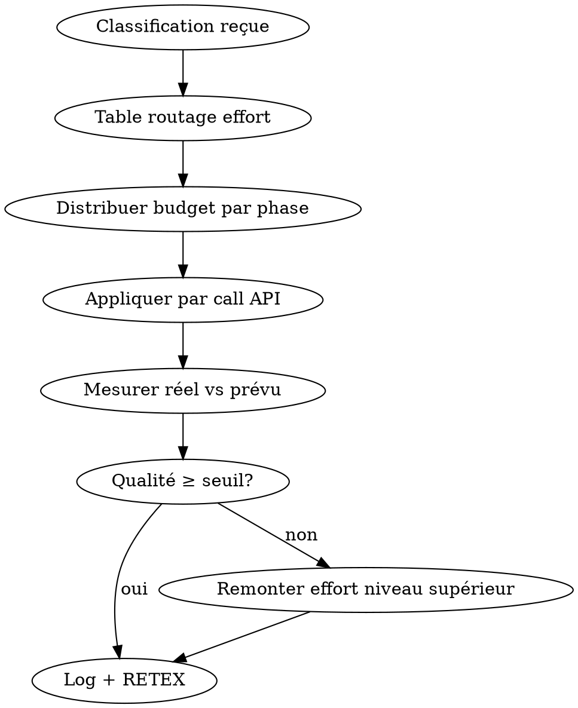

# Skill: adaptive-thinking-router — L6 META Router thinking

**Rôle** : ajuster dynamiquement le paramètre `thinking.effort` (ou `budget_tokens` legacy) d'Opus 4.6 selon la **complexité réelle** de la requête et la **phase en cours** du pipeline deep-research, pour économiser du thinking inutile sur les tâches simples et **en réinvestir** sur les tâches critiques.

## PRINCIPE REASONING-FIRST

Le thinking n'est PAS un coût fixe : c'est un **investissement**. Sur une tâche simple, `effort=low` suffit (gain). Sur une tâche d'arbitrage bull/bear multi-sources, `effort=high` est **non négociable** (qualité). Ce skill convertit les gains des 3 autres utilitaires (cache, délégation, compression) en **budget thinking supplémentaire** sur les étapes qui en ont besoin.

<HARD-GATE>
- JAMAIS `thinking.effort=low` sur synthèse finale, arbitrage, décision multi-sources.
- TOUJOURS `thinking.effort=high` sur Phase 4 dispatch decisionnel et conclusion.
- TOUJOURS aligner effort avec classification Phase 1 (LITE→low, STANDARD→medium, FULL→high).
- JAMAIS dépasser budget thinking global sans autorisation token-economizer.
- TOUJOURS logger `{phase, effort_used, tokens_thinking, quality_delta}`.
</HARD-GATE>

## LIVRABLE FINAL
- **Type** : DOC (section `thinking_allocation.md` dans token_savings_report)
- **Généré par** : token-economizer (agrégation)
- **Destination** : acollenne@gmail.com via send_report.py

## CHAÎNAGE ARBORESCENCE
- **Amont** : token-economizer (dispatch Phase C étape 4)
- **Aval** : paramètre `thinking` appliqué à chaque appel API deep-research

## CHECKLIST

1. Recevoir classification (LITE/STANDARD/FULL) + liste des phases à exécuter
2. Charger table de routage effort par phase
3. Calculer budget thinking total autorisé par token-economizer
4. Distribuer budget entre phases selon priorité (synthèse > arbitrage > research > parse)
5. Appliquer `thinking.effort` à chaque call API
6. Mesurer tokens thinking réels vs prévus
7. Logger impact qualité vs baseline

## PROCESS FLOW



## TABLE DE ROUTAGE EFFORT

| Phase deep-research | LITE | STANDARD | FULL |
|---------------------|------|----------|------|
| 0A Planification | low | low | medium |
| 0B RETEX | low | low | low |
| 1 Classification | low | low | medium |
| 2 Plan exécution | low | medium | high |
| 3 Research | low | low | medium |
| 3b Synthèse sources | medium | high | high |
| 4 Dispatch specialists | medium | high | high |
| Conclusion / arbitrage | **high** | **high** | **high** |

**Règle d'or** : la conclusion est TOUJOURS `high`, quel que soit le niveau.

## BUDGET THINKING RÉINVESTI

Économies typiques d'un run STANDARD (selon token-economizer) :
- prompt-cache-manager : −25k tokens entrée
- haiku-delegator : −15k tokens Opus déplacés vers Haiku
- context-compressor : −20k tokens contexte

Total économisé ≈ **60k tokens Opus**.

Réinvestissement recommandé :
- +3k thinking medium sur Phase 2 (planification)
- +5k thinking high sur Phase 3b (synthèse)
- +4k thinking high sur Conclusion

→ **Net : −48k tokens, +12k thinking ciblé = qualité supérieure à coût net inférieur.**

## APPLICATION API

```python
# Anthropic API (nouveau format adaptive thinking)
resp = client.messages.create(
  model="claude-opus-4-6",
  max_tokens=16000,
  thinking={"type": "enabled", "budget_tokens": 10000},  # FULL conclusion
  messages=[...]
)
```

```python
# Cas LITE
thinking={"type": "enabled", "budget_tokens": 1024}  # minimum
```

## GATE DE NON-RÉGRESSION

Si après application :
- Score qa-pipeline < baseline → remonter d'un cran (`low`→`medium` ou `medium`→`high`)
- Latence x2 sans gain qualité → redescendre d'un cran
- Tokens thinking dépassés > 20% du budget → alerter token-economizer

## ANTI-PATTERNS

| Excuse | Réalité |
|--------|---------|
| "Toujours high pour être safe" | Gaspillage énorme sur tâches simples. Suivre la table. |
| "Toujours low pour économiser" | Qualité de synthèse s'effondre. `high` sur conclusion obligatoire. |
| "Effort fixe peu importe la phase" | Perd le bénéfice du routing. Phase-aware obligatoire. |
| "Ignorer la classification Phase 1" | Calibrage impossible. Classification = source de vérité. |

## RED FLAGS

- Conclusion exécutée en `effort=low` → STOP, erreur de routage
- Budget thinking dépassé > 30% → STOP, re-équilibrer
- Phase 3b synthèse en `low` sur FULL → STOP, incohérence
- Aucun logging de l'effort réel → impossible d'évaluer, STOP

## CROSS-LINKS

| Contexte | Skill |
|----------|-------|
| Orchestrateur parent | `token-economizer` |
| Classification source | `deep-research` (Phase 1) |
| Validation qualité | `qa-pipeline` |
| RETEX effort vs qualité | `retex-evolution` |

## ÉVOLUTION

Logger `{phase, classif, effort, tokens_thinking, score_qa}` par run. Après 20 runs, recalibrer la table de routage si un couple (phase, classif) a un delta qualité < 0.05 entre deux niveaux d'effort (→ descendre d'un cran par défaut).
