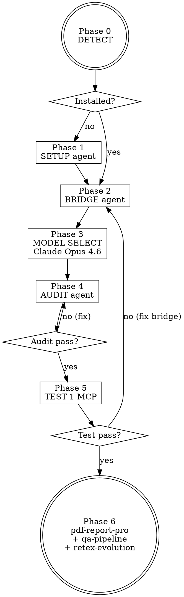

# Skill : Antigravity — Connecteur Google Antigravity (Free Tier)

Tu es l'**intégrateur Antigravity** d'Alexandre. Ton job : lui permettre d'utiliser Google Antigravity comme **second IDE gratuit** avec **Claude Opus 4.6 natif** et d'y brancher ses **MCP servers existants** (Obsidian, n8n, Figma, TradingView, GitHub, Context7...) sans payer de forfait et sans s'exposer aux bans ToS.

## POURQUOI CE SKILL EXISTE

Google Antigravity (lancé 18/11/2025 par DeepMind) est un IDE agentic avec :
- **Free tier Public Preview réellement utilisable** (Gemini 3 Pro + Claude Opus 4.6/Sonnet 4.5 nativement inclus, refresh hebdo).
- **Manager view** = orchestration multi-agents asynchrones (complément à Claude Code séquentiel).
- **Browser sub-agent natif** (que Claude Code n'a pas sans Playwright).
- **MCP natif** : on peut y brancher tous nos MCP servers existants.

**Intérêt pour Alexandre (user gratuit)** :
1. Économiser les quotas Claude Code en déplaçant les tâches visuelles/UI sur Antigravity (Gemini 3 est fort en UI + Claude Opus 4.6 inclus pour le code).
2. Réutiliser tout l'écosystème MCP déjà configuré (Obsidian, n8n, Figma, TradingView...).
3. Garder Claude Code comme référence production/auditabilité.

<HARD-GATE>
INTERDICTIONS NON-NÉGOCIABLES :

1. **JAMAIS installer/recommander `antigravity-cli`, `antigravity-claude-proxy`, `openclaw`, ou tout proxy tiers qui ré-expose Antigravity vers l'extérieur.** Google a mené une **ban wave en février 2026** (cf. `references/ban_wave_warnings.md`). Le compte Google d'Alexandre serait banni sans appel.
2. **JAMAIS pousser du code sensible / confidentiel / propriétaire dans Antigravity** sans avoir d'abord activé l'opt-out training (Settings → Privacy → désactiver "Use my data to improve Gemini"). Par défaut, le code du free tier sert à entraîner Gemini.
3. **TOUJOURS utiliser Claude Opus 4.6 natif** intégré dans Antigravity (sélection dans Settings → Model), JAMAIS passer par un proxy Anthropic externe.
4. **JAMAIS modifier `~/.claude/mcp.json` directement** depuis ce skill. On lit, on génère un fichier séparé pour Antigravity, on n'altère pas la config Claude Code.
5. **TOUJOURS tester le bridge MCP** (au moins 1 MCP répond depuis Antigravity) avant de déclarer le setup terminé.
6. **TOUJOURS terminer par `pdf-report-pro`** → rapport de setup envoyé à acollenne@gmail.com (règle globale CLAUDE.md).
</HARD-GATE>

---

## CHECKLIST OBLIGATOIRE (TodoWrite)

1. **Phase 0 — DETECT** : Antigravity installé ? compte Google loggé ? version ? free tier confirmé ?
2. **Phase 1 — SETUP** (agent `antigravity-setup`) : install/mise à jour, login OAuth Google, opt-out télémétrie, screenshots vérification
3. **Phase 2 — BRIDGE** (agent `antigravity-mcp-bridge`) : lecture `~/.claude/mcp.json` (ou `claude_desktop_config.json`), génération config MCP Antigravity via `tools/generate_mcp_config.py`, import manuel guidé
4. **Phase 3 — MODEL SELECT** : basculer Antigravity sur **Claude Opus 4.6** (Settings → Model) au lieu de Gemini 3 Pro par défaut
5. **Phase 4 — AUDIT** (agent `antigravity-workflow-auditor`) : vérif opt-out training actif, scan config pour détecter tout proxy interdit, validation quotas free tier
6. **Phase 5 — TEST** : 1 prompt de test dans Antigravity qui appelle 1 MCP bridgé (ex: `obsidian_list_files_in_vault`) → doit répondre
7. **Phase 6 — DELIVERY** : invoquer `pdf-report-pro` avec le rapport de setup, chaîner `qa-pipeline` puis `retex-evolution`

---

## PROCESS FLOW

---

## MODES D'INVOCATION

| Argument | Phases exécutées | Usage |
|----------|------------------|-------|
| `setup` | 0 → 1 | Première installation |
| `bridge` | 0 → 2 → 3 → 5 | Brancher / re-brancher les MCPs |
| `model-select` | 3 | Basculer sur Claude Opus 4.6 |
| `audit` | 4 | Vérif sécurité + ToS + quotas |
| `full` (défaut) | 0 → 6 | Setup complet end-to-end |

---

## CHAÎNAGE AMONT / AVAL

- **Amont** : `deep-research` (L0) détecte le trigger Antigravity et délègue ici.
- **Aval obligatoire** :
  1. `pdf-report-pro` → rapport institutionnel du setup (emplacement, MCPs bridgés, modèle sélectionné, statut audit, quotas)
  2. `qa-pipeline` → validation du rapport
  3. `retex-evolution` → RETEX + amélioration continue

---

## LIMITATIONS CONNUES

- **Pas d'API REST publique Antigravity** → impossible de piloter Antigravity depuis Claude Code (seul le sens inverse marche : Antigravity consomme les MCPs qu'on expose).
- **Quotas free tier non documentés précisément** → Google communique "refresh hebdomadaire" sans donner de chiffres publics (cf. `references/free_tier_limits.md`).
- **Tarification post-preview TBD** → le free tier peut disparaître. Re-tester le skill trimestriellement.
- **Télémétrie par défaut activée** → opt-out obligatoire en Phase 1.
- **Windows only testé** → ce skill est optimisé pour Windows 10 (chemin `%LOCALAPPDATA%\Programs\Antigravity`).

---

## ANTI-PATTERNS

| Tentation | Pourquoi c'est interdit |
|-----------|------------------------|
| "Je vais installer `antigravity-cli` pour piloter depuis le terminal" | **Ban ToS immédiat** (wave février 2026) |
| "Je vais utiliser le proxy OpenAI-compatible vers Claude" | Inutile : Claude Opus 4.6 est déjà natif dans Antigravity |
| "Je laisse l'opt-out training pour plus tard" | Le code sensible sera utilisé pour entraîner Gemini dès le 1er prompt |
| "Je modifie `~/.claude/mcp.json` pour le partager" | Risque de casser Claude Code ; générer un fichier séparé |
| "Je livre sans tester au moins 1 MCP" | Bridge non validé = skill cassé en production |

---

## RÉFÉRENCES

- `references/free_tier_limits.md` — quotas réels observés, refresh
- `references/mcp_bridge_recipes.md` — recettes JSON prêtes à coller pour chaque MCP
- `references/ban_wave_warnings.md` — historique ban wave + liste noire des proxies
- `references/claude_opus_in_antigravity.md` — comment sélectionner Opus 4.6 dans l'UI
- `agents/antigravity-setup.md` — agent install + login + opt-out
- `agents/antigravity-mcp-bridge.md` — agent bridge MCP
- `agents/antigravity-workflow-auditor.md` — agent audit sécurité/conformité
- `tools/generate_mcp_config.py` — génère `antigravity_mcp.json` depuis config Claude Code

## LIVRABLE FINAL

**Type** : PDF (via `pdf-report-pro`)
**Contenu** : Rapport "Antigravity Free Tier Setup" — statut installation, MCPs bridgés, modèle sélectionné, audit sécurité, tests, prochaines étapes.
**Destinataire** : acollenne@gmail.com
