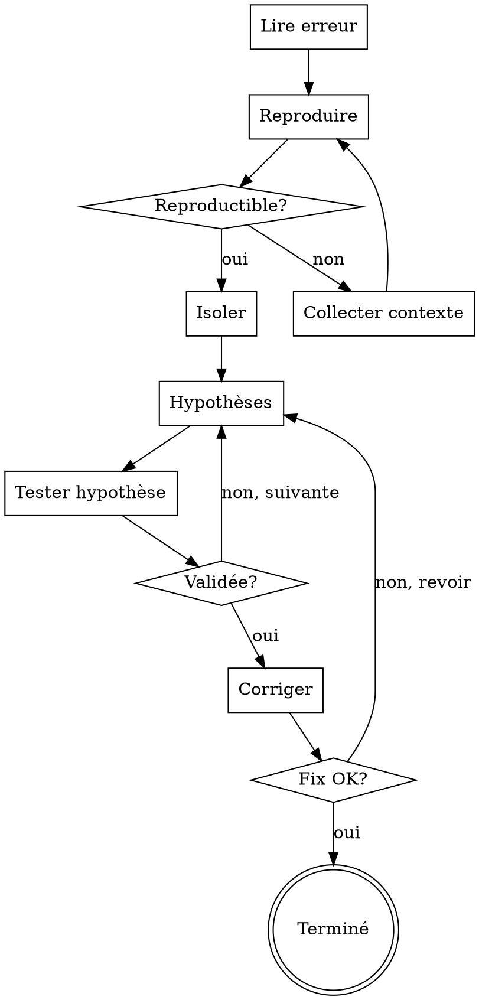

## RÈGLE UNIVERSELLE — LIRE L'INTÉGRALITÉ DU SKILL AVANT D'AGIR

**OBLIGATOIRE : Avant d'exécuter quoi que ce soit, tu DOIS :**
1. Lire l'INTÉGRALITÉ de ce fichier SKILL.md (pas juste le début)
2. Comprendre chaque section, chaque règle, chaque contrainte
3. Respecter ce skill À LA LETTRE — ne rien sauter, ne rien simplifier

**Ne JAMAIS commencer l'exécution sans avoir lu et compris TOUT le skill.**

---

# Skill : Débogage Avancé

## CHECKLIST DE DÉBOGAGE

Créer une tâche TodoWrite pour chaque étape :

1. **Lire l'erreur** — Lire INTÉGRALEMENT le message d'erreur/stack trace
2. **Reproduire** — Confirmer que le bug est reproductible
3. **Isoler** — Identifier le fichier/fonction/ligne exacte
4. **Hypothèses** — Formuler 2-3 hypothèses avec niveau de confiance
5. **Tester** — Valider/invalider chaque hypothèse
6. **Corriger** — Appliquer le fix minimal
7. **Vérifier** — Confirmer que le fix résout le problème SANS en créer d'autres

## PROCESS FLOW



## Processus de débogage

### 1. Triage rapide
Identifie en 30 secondes :
- **Type d'erreur** : syntaxe, runtime, logique, performance, réseau
- **Contexte** : quel langage, quelle version, quel environnement
- **Reproductibilité** : toujours / parfois / sous conditions spécifiques

### 2. Lecture du stack trace
- Lire DE BAS EN HAUT : la cause racine est généralement à la dernière frame utilisateur
- Identifier la ligne exacte et le fichier
- Distinguer le code utilisateur du code de bibliothèque

### 3. Hypothèses structurées
Formuler 2-3 hypothèses par ordre de probabilité :
```
H1 (prob. 70%) : [hypothèse la plus probable]
H2 (prob. 20%) : [hypothèse alternative]
H3 (prob. 10%) : [cas edge]
```

### 4. Validation
- Lire le code autour de la ligne incriminée
- Vérifier les types, les valeurs nulles, les indices hors limites
- Chercher sur internet si l'erreur est connue (ex: "Python 3.13 + [lib] + [erreur]")

### 5. Correction
- Proposer la correction minimale (ne pas refactoriser tout le code)
- Expliquer POURQUOI c'était cassé
- Signaler si d'autres parties du code risquent le même problème

## Patterns d'erreurs fréquents

**Python** : IndentationError, TypeError (None), KeyError dict, AttributeError, ImportError version mismatch
**JavaScript** : undefined is not a function, Cannot read properties of null, Promise rejection non gérée
**Pine Script** : "Cannot call 'request.security' from within a 'request.security' call", dépassement de plots
**APIs** : 429 rate limit, 401 auth, CORS, timeout

## Règle d'or
Ne jamais corriger le symptôme sans comprendre la cause. Si l'erreur est cryptique, chercher sur Stack Overflow / GitHub Issues avant de proposer un workaround.

## RECHERCHE AUTOMATIQUE AVANT DEBUG
TOUJOURS chercher AVANT de debugger manuellement :
1. WebSearch "[error message exact] site:stackoverflow.com"
2. WebSearch "[error message] [framework] [language] fix"
3. WebSearch "[error message] site:github.com/[repo]/issues"
4. Si Context7 MCP disponible → chercher dans la doc officielle

## OUTILS DIAGNOSTIC AUTOMATISÉS
| Langage | Linter | Type Checker | Profiler |
|---------|--------|-------------|----------|
| Python | pylint, flake8, ruff | mypy, pyright | cProfile, memory_profiler |
| JavaScript | eslint | typescript | Chrome DevTools |
| Pine Script | Vérif compile TradingView | — | — |
| Bash | shellcheck | — | time, strace |
TOUJOURS exécuter le linter AVANT l'analyse manuelle.

## ARBRE DE DÉCISION FALLBACK PAR TYPE D'ERREUR
| Type erreur | Action 1 | Action 2 | Action 3 |
|-------------|----------|----------|----------|
| Syntaxe | Linter auto | Lire doc langage | Gemini Flash fix |
| Runtime (crash) | Stack trace → identifier ligne | WebSearch erreur | DeepSeek-R1 analyse |
| Logique (résultat faux) | Print/log intermédiaires | Test unitaire isolé | Revue code manuelle |
| Mémoire (OOM) | memory_profiler | Optimiser structures | Pagination/streaming |
| Réseau (timeout/403) | Vérifier URL/endpoint | Retry avec backoff | Fallback source |
| Concurrence (race) | Logging timestamps | Lock/mutex analysis | Simplifier parallélisme |

## LOGGING DEBUG STRUCTURÉ
Niveaux obligatoires :
- **DEBUG** : détail interne (variables, états)
- **INFO** : flux normal (étapes franchies)
- **WARN** : comportement suspect mais non bloquant
- **ERROR** : erreur récupérable
- **CRITICAL** : erreur fatale, arrêt nécessaire

## TEMPLATE ROOT CAUSE ANALYSIS
Pour chaque bug résolu :
```
BUG : [description]
SYMPTÔME : [ce qu'on observe]
CAUSE RACINE : [pourquoi ça arrive]
FIX : [ce qu'on a changé]
PRÉVENTION : [comment éviter à l'avenir]
TEST : [comment vérifier que c'est résolu]
```

## ROUTAGE MULTI-IA — DEBUG
| Tâche | IA Primaire | Justification |
|-------|------------|---------------|
| Fix code | Gemini Flash | N°1 code 10/10 |
| Analyse root cause | DeepSeek-R1 | Raisonnement profond |
| Fix rapide | Groq (2.8s) | Vitesse |
| Vérification | TOUTES en parallèle | Anti-hallucination |

## SYSTÈME DE CONFIANCE
| Niveau | Critère | Marqueur |
|--------|---------|----------|
| ÉLEVÉ | Fix testé + confirmé | ✓✓✓ |
| MOYEN | Fix logique non testé | ✓✓ |
| FAIBLE | Hypothèse non vérifiée | ✓ |
| SPÉCULATIF | Piste exploratoire | ~ |

## ANTI-PATTERNS

| Excuse | Réalité |
|--------|---------|
| "Je sais ce que c'est, pas besoin de lire l'erreur" | 80% des bugs sont dans le message d'erreur. TOUJOURS lire. |
| "Je vais tout réécrire, c'est plus simple" | Un fix chirurgical > une réécriture. Changer le minimum nécessaire. |
| "Ça marchait avant, c'est forcément le dernier commit" | Corrélation ≠ causalité. Vérifier avec git bisect si nécessaire. |
| "J'ajoute un try/catch pour masquer l'erreur" | Masquer ≠ corriger. Traiter la cause, pas le symptôme. |
| "Le bug est intermittent, on peut ignorer" | Les bugs intermittents sont les plus dangereux en production. |

## RED FLAGS — STOP

- Fix sans avoir reproduit le bug → STOP
- try/catch vide ou qui avale l'erreur → STOP
- Plus de 3 fichiers modifiés pour un fix → STOP, vérifier le scope

## CROSS-LINKS

| Contexte | Skill |
|----------|-------|
| Debug systématique | `superpowers:systematic-debugging` |
| Tests après fix | `superpowers:test-driven-development` |
| Vérification | `superpowers:verification-before-completion` |
| Si c'est du code à réécrire | `dev-team` |
| Validation qualité | `qa-pipeline` |

## ÉVOLUTION

Après chaque session de debug :
- Si un pattern d'erreur se répète → l'ajouter dans l'arbre de décision
- Si une méthode de debug était particulièrement efficace → la documenter
- Si le fix a créé un nouveau bug → revoir le processus de vérification

Seuils : si le même type de bug revient > 2 fois → créer une règle de prévention.
