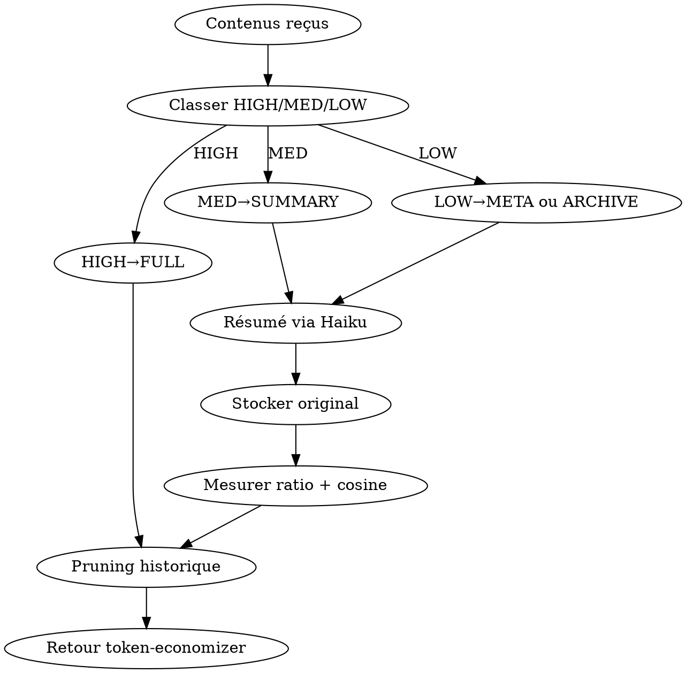

# Skill: context-compressor — L6 META Compression hiérarchique

**Rôle** : réduire le volume de contexte envoyé à Opus en appliquant une **compression sémantique multi-niveaux** et un **pruning** des contenus à faible valeur, sans jamais perdre l'information critique au raisonnement.

## PRINCIPE REASONING-FIRST

Opus raisonne **mieux sur un contexte dense et ciblé** que sur un contexte volumineux et bruité. La compression n'est pas une amputation : c'est un **nettoyage du signal**. Chaque niveau de compression conserve une clé de récupération vers le niveau supérieur (`id` citation).

<HARD-GATE>
- JAMAIS compresser la requête utilisateur brute.
- JAMAIS compresser les instructions système (elles sont déjà cachées via prompt-cache-manager).
- TOUJOURS conserver un niveau SUMMARY minimum (jamais jeter directement vers ARCHIVE).
- TOUJOURS stocker l'original FULL en disque (`~/.claude/cache/compressed/{id}.full.md`) pour rollback.
- TOUJOURS calculer ratio de compression réel + score sémantique (cosine similarity ≥ 0.85).
- JAMAIS appliquer compression en Phase 4 de deep-research (trop tard, perte de citations).
</HARD-GATE>

## LIVRABLE FINAL
- **Type** : DOC (`compression_report.md`)
- **Généré par** : token-economizer (agrégation)
- **Destination** : acollenne@gmail.com via send_report.py

## CHAÎNAGE ARBORESCENCE
- **Amont** : token-economizer (dispatch Phase C étape 2)
- **Aval** : contexte compressé renvoyé à deep-research Phase 2/3

## CHECKLIST

1. Recevoir la liste de contenus à compresser (résultats tools, historique, docs auxiliaires)
2. Classer chaque contenu par valeur (HIGH/MED/LOW) selon règles heuristiques
3. Appliquer le niveau cible : HIGH→FULL, MED→SUMMARY, LOW→META ou ARCHIVE
4. Générer les résumés via Haiku 4.5 (délégué via haiku-delegator)
5. Stocker originaux dans `~/.claude/cache/compressed/`
6. Mesurer : tokens avant/après + cosine similarity
7. Pruner l'historique conversation (supprimer logs, tool outputs anciens)
8. Retourner le contexte nettoyé à token-economizer

## PROCESS FLOW



## LES 4 NIVEAUX DE COMPRESSION

| Niveau | Ratio | Contenu conservé | Usage |
|--------|-------|------------------|-------|
| **FULL** | 1:1 | Tout (brut) | Info critique au raisonnement (requête, sources clés, décisions) |
| **SUMMARY** | 1:5 | Idées principales, chiffres-clés, citations | Sources secondaires, résultats tools volumineux |
| **META** | 1:20 | Titre + 1 phrase + lien id | Contexte historique, anciennes itérations |
| **ARCHIVE** | 1:100 | Juste `{id, type, date, cite}` | Logs, trace, debug output |

## HEURISTIQUES DE CLASSIFICATION

Un contenu est **HIGH** si :
- Il contient un chiffre ou une date mentionné dans la requête
- Il provient d'une source primaire autoritaire (Bloomberg, Reuters, SEC, Fed)
- Il est cité dans la synthèse en cours
- Il contient une contradiction avec d'autres sources (arbitrage)

Un contenu est **LOW** si :
- Il est > 30 min ancien dans la conversation
- C'est un log, stack trace, tool call détail
- Il est redondant avec un autre contenu déjà HIGH

Sinon → **MED**.

## PRUNING DE L'HISTORIQUE

Règles (appliquées pre-send) :
1. Supprimer tool outputs > 2 tours de conversation en arrière (sauf HIGH)
2. Supprimer les messages système répétés (caching fait le reste)
3. Compresser les anciens user/assistant turns en META
4. Conserver TOUJOURS : les 2 derniers tours complets + la requête originale

## VALIDATION SÉMANTIQUE

```python
from sentence_transformers import SentenceTransformer
model = SentenceTransformer('all-MiniLM-L6-v2')
sim = cosine(model.encode(original), model.encode(compressed))
assert sim >= 0.85, "Compression trop agressive, rollback"
```

Si `sim < 0.85` → rollback automatique vers niveau supérieur (META → SUMMARY → FULL).

## ANTI-PATTERNS

| Excuse | Réalité |
|--------|---------|
| "Compresser tout en ARCHIVE pour max économie" | Raisonnement s'effondre. Taxonomie HIGH/MED/LOW obligatoire. |
| "Pas besoin de stocker les originaux" | Impossible de rollback, perte définitive. Stockage OBLIGATOIRE. |
| "Skip la validation cosine, ça ralentit" | Dégradations silencieuses. Validation OBLIGATOIRE. |
| "Compresser l'historique en cours de raisonnement" | Casse la cohérence. Pre-send uniquement. |

## RED FLAGS

- Ratio compression > 90% sur un contenu HIGH → STOP, mal classifié
- Cosine similarity < 0.85 → STOP, rollback
- Stockage `~/.claude/cache/compressed/` > 1 GB → nettoyer anciens
- Compression appliquée en Phase 4 deep-research → STOP, trop tard

## CROSS-LINKS

| Contexte | Skill |
|----------|-------|
| Orchestrateur parent | `token-economizer` |
| Résumés délégués | `haiku-delegator` |
| Cache original | `prompt-cache-manager` |
| Validation qualité | `qa-pipeline` |

## ÉVOLUTION

Logger `{content_type, niveau, ratio, cosine, rollback?}` par run. Si rollback > 10% → durcir heuristiques de classification (moins agressif).
