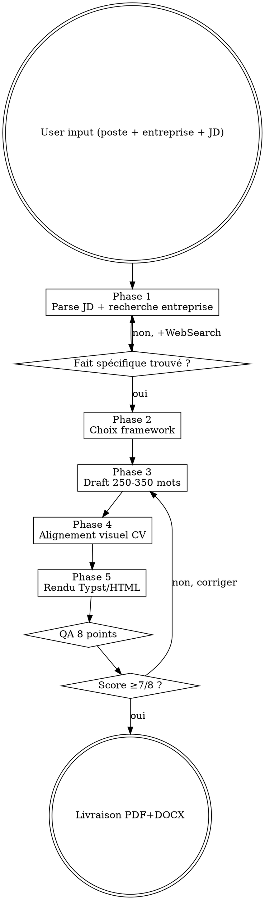

# Cover Letter Creator — Skill institutionnel

Génère des lettres de motivation modernes, courtes (250-350 mots), personnalisées par offre, esthétiquement cohérentes avec le CV.

<HARD-GATE>
RÈGLES NON-NÉGOCIABLES :
1. JAMAIS inventer un fait sur l'entreprise, une valeur, une actualité, un nom de hiring manager. Toujours vérifier via WebSearch/WebFetch.
2. JAMAIS inventer une motivation, une expérience ou un résultat absent du CV utilisateur.
3. JAMAIS dépasser 350 mots ni une page. Longueur stricte 250-350.
4. JAMAIS ouvrir par "I am writing to apply for…" / "Je me permets de vous écrire…" (anti-pattern #1).
5. TOUJOURS inclure au moins 1 fait spécifique vérifié sur l'entreprise dans le hook.
6. TOUJOURS aligner visuellement la lettre avec le CV si `C:\tmp\cv_<nom>.json` existe (même police, header, palette).
7. TOUJOURS passer la QA checklist 8 points avant livraison.
</HARD-GATE>

## Checklist d'exécution (TodoWrite obligatoire)

À créer en TodoWrite au démarrage du skill, à compléter dans l'ordre :

1. **Parser** l'offre d'emploi (missions, compétences, valeurs, hiring manager)
2. **Rechercher** l'entreprise via WebSearch/WebFetch (actu, valeurs, 1 fait spécifique)
3. **Sélectionner** le framework adapté (AIDA / Storytelling / Problem-Solution / Classique)
4. **Drafter** la lettre 250-350 mots en 4 paragraphes (hook → pourquoi vous → pourquoi eux → CTA)
5. **Aligner** visuellement avec le CV (lire JSON canonique s'il existe)
6. **Rendre** via Typst (principal) ou HTML/Playwright
7. **Vérifier** la QA checklist 8 points (bloquant si <7/8)
8. **Livrer** PDF + DOCX + score QA

## Quand utiliser ce skill
- "Écris ma lettre de motivation", "fais-moi une lettre pour ce poste"
- "Lettre pour [entreprise / poste]"
- "Cover letter for …"
- Après avoir créé un CV via `cv-creator` pour un poste donné

## Architecture (5 phases)

```
[Phase 1] Parse offre + recherche entreprise (valeurs, actus récentes, hiring manager si possible)
        ↓
[Phase 2] Sélection framework selon secteur :
  - AIDA (Attention/Interest/Desire/Action) → ventes, marketing, client-facing
  - Storytelling → créatif, leadership, changement de carrière
  - Problem-Solution → conseil, tech, ingénieur
  - Classique 4 paragraphes → académique, finance, juridique
        ↓
[Phase 3] Draft 250-350 mots avec hook personnalisé + faits spécifiques sur l'entreprise
        ↓
[Phase 4] Alignement visuel avec cv-creator (même font, même header, même palette)
        ↓
[Phase 5] Rendu Typst (principal) ou HTML/Playwright — PDF + DOCX
```

## Phase 1 — Parse offre + recherche entreprise

Extraire de la JD :
- Intitulé exact du poste + référence (si disponible)
- 3-5 missions clés
- 3-5 compétences critiques
- Valeurs/culture mentionnées
- Nom du hiring manager si indiqué

Recherche entreprise (via WebSearch si autorisé) :
- Actualité récente (levée, acquisition, lancement produit)
- Valeurs officielles (site carrières)
- 1 fait spécifique à mentionner dans le hook

⚠️ Si l'utilisateur ne fournit pas de JD → demander OU produire une lettre générique clairement étiquetée.

## Phase 2 — Sélection framework

| Secteur | Framework recommandé | Justification |
|---|---|---|
| Vente/marketing/commercial | **AIDA** | Démontre la maîtrise des techniques de persuasion |
| Créatif/design/communication | **Storytelling** | Attendu dans le milieu |
| Leadership/management | **Storytelling** | Humain, incarné |
| Conseil/stratégie | **Problem-Solution** | MECE, structuré |
| Tech/ingénieur/data | **Problem-Solution** | Factuel, orienté impact |
| Finance/audit/juridique | **Classique 4 paragraphes** | Sobriété attendue |
| Académique/recherche | **Classique 4 paragraphes** | Formel |

Par défaut : `problem-solution` (universel, impact-oriented).

## Phase 3 — Draft (250-350 mots, 4 paragraphes)

### Structure universelle

**P1 — Hook (2-3 phrases, ~50 mots)**
- JAMAIS "I am writing to apply for…"
- Accrocher avec : une valeur commune, un problème à résoudre, un résultat pertinent, une anecdote courte
- Mentionner le poste exact + 1 fait spécifique sur l'entreprise

**P2 — Pourquoi vous (130-150 mots)**
- 2-3 expériences/résultats quantifiés directement liés aux missions de l'offre
- Reprendre 3-5 mots-clés critiques de la JD
- "J'ai fait X → résultat Y → c'est pertinent pour Z chez [entreprise]"

**P3 — Pourquoi eux (70-90 mots)**
- Aligner vos valeurs/objectifs avec ceux de l'entreprise
- Mentionner le fait spécifique trouvé en Phase 1 (actu, produit, culture)
- Montrer que vous connaissez la boîte, pas un copier-coller

**P4 — Call-to-action (30-50 mots)**
- Proposer un échange/entretien
- Rester confiant sans être arrogant
- Formule de politesse sobre ("Je reste à votre disposition…", "Looking forward to discussing…")

## Phase 4 — Alignement visuel avec cv-creator

Lire `C:\tmp\cv_<nom>.json` s'il existe, reprendre :
- Police (ex : Inter, Garamond)
- Couleur accent
- Format du header (nom, coordonnées, ligne de séparation)
- Signature / pied de page

Résultat : CV + lettre forment un pack visuellement cohérent.

## Phase 5 — Rendu

### Typst (moteur principal)
Templates dans `templates/` :
- `classic.typ` — 4 paragraphes sobres
- `aida.typ` — structure marketing
- `storytelling.typ` — narratif
- `problem-solution.typ` — consulting/tech

### HTML + Playwright (fallback / versions créatives)
Réutilise le pipeline `pdf-report-pro`.

### DOCX (ATS strict)
`pandoc lettre.md -o lettre.docx --reference-doc=templates/reference.docx`

## Règles critiques (2026)

| Règle | Détail |
|---|---|
| **Longueur** | 250-350 mots max, 1 page, jamais >1 page |
| **Police** | 11pt corps, 12pt header, même famille que le CV |
| **Marges** | 2.54 cm (1 inch) |
| **Date** | Haut droite, format localisé (FR : "7 avril 2026", US : "April 7, 2026") |
| **Destinataire** | Nom + poste + entreprise. Si inconnu : "À l'attention du responsable du recrutement" (jamais "To Whom It May Concern") |
| **Objet** | "Candidature — [Intitulé exact du poste] — Réf. [XXX]" |
| **Langue** | Celle de l'offre (FR pour FR, EN pour intl) |
| **Ton** | Confiant, concret, factuel. Ni obséquieux, ni arrogant. |
| **Personnalisation** | Au MINIMUM 1 fait spécifique sur l'entreprise + 1 alignement à ses valeurs |

## Anti-patterns à BANNIR

| Excuse | Réalité |
|---|---|
| "Je me permets de vous écrire pour…" est poli | Anti-pattern #1 — recruteur passe à la suivante en 3 secondes. Hook concret obligatoire. |
| "Je répète mon CV pour bien insister" | La lettre COMPLÈTE le CV, ne le répète pas. Sinon doublon = rejet. |
| "Une lettre générique fonctionne pour 30 boîtes" | Détectée en 5 secondes. Personnalisation = +60% callback. |
| "Plus c'est long, plus ça montre ma motivation" | >350 mots = pas lu. 1 page stricte. |
| "Une faute ce n'est pas grave" | 77% de rejet immédiat (étude 2026). Spell check obligatoire. |
| "Ce serait un immense honneur de…" | Ton obséquieux = perçu juniors/peu confiant. Confiance factuelle. |
| "Je parle de mes objectifs personnels" | Le recruteur s'en moque. La lettre parle de ce que TU apportes à L'ENTREPRISE. |
| "J'invente un fait sur l'entreprise pour montrer que je connais" | Détecté à l'entretien = blacklist. Toujours WebSearch + vérifier. |

## QA checklist (8 points)

```
□ 1. Longueur 250-350 mots
□ 2. 1 page stricte
□ 3. Hook personnalisé (pas "I am writing…")
□ 4. Au moins 1 fait spécifique sur l'entreprise
□ 5. 3-5 mots-clés de la JD intégrés naturellement
□ 6. Résultats quantifiés dans P2
□ 7. Cohérence visuelle avec le CV (même police, header, palette)
□ 8. Pas de fautes (spell check passé)
```

## Livraison

```
✅ Lettre de motivation — [nom] / [poste chez entreprise]

Fichiers :
  - PDF : C:\tmp\lettre_<nom>_<entreprise>.pdf
  - DOCX : C:\tmp\lettre_<nom>_<entreprise>.docx

Framework : [AIDA / Storytelling / Problem-Solution / Classique]
Mots : [X]/350
QA : [X]/8
Cohérence visuelle avec CV : [oui / non]
```

## Évolution du skill (mécanisme RETEX intégré)

**Auto-amélioration obligatoire après chaque usage** via `retex-evolution` :

```bash
python ~/.claude/tools/retex_manager.py save cover_letter \
  --quality [score_QA/8] --framework [nom] --tools-used "typst,websearch" \
  --notes "[lessons]"
```

**Métriques trackées** :
- `qa_avg` : score QA moyen sur N=5 derniers usages (objectif ≥7/8)
- `framework_usage` : distribution AIDA/Storytelling/Problem-Solution/Classique par secteur
- `word_count_avg` : longueur moyenne (doit rester 250-350)
- `callback_rate` : taux de callback reporté par l'utilisateur
- `user_satisfaction` : score /10 via `feedback-loop`

**Déclencheurs d'amélioration automatiques** :
| Métrique | Seuil | Action |
|---|---|---|
| `qa_avg` | <7/8 sur 5 usages | Lancer `skill-creator improve cover-letter-creator` |
| `word_count_avg` | hors 250-350 | Renforcer contrainte Phase 3 (draft) |
| `callback_rate` | <10% | Revoir les hooks et la personnalisation Phase 1 |
| Nouveau secteur récurrent | 3+ demandes | Ajouter ligne dans matrice frameworks Phase 2 |
| Anti-pattern nouveau | 2+ occurrences | Enrichir table Anti-patterns |

**Évolution continue** : versionnage obligatoire. Avant toute édit → backup `SKILL.md.bak_v<N>_<date>`.

## Process Flow (Graphviz)



## Scénarios de test

**Trigger (DOIT s'activer) :**
- "Écris-moi une lettre de motivation pour ce poste de PM chez Spotify"
- "Fais-moi une cover letter pour cette offre [JD]"
- "Lettre de motivation pour Goldman Sachs investment banking"
- "Rédige une motivation letter pour mon application doctorale"

**No-trigger (NE DOIT PAS s'activer) :**
- "Crée mon CV" → `cv-creator`
- "Écris un email à mon manager" → assistant général
- "Fais un rapport PDF sur Tesla" → `pdf-report-pro`
- "Génère un flyer événement" → `flyer-creator`

## Cross-links (chaîne amont/aval)

| Contexte | Skill à invoquer |
|---|---|
| AVANT — recherche entreprise (actu, valeurs, hiring manager) | `deep-research` |
| AVANT — créer/mettre à jour le CV cohérent | `cv-creator` |
| AVANT — brainstorming du positionnement et du hook | `superpowers:brainstorming` |
| PENDANT — moteur PDF (variantes HTML/Playwright) | `pdf-report-pro` |
| PENDANT — validation anti-hallucination critique | `qa-pipeline` |
| APRÈS — collecte feedback utilisateur (callback, entretien) | `feedback-loop` |
| APRÈS — RETEX + amélioration continue | `retex-evolution` |

## LIVRABLE FINAL

- **Type** : PDF
- **Généré par** : self
- **Destination** : acollenne@gmail.com via send_report.py

## CHAÎNAGE ARBORESCENCE

- **Amont** : deep-research (entrée unique)
- **Aval** : self


---

## DELIVERY GATE — layout-qa (OBLIGATOIRE)

**Avant tout envoi du livrable final**, ce skill DOIT invoquer la porte `layout-qa` :

```bash
python ~/.claude/skills/layout-qa/scripts/run_gate.py \
    --input <livrable> \
    --brief <brief.md> \
    --caller <nom-de-ce-skill> \
    --max-iter 3 \
    --out-report qa_report.json
```

- Exit `0` (PASS) → envoi autorisé (email, téléchargement utilisateur)
- Exit `1` (FIX) → lire `qa_report.json`, appliquer les corrections au Composer, re-rendre, re-invoquer layout-qa (max 3 itérations)
- Exit `2` (FAIL) → escalade utilisateur avec les PNG annotés (`annotated_dir`)

La phase vision multimodale est assurée par l'agent `visual-layout-critic` côté Claude après l'exécution déterministe du script. Aucun livrable ne sort sans verdict PASS.
