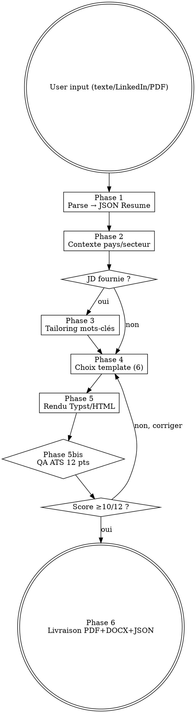

# CV Creator — Skill institutionnel

Génère des CV de qualité professionnelle, ATS-friendly, esthétiques, multi-pays (FR/US/UK/DE/EU), multi-secteurs (tech/finance/conseil/académique).

<HARD-GATE>
RÈGLES NON-NÉGOCIABLES :
1. JAMAIS inventer une expérience, un diplôme, une compétence, une date non fournie par l'utilisateur. Tailoring = reformulation, pas fabrication.
2. JAMAIS livrer un CV sans avoir passé la QA ATS 12 points (score affiché à l'utilisateur).
3. JAMAIS de photo sur les versions US/UK/intl (EEOC) — photo OBLIGATOIRE uniquement Allemagne.
4. JAMAIS de multi-colonnes, tableaux, icônes, skill bars, graphiques sur la version ATS (cassent 90% des parseurs).
5. TOUJOURS sauvegarder le JSON Resume canonique dans `C:\tmp\cv_<nom>.json` pour réutilisation par cover-letter-creator.
6. TOUJOURS utiliser une font système (Calibri/Arial/Helvetica/Garamond/Times/Inter), jamais de font custom.
</HARD-GATE>

## Checklist d'exécution (TodoWrite obligatoire)

À créer en TodoWrite au démarrage du skill, à compléter dans l'ordre :

1. **Parser** les données utilisateur → JSON Resume schema (Phase 1)
2. **Détecter** le contexte pays + secteur + ATS strict (Phase 2)
3. **Tailorer** sur la JD si fournie (extraction mots-clés + rewrite, Phase 3)
4. **Sélectionner** le template adapté parmi les 6 (Phase 4)
5. **Rendre** via Typst (principal) ou HTML/Playwright (Phase 5)
6. **Vérifier** la QA ATS 12 points (Phase 5 bis — bloquant si <10/12)
7. **Générer** la variante DOCX si demandée (pandoc)
8. **Livrer** PDF + DOCX + JSON canonique + score QA

## Quand utiliser ce skill
- "Crée mon CV", "fais-moi un CV", "refais mon CV", "résumé", "curriculum vitae"
- "Adapte mon CV à cette offre" (tailoring)
- "Convertis mon LinkedIn en CV"
- "Mets mon CV au format Harvard / McKinsey / Europass / Tech"

## Architecture & stack (issu du benchmark 2026)

```
Données utilisateur (texte libre / LinkedIn / ancien CV)
        ↓
[Phase 1] Parsing → JSON Resume schema (data canonique)
        ↓
[Phase 2] Détection contexte (pays, secteur, ATS strict ?)
        ↓
[Phase 3] Tailoring offre (si JD fournie) — keyword extraction + rewrite bullets
        ↓
[Phase 4] Sélection template (Harvard / Jake's / McKinsey / Europass / Modern / Tech)
        ↓
[Phase 5] Rendu :
  - Moteur principal : Typst modern-cv (ATS-safe, <2s)
  - Moteur secondaire : HTML/CSS + Playwright page.pdf() (versions créatives)
  - Variante DOCX via pandoc (ATS strict)
        ↓
[Phase 6] QA ATS : checklist 12 points (fonts, colonnes, mots-clés, longueur, dates)
        ↓
Livraison : PDF + DOCX + JSON source (réutilisable)
```

## Templates supportés (6, couvrent 95% des cas)

| Template | Use case | Pays | ATS-score | Moteur |
|---|---|---|---|---|
| **harvard** | MBA, conseil, finance, académique, universel | US/UK/intl | 10/10 | Typst (mono-col, Garamond) |
| **jakes** | Tech, ingénieur, développeur | US/UK/intl | 10/10 | Typst (mono-col, sans-serif) |
| **mckinsey** | Conseil stratégie, BB, finance | US/UK/intl | 9/10 | Typst (chronologique, bullets résultats) |
| **europass** | Institutions UE, bourses, académique EU | UE | 8/10 | Typst officiel + CEFR langues |
| **modern** | Tech moderne, startup, design | intl | 7/10 | Typst modern-cv (accent couleur) |
| **tech-onepage** | Dev/data scientist senior, dense | intl | 8/10 | HTML/Playwright |

Par défaut : `harvard` (le plus universel, ATS-safe).

## Phase 1 — Collecte & parsing → JSON Resume

Schéma standard JSON Resume (https://jsonresume.org/schema). Champs minimaux :
```json
{
  "basics": {"name": "", "label": "", "email": "", "phone": "", "location": {"city": "", "countryCode": ""}, "summary": "", "profiles": [{"network": "LinkedIn", "url": ""}]},
  "work": [{"name": "", "position": "", "startDate": "YYYY-MM", "endDate": "YYYY-MM|present", "highlights": ["bullet quantifié"]}],
  "education": [{"institution": "", "studyType": "", "area": "", "startDate": "", "endDate": ""}],
  "skills": [{"name": "category", "keywords": []}],
  "languages": [{"language": "", "fluency": "C1"}],
  "projects": [], "certificates": [], "awards": []
}
```

Si l'utilisateur fournit du texte libre / un ancien CV / un PDF → parser intelligemment vers ce schéma. Toujours sauvegarder le JSON dans `C:\tmp\cv_<nom>.json` pour réutilisation.

## Phase 2 — Détection contexte (règles pays critiques)

| Pays | Photo | Longueur | Date naissance | Spécificités |
|---|---|---|---|---|
| FR | Optionnelle (oui tradi, non tech) | 1-2 pages | Optionnelle | "Expériences professionnelles" |
| US | **JAMAIS** (EEOC) | 1 page (<10 ans) | Jamais | "Work Experience", pas d'objectif daté |
| UK | Jamais | 2 pages | Jamais | "Personal Statement" optionnel |
| DE | **OBLIGATOIRE** (coin sup. droit) | 2 pages | Souvent incluse | "Lebenslauf", signature |
| EU/Europass | Optionnelle | 2-3 pages | Optionnelle | Niveaux CEFR langues obligatoires |

## Phase 3 — Tailoring offre (si JD fournie)

1. Extraire 15-25 mots-clés de la JD (hard skills + soft skills + outils + certifs)
2. Scoring match vs CV actuel (objectif 60-80% coverage)
3. Réécrire les bullets pour intégrer les mots-clés manquants **sans inventer** d'expérience
4. Inclure abréviations + versions longues ("PM" + "Project Manager")
5. Reordonner les expériences/skills par pertinence

⚠️ JAMAIS inventer d'expérience, de diplôme, de compétence non mentionnée par l'utilisateur. Tailoring = reformulation, pas fabrication.

## Phase 4 — Rendu

### Moteur principal : Typst (recommandé)

```bash
typst compile templates/<template>.typ output.pdf --input data=cv.json
```

Si Typst non installé : fallback HTML+Playwright.

### Moteur secondaire : HTML + Playwright

Utiliser le pipeline `pdf-report-pro` existant (même Playwright `page.pdf()`). Templates HTML dans `templates/html/`.

### Variante DOCX (ATS strict)

```bash
pandoc cv.md -o cv.docx --reference-doc=templates/reference.docx
```

## Phase 5 — QA ATS (checklist 12 points obligatoire)

```
□ 1. Mono-colonne (pas de tableau, pas de colonnes multiples)
□ 2. Font système uniquement (Calibri/Arial/Helvetica/Garamond/Times/Inter)
□ 3. Pas d'icônes, skill bars, images (sauf photo DE), graphiques
□ 4. Sections nommées standard ("Work Experience", "Education", "Skills")
□ 5. Dates format cohérent (MMM YYYY)
□ 6. Marges 1 inch (2.54 cm)
□ 7. Corps 10-12pt
□ 8. Bullets quantifiés (résultats, pas duties)
□ 9. Longueur respectée (1 page si <10 ans XP, 2 max sinon)
□ 10. Email professionnel, pas de header/footer Word
□ 11. 60-80% coverage mots-clés JD (si tailoring)
□ 12. Pas de fautes d'orthographe (passer un check)
```

Si un point KO → corriger et re-vérifier. Score final /12 affiché à l'utilisateur.

## Phase 6 — Livraison

- `C:\tmp\cv_<nom>_<template>.pdf` (principal)
- `C:\tmp\cv_<nom>_<template>.docx` (ATS strict, si demandé)
- `C:\tmp\cv_<nom>.json` (data canonique réutilisable)
- Envoi email auto via `send_report.py` si analyse importante

## Design (standards pro 2026)
- **Typos** : Inter, IBM Plex Sans, Source Sans 3, Lato (sans), Garamond, EB Garamond (serif Harvard). Max 2 familles.
- **Palette** : noir #111 + gris #555 + 1 accent (bleu marine #1e3a8a, bordeaux #7f1d1d, vert forêt #14532d). Jamais >2 couleurs.
- **Hiérarchie** : H1 16-18pt / H2 12-13pt / body 10-11pt. Baseline 4/8pt. Alignement gauche strict. Whitespace généreux.

## Anti-patterns à BANNIR

| Excuse | Réalité |
|---|---|
| "Une photo rend le CV plus humain" | EEOC US/UK : motif de rejet immédiat. Photo OBLIGATOIRE seulement Allemagne. |
| "Le multi-colonnes c'est plus moderne" | Cassent 90% des parseurs ATS — ton CV n'arrive jamais au recruteur. |
| "Les skill bars sont visuels et clairs" | Invisibles à l'ATS, perçues amateur par les recruteurs seniors. |
| "Je liste mes responsabilités" | Duties = bin. Bullets quantifiés ("Increased X by 30%") = callback. |
| "Je bourre l'offre de mots-clés" | ATS 2026 analysent le contexte. Stuffing = filtre anti-spam. |
| "Un CV générique fait l'affaire pour 50 candidatures" | Tailoring = 40% callbacks en plus (Jobscan 2026). |
| "Plus de 2 pages = plus d'expérience valorisée" | Rejet immédiat si non-exec/non-académique. |
| "Cette expérience que je n'ai pas vraiment, je l'arrondis" | Fraude détectée = blacklist + procédure. JAMAIS inventer. |

## Outils & dépendances
- **Typst** : moteur principal — `winget install typst` ou `cargo install typst-cli`
- **Playwright** : déjà installé (pdf-report-pro)
- **pandoc** : pour DOCX — `winget install pandoc`
- **Python 3.13** : parsing JSON, scoring keywords

## Évolution du skill (mécanisme RETEX intégré)

**Auto-amélioration obligatoire après chaque usage** via `retex-evolution` :

```bash
python ~/.claude/tools/retex_manager.py save cv_creation \
  --quality [score_QA/12] --template [nom] --tools-used "typst,playwright" \
  --notes "[lessons]"
```

**Métriques trackées** :
- `qa_ats_avg` : score QA moyen sur N=5 derniers usages (objectif ≥11/12)
- `template_usage` : distribution des templates → prioriser le polissage du top 1
- `tailoring_coverage_avg` : % moyen de match mots-clés JD (objectif 60-80%)
- `callback_rate` : si l'utilisateur reporte des entretiens obtenus
- `user_satisfaction` : score /10 collecté via `feedback-loop`

**Déclencheurs d'amélioration automatiques** :
| Métrique | Seuil | Action |
|---|---|---|
| `qa_ats_avg` | <10/12 sur 5 usages | Revoir le template le plus utilisé, lancer `skill-creator improve` |
| `tailoring_coverage_avg` | <50% | Renforcer Phase 3 (extraction mots-clés) |
| `user_satisfaction` | <7/10 | Brainstormer via `superpowers:brainstorming` |
| Nouveau pays/secteur récurrent | 3+ demandes | Ajouter ligne dans Phase 2 (règles pays) |
| Bug/edge case nouveau | 2+ occurrences | Ajouter dans table Anti-patterns |

**Évolution continue** : ce SKILL.md est versionné. Toute modification → backup `SKILL.md.bak_v<N>_<date>` avant édit.

## Process Flow (Graphviz)



## Scénarios de test

**Trigger (DOIT s'activer) :**
- "Crée-moi un CV pour un poste de data scientist"
- "Refais mon CV au format Harvard"
- "Adapte mon résumé à cette offre d'emploi [JD]"
- "Convertis mon LinkedIn en curriculum vitae ATS-friendly"

**No-trigger (NE DOIT PAS s'activer) :**
- "Écris-moi une lettre de motivation" → `cover-letter-creator`
- "Crée un flyer pour mon entreprise" → `flyer-creator`
- "Fais un rapport PDF sur Tesla" → `pdf-report-pro`
- "Analyse mon site web" → `website-analyzer`

## Cross-links (chaîne amont/aval)

| Contexte | Skill à invoquer |
|---|---|
| AVANT — recherche entreprise cible pour tailoring | `deep-research` |
| AVANT — brainstorming du positionnement | `superpowers:brainstorming` |
| PENDANT — moteur PDF (HTML variantes créatives) | `pdf-report-pro` |
| PENDANT — validation anti-hallucination | `qa-pipeline` |
| APRÈS — lettre de motivation cohérente visuellement | `cover-letter-creator` |
| APRÈS — collecte feedback utilisateur | `feedback-loop` |
| APRÈS — RETEX + amélioration continue | `retex-evolution` |

## Format de réponse final

```
✅ CV créé — [nom] / [template]

Fichiers livrés :
  - PDF : C:\tmp\cv_xxx.pdf
  - DOCX : C:\tmp\cv_xxx.docx
  - JSON : C:\tmp\cv_xxx.json

QA ATS : [X]/12
Coverage mots-clés JD : [X]%
Longueur : [X] page(s)
Template : [nom] (justification : ...)
```

## LIVRABLE FINAL

- **Type** : PDF
- **Généré par** : self
- **Destination** : acollenne@gmail.com via send_report.py

## CHAÎNAGE ARBORESCENCE

- **Amont** : deep-research (entrée unique)
- **Aval** : self


---

## DELIVERY GATE — layout-qa (OBLIGATOIRE)

**Avant tout envoi du livrable final**, ce skill DOIT invoquer la porte `layout-qa` :

```bash
python ~/.claude/skills/layout-qa/scripts/run_gate.py \
    --input <livrable> \
    --brief <brief.md> \
    --caller <nom-de-ce-skill> \
    --max-iter 3 \
    --out-report qa_report.json
```

- Exit `0` (PASS) → envoi autorisé (email, téléchargement utilisateur)
- Exit `1` (FIX) → lire `qa_report.json`, appliquer les corrections au Composer, re-rendre, re-invoquer layout-qa (max 3 itérations)
- Exit `2` (FAIL) → escalade utilisateur avec les PNG annotés (`annotated_dir`)

La phase vision multimodale est assurée par l'agent `visual-layout-critic` côté Claude après l'exécution déterministe du script. Aucun livrable ne sort sans verdict PASS.
