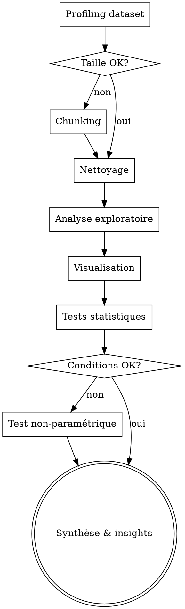

## RÈGLE UNIVERSELLE — LIRE L'INTÉGRALITÉ DU SKILL AVANT D'AGIR

**OBLIGATOIRE : Avant d'exécuter quoi que ce soit, tu DOIS :**
1. Lire l'INTÉGRALITÉ de ce fichier SKILL.md (pas juste le début)
2. Comprendre chaque section, chaque règle, chaque contrainte
3. Respecter ce skill À LA LETTRE — ne rien sauter, ne rien simplifier

**Ne JAMAIS commencer l'exécution sans avoir lu et compris TOUT le skill.**

---

# Skill : Analyse de Données

<HARD-GATE>
JAMAIS d'analyse sans ces étapes préalables :
1. Profiling du dataset (shape, dtypes, nulls, describe) AVANT toute manipulation
2. Vérification de la taille en mémoire AVANT chargement (RAM 12 GB → max ~2 GB dataset)
3. Sauvegarde des graphiques en fichier PNG (JAMAIS de display GUI seul)
4. Vérification des conditions d'application AVANT tout test statistique
</HARD-GATE>

## CHECKLIST OBLIGATOIRE

1. **Profiling** — Charger, shape, dtypes, describe, nulls, head
2. **Nettoyage** — Doublons, types, outliers (IQR + Z-score), imputation
3. **Analyse** — Distributions, corrélations, groupements, séries temporelles
4. **Visualisation** — Graphiques pertinents, `plt.savefig()` obligatoire
5. **Tests statistiques** — Vérifier conditions AVANT, choisir le bon test
6. **Synthèse** — 3 insights clés, anomalies, recommandations

## PROCESS FLOW



---

## Workflow standard

### 1. Exploration initiale
```python
import pandas as pd
import numpy as np

df = pd.read_csv('fichier.csv')  # ou read_excel, read_json
print(df.shape)
print(df.dtypes)
print(df.describe())
print(df.isnull().sum())
print(df.head())
```

### 2. Nettoyage
- Valeurs manquantes : drop ou imputation (médiane pour numérique, mode pour catégoriel)
- Doublons : `df.drop_duplicates()`
- Types incorrects : conversion explicite
- Outliers : IQR ou Z-score

### 3. Analyse
- Distributions : histogrammes, boxplots
- Corrélations : `df.corr()`, heatmap
- Groupements : `groupby()`, pivot tables
- Séries temporelles : resample, rolling means

### 4. Visualisation
Utiliser **matplotlib** ou **plotly** :
```python
import matplotlib.pyplot as plt
# Toujours sauvegarder en fichier (pas de display GUI sur certains envs)
plt.savefig('output.png', dpi=150, bbox_inches='tight')
```

### 5. Synthèse
Toujours conclure avec :
- Les 3 insights les plus importants
- Les anomalies détectées
- Les recommandations

## Backtesting financier
Utiliser **vectorbt** ou **backtrader** pour les stratégies complexes.
Pour les backtests simples : pandas pur (plus léger).

Métriques à calculer systématiquement :
- Return total & annualisé
- Sharpe ratio
- Max drawdown
- Win rate
- Profit factor

## Contraintes machine
RAM 12 GB : éviter de charger des datasets >2 GB en mémoire.
Préférer le chunking pour les gros fichiers : `pd.read_csv(file, chunksize=10000)`

## AUTO-SOURCING DATASETS
Sources publiques à consulter selon le domaine :
- **Finance** : Yahoo Finance API, FRED, FMP, Alpha Vantage
- **Open Data** : data.gouv.fr, Kaggle, UCI ML Repository, World Bank
- **Social** : LunarCrush (crypto), Reddit API, Twitter API
WebSearch "dataset [domaine] public free" si aucune source directe.

## TESTS STATISTIQUES AVANCÉS
| Test | Quand l'utiliser | Condition |
|------|-----------------|-----------|
| t-test | Comparer 2 moyennes | Données normales, N>30 |
| Chi-2 | Association catégorielle | Fréquences attendues >5 |
| ANOVA | Comparer 3+ groupes | Normalité, homoscédasticité |
| Régression linéaire | Relation variable dépendante | Linéarité, résidus normaux |
| Mann-Whitney | 2 groupes non-paramétriques | Distribution non-normale |
| Corrélation Pearson/Spearman | Relation entre 2 variables | Pearson=linéaire, Spearman=monotone |
TOUJOURS vérifier les conditions d'application AVANT d'utiliser un test.

## BACKTESTING AVANCÉ
- **Walk-forward** : entraîner sur fenêtre glissante, tester sur la suivante
- **Monte Carlo** : simuler N scénarios aléatoires pour estimer distribution résultats
- **Bootstrap** : rééchantillonnage avec remplacement pour IC robustes
- **Cross-validation** : k-fold pour éviter overfitting
TOUJOURS reporter : rendement, Sharpe, max drawdown, win rate, profit factor.

## ROUTAGE MULTI-IA — DATA
| Tâche | IA Primaire | Justification |
|-------|------------|---------------|
| Extraction données | Gemini Flash | N°1 format JSON/tableaux |
| Analyse FR | Mistral Large | N°1 français |
| Raisonnement stats | DeepSeek-R1 | Thinking tokens |
| Validation rapide | Groq (2.8s) | Vitesse |
| Vérification croisée | TOUTES en parallèle | Anti-hallucination |

## DÉTECTION OUTLIERS ET NETTOYAGE
Protocole systématique :
1. IQR method : outlier si < Q1-1.5*IQR ou > Q3+1.5*IQR
2. Z-score : outlier si |z| > 3
3. Visualisation : boxplot + scatter pour confirmer visuellement
4. Décision : supprimer / winsoriser / garder avec flag
TOUJOURS documenter les outliers trouvés et la décision prise.

## PROFILING AUTOMATIQUE DE DATASET
Avant toute analyse, TOUJOURS exécuter un profiling :
- Dimensions : N lignes × M colonnes
- Types : numérique, catégoriel, datetime, texte
- Valeurs manquantes : % par colonne, pattern (MCAR/MAR/MNAR)
- Distributions : histogrammes, skewness, kurtosis
- Corrélations : matrice de corrélation top pairs
Lib recommandée : ydata-profiling (ex pandas-profiling)

## SYSTÈME DE CONFIANCE
| Niveau | Critère | Marqueur |
|--------|---------|----------|
| ÉLEVÉ | Données vérifiées + test stat significatif | ✓✓✓ |
| MOYEN | Données fiables, pas de test formel | ✓✓ |
| FAIBLE | Données partielles ou non vérifiées | ✓ |
| SPÉCULATIF | Estimation sans données | ~ |

## MATRICE DE FALLBACK
| Outil principal | Fallback 1 | Fallback 2 |
|----------------|------------|------------|
| pandas-profiling | stats manuelles (describe) | Gemini extraction |
| matplotlib | Plotly interactif | chart_generator.py |
| Alpha Vantage | FMP API | WebSearch données |
| Kaggle dataset | UCI ML | WebSearch "[domaine] dataset" |

---

## ANTI-PATTERNS

| Excuse | Réalité |
|--------|---------|
| "On peut charger tout le dataset en mémoire" | Vérifier la taille AVANT de charger. RAM 12 GB → max ~2 GB dataset. Préférer le chunking pour les gros fichiers. |
| "Les outliers sont du bruit, on supprime" | TOUJOURS analyser les outliers (IQR + Z-score + visuel) AVANT de décider. Certains outliers sont des signaux réels. |
| "Un seul test statistique suffit" | Vérifier les CONDITIONS d'application (normalité, homoscédasticité) AVANT d'utiliser un test. Sinon → test non-paramétrique. |
| "Le graphique matplotlib par défaut est suffisant" | TOUJOURS sauvegarder en fichier PNG (pas de display GUI). Utiliser `dpi=150` et `bbox_inches='tight'`. |

## RED FLAGS — STOP

- Dataset chargé sans profiling préalable → STOP, explorer d'abord (shape, dtypes, nulls)
- Test statistique sans vérification des conditions → STOP, valider les prérequis
- Graphique affiché sans sauvegarde fichier → STOP, toujours `plt.savefig()`

## CROSS-LINKS

| Contexte | Skill |
|----------|-------|
| Données financières | `stock-analysis`, `financial-modeling` |
| Graphiques pour PDF | `pdf-report-gen` |
| Backtesting stratégies | `stock-analysis` |
| Orchestration | `deep-research` |

## ÉVOLUTION

Après chaque analyse de données :
- Si un type de dataset pose problème (encoding, format) → documenter le workaround
- Si une librairie est plus performante que pandas pour un cas → l'ajouter aux alternatives
- Si le profiling automatique est trop lent → ajuster les seuils

Seuils : si > 30% du temps est passé en nettoyage → automatiser les étapes récurrentes.
