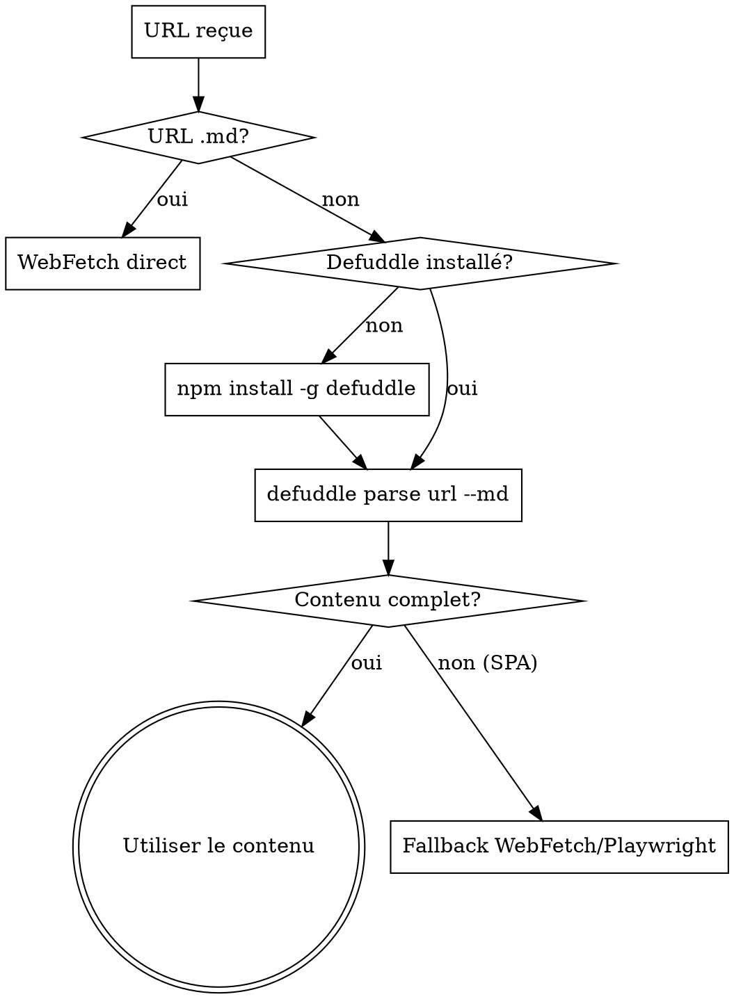

# Defuddle — Extraction Web Propre

Extraire du contenu Markdown propre depuis des pages web, en supprimant navigation, publicités et clutter. Économise 50-80% de tokens vs WebFetch brut.

<HARD-GATE>
Règles NON-NÉGOCIABLES :
1. TOUJOURS utiliser `--md` pour obtenir du Markdown (JAMAIS du HTML brut)
2. JAMAIS utiliser Defuddle sur des URLs `.md` — elles sont déjà en Markdown, utiliser WebFetch
3. Si le contenu extrait est incomplet (SPA, JavaScript-rendered) → fallback WebFetch ou Playwright
</HARD-GATE>

## CHECKLIST OBLIGATOIRE

1. **Vérifier l'URL** — S'assurer que ce n'est PAS une URL `.md` (sinon → WebFetch)
2. **Vérifier installation** — `defuddle --version` ou `npm install -g defuddle` si manquant
3. **Exécuter** — `defuddle parse <url> --md`
4. **Vérifier le contenu** — Le Markdown extrait est-il complet et lisible ?
5. **Fallback** — Si contenu incomplet → WebFetch ou Playwright

## PROCESS FLOW



---

## Installation

```bash
npm install -g defuddle
```

## Usage

```bash
defuddle parse <url> --md                  # Extraction Markdown (TOUJOURS --md)
defuddle parse <url> --md -o content.md    # Sauvegarder dans un fichier
defuddle parse <url> -p title              # Extraire un métadonnée spécifique
defuddle parse <url> -p description
defuddle parse <url> -p domain
```

## Output formats

| Flag | Format |
|------|--------|
| `--md` | Markdown (choix par défaut) |
| `--json` | JSON avec HTML et Markdown |
| (none) | HTML brut (à éviter) |
| `-p <name>` | Métadonnée spécifique |

## When to Use

| Scenario | Tool |
|----------|------|
| Standard web page (article, docs, blog) | **Defuddle** (removes clutter, saves tokens) |
| URL ending in `.md` | WebFetch directly (already markdown) |
| Need full HTML with scripts/styles | WebFetch |
| JavaScript-rendered content (SPA) | WebFetch or Playwright |

## ANTI-PATTERNS

| Excuse | Réalité |
|--------|---------|
| "WebFetch works fine for all pages" | Defuddle removes navigation, ads, and clutter — saving 50-80% tokens vs raw HTML. Use it for standard web pages. |
| "Defuddle works for .md URLs" | URLs ending in `.md` are already markdown. Use WebFetch directly — Defuddle adds no value. |
| "No need for --md flag" | ALWAYS use `--md` for markdown output. Without it, you get raw HTML which wastes tokens. |
| "Defuddle handles all dynamic content" | Defuddle works on static HTML. For JavaScript-rendered SPAs, use Playwright or WebFetch. |

## CROSS-LINKS

| Contexte | Skill |
|----------|-------|
| Alternative for full HTML | WebFetch |
| Website analysis | `website-analyzer` |
| Documentation lookup | Context7 MCP |
| Research pipeline | `deep-research` |

## ÉVOLUTION

Après chaque utilisation de Defuddle :
- Si le contenu extrait est incomplet → vérifier si la page est un SPA (fallback WebFetch)
- Si Defuddle n'est pas installé → `npm install -g defuddle`
- Si un nouveau format de page pose problème → documenter le workaround

Seuils : si extraction incomplète > 30% → préférer WebFetch pour ce type de site.
