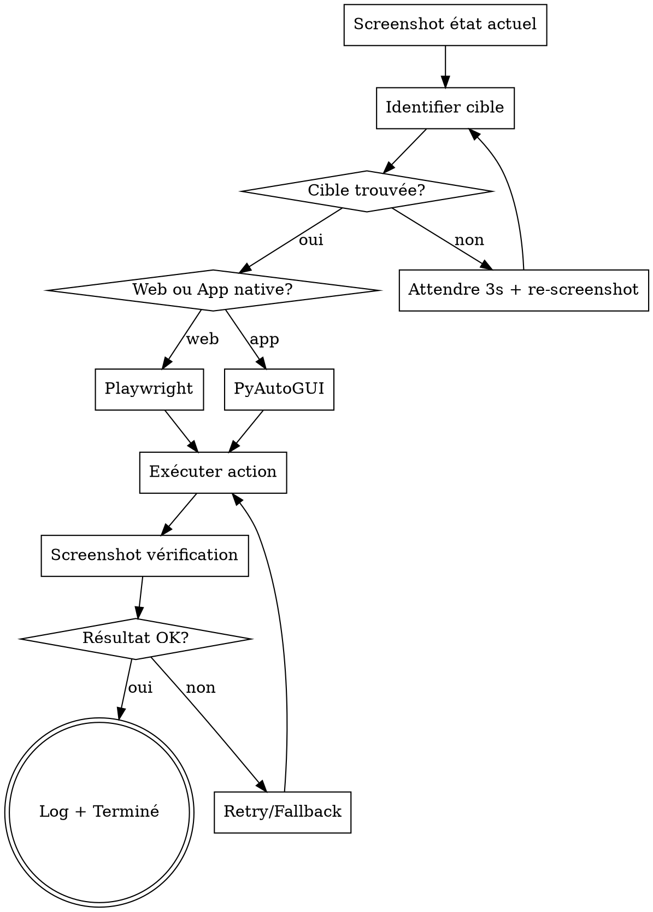

## RÈGLE UNIVERSELLE — LIRE L'INTÉGRALITÉ DU SKILL AVANT D'AGIR

**OBLIGATOIRE : Avant d'exécuter quoi que ce soit, tu DOIS :**
1. Lire l'INTÉGRALITÉ de ce fichier SKILL.md (pas juste le début)
2. Comprendre chaque section, chaque règle, chaque contrainte
3. Respecter ce skill À LA LETTRE — ne rien sauter, ne rien simplifier

**Ne JAMAIS commencer l'exécution sans avoir lu et compris TOUT le skill.**

---

# Skill : Contrôle du Bureau Windows

<HARD-GATE>
JAMAIS d'action bureau sans ces prérequis :
1. `pyautogui.FAILSAFE = True` TOUJOURS activé
2. Screenshot AVANT chaque action pour vérifier l'état du bureau
3. Screenshot APRÈS chaque action pour vérifier le résultat
4. Confirmation utilisateur AVANT toute action destructive (supprimer, envoyer)
</HARD-GATE>

## CHECKLIST OBLIGATOIRE

1. **Screenshot** — Capturer l'état actuel du bureau
2. **Identifier** — Localiser l'élément cible (coordonnées ou image)
3. **Choisir l'outil** — Playwright pour le web, PyAutoGUI pour les apps natives
4. **Agir** — Exécuter l'action avec retry max 2x + backoff 2s
5. **Vérifier** — Screenshot post-action, comparer avec l'attendu

## PROCESS FLOW



---

## Deux outils disponibles

### 1. Playwright (navigateur web) — PRÉFÉRÉ pour tout ce qui est web
Utilise les outils MCP Playwright directement.

**Ouvrir une page web :**
→ `mcp__playwright__browser_navigate` avec l'URL

**Cliquer sur un élément :**
→ `mcp__playwright__browser_snapshot` pour voir la page, puis `mcp__playwright__browser_click` avec le ref

**Remplir un formulaire :**
→ `mcp__playwright__browser_fill_form`

**Screenshot :**
→ `mcp__playwright__browser_take_screenshot`

### 2. PyAutoGUI (bureau Windows) — pour les apps natives
Utilise via Bash avec Python.

**Python path** : `C:/Users/Alexandre collenne/AppData/Local/Programs/Python/Python313/python.exe`

**Exemples d'actions :**

```python
# Ouvrir une application
import subprocess
subprocess.Popen(['notepad.exe'])

# Clic à une position
import pyautogui
pyautogui.click(x=500, y=300)

# Taper du texte
pyautogui.typewrite('texte à taper', interval=0.05)

# Screenshot du bureau
screenshot = pyautogui.screenshot()
screenshot.save('desktop_screenshot.png')

# Raccourci clavier
pyautogui.hotkey('ctrl', 'c')

# Trouver une image sur l'écran
location = pyautogui.locateOnScreen('bouton.png', confidence=0.8)
```

## Workflow pour les tâches complexes

1. **Screenshot** d'abord pour voir l'état du bureau
2. **Identifier** l'élément cible (coordonnées ou image)
3. **Agir** avec PyAutoGUI ou Playwright
4. **Vérifier** avec un nouveau screenshot

## Ouvrir des fichiers Windows

```bash
# Via Bash (méthode la plus simple)
start "C:/chemin/vers/fichier.xlsx"
# Ou
cmd /c start "" "C:/chemin/vers/fichier.pdf"
```

## Règles de sécurité
- Toujours confirmer avec l'utilisateur avant des actions destructives (supprimer, envoyer)
- Ajouter `pyautogui.FAILSAFE = True` (déplacer souris coin haut-gauche pour stopper)
- Préférer Playwright pour le web (plus fiable et précis)
- Éviter PyAutoGUI sur des zones sensibles sans confirmation


## MATRICE ROUTAGE MCP
| Action | MCP Principal | Fallback | Quand utiliser |
|--------|--------------|----------|----------------|
| Lire/écrire fichier | Desktop Commander (read_file/write_file) | Windows-MCP FileSystem | Toujours Desktop Commander d'abord |
| Exécuter commande | Desktop Commander (start_process) | Windows-MCP PowerShell | DC pour bash, WinMCP pour PowerShell |
| Cliquer/taper | Windows-MCP (Click/Type) | Claude in Chrome (computer) | WinMCP pour Windows, Chrome pour navigateur |
| Screenshot | Windows-MCP (Screenshot) | Claude in Chrome (computer) | WinMCP pour bureau, Chrome pour page web |
| Naviguer web | Claude in Chrome (navigate) | Desktop Commander (start_process chrome) | Chrome MCP prioritaire |
| Lister processus | Desktop Commander (list_processes) | Windows-MCP Process | Équivalents |

## GESTION ERREURS ROBUSTE
Pour chaque action :
1. Essayer l'action principale
2. Si échec → log l'erreur + retry 1x après 2s
3. Si 2e échec → basculer sur fallback MCP
4. Si fallback échoue → signaler à l'utilisateur avec diagnostic
Pattern retry : max 2 tentatives, backoff 2s entre chaque.

## LOGGING STRUCTURÉ DES ACTIONS
Chaque action doit être loggée :
[TIMESTAMP] ACTION: [type] | MCP: [nom] | CIBLE: [élément] | RÉSULTAT: [succès/échec] | DÉTAIL: [info]

## VÉRIFICATION PRÉ-ACTION
Avant chaque action interactive :
1. Screenshot pour vérifier l'état actuel
2. Identifier l'élément cible (visible ? cliquable ?)
3. Si élément non trouvé → attendre 3s + re-screenshot
4. Si toujours absent → signaler erreur

## VÉRIFICATION POST-ACTION
Après chaque action :
1. Screenshot pour vérifier le résultat
2. Comparer avec l'état attendu
3. Si résultat inattendu → log + retry ou fallback

## TEMPLATES AUTOMATISATION
| Tâche courante | Séquence MCP |
|---------------|-------------|
| Ouvrir app + fichier | App(open) → Wait(2s) → Screenshot(vérif) |
| Copier-coller | Click(source) → Shortcut(Ctrl+C) → Click(dest) → Shortcut(Ctrl+V) |
| Remplir formulaire | Click(champ1) → Type(valeur1) → Click(champ2) → Type(valeur2) |
| Naviguer web | Chrome.navigate(url) → Wait(load) → Chrome.read_page |


## ROUTAGE MULTI-IA — DESKTOP CONTROL
| Tâche | IA Primaire | Justification |
|-------|------------|---------------|
| Automatisation code | Gemini Flash | N°1 code 10/10 |
| Instructions FR | Mistral Large | N°1 français |
| Debug automatisation | DeepSeek-R1 | Raisonnement profond |

## SYSTÈME DE CONFIANCE ACTIONS
| Niveau | Critère | Marqueur |
|--------|---------|----------|
| ÉLEVÉ | Action vérifiée par screenshot post-action | ✓✓✓ |
| MOYEN | Action exécutée sans vérification visuelle | ✓✓ |
| FAIBLE | Action tentée avec retry | ✓ |
| SPÉCULATIF | Élément cible non confirmé visuellement | ~ |

---

## ANTI-PATTERNS

| Excuse | Réalité |
|--------|---------|
| "PyAutoGUI pour tout, c'est plus simple" | Playwright est TOUJOURS préféré pour le web (plus fiable, précis, pas de dépendance aux coordonnées écran). |
| "Pas besoin de screenshot avant de cliquer" | TOUJOURS vérifier l'état du bureau avant et après chaque action. Les coordonnées changent selon la résolution. |
| "Un seul essai suffit" | Pattern retry obligatoire : 2 tentatives max avec backoff 2s, puis fallback MCP alternatif. |
| "Les actions automatisées sont sûres" | TOUJOURS `pyautogui.FAILSAFE = True`. Les actions destructives nécessitent confirmation utilisateur. |

## RED FLAGS — STOP

- Action destructive (supprimer, envoyer) sans confirmation utilisateur → STOP
- Clic sur coordonnées sans screenshot préalable → STOP, vérifier d'abord
- FAILSAFE désactivé → STOP, réactiver immédiatement

## CROSS-LINKS

| Contexte | Skill |
|----------|-------|
| Automatisation web | Playwright MCP |
| Screenshots pour analyse | `image-enhancer` (si amélioration nécessaire) |
| Debug d'automatisation | `code-debug` |
| Orchestration | `deep-research` |

## ÉVOLUTION

Après chaque session de contrôle bureau :
- Si PyAutoGUI échoue sur une résolution spécifique → documenter les coordonnées alternatives
- Si un MCP est plus fiable qu'un autre → mettre à jour la matrice de routage
- Si une tâche d'automatisation est récurrente → créer un template dédié

Seuils : si taux d'échec actions > 20% → revoir la stratégie de vérification pré/post-action.

## LIVRABLE FINAL

- **Type** : PDF
- **Généré par** : pdf-report-pro
- **Destination** : acollenne@gmail.com via send_report.py

## CHAÎNAGE ARBORESCENCE

- **Amont** : deep-research (entrée unique)
- **Aval** : pdf-report-pro

