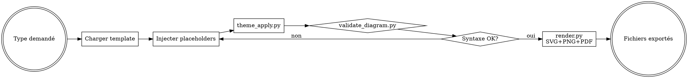

# Skill : diagram-toolkit — Bibliothèque technique de schémas pro

Bibliothèque partagée fournissant templates, thèmes et outils CLI pour générer, styliser et exporter des diagrammes professionnels. **Ce skill n'est pas auto-invoqué** — il est consommé par `idea-to-diagram` et peut être appelé manuellement.

<HARD-GATE>
1. Tout diagramme généré via ce toolkit DOIT utiliser un template (`templates/`) et un thème (`themes/`)
2. Tout export DOIT passer par `tools/render.py` (uniformité)
3. Aucun hardcode de couleur — toujours via `theme_apply.py`
4. Fallback Mermaid obligatoire si l'outil primaire est indisponible
</HARD-GATE>

---

## CHECKLIST OBLIGATOIRE (TodoWrite)

1. **Identifier le type** de diagramme demandé — catalogue étendu (43 templates : 31 Mermaid/D2/Dot/Typst + 12 HTML) :
   - **Structure/hiérarchie** : `pyramid`, `mece-tree`, `org-chart`, `wbs`, `mindmap`
   - **Processus/flux** : `scqa`, `kanban`, `user-journey`, `sankey`
   - **Temporel** : `sequence`, `timeline`, `gantt`, `roadmap`
   - **États & données** : `state-machine`, `er-diagram`
   - **Causes-effets** : `fishbone`, `causal-loop`
   - **Matrices 2×2** : `matrix-2x2`, `bcg-matrix`, `swot`, `ansoff`, `eisenhower`, `impact-effort`, `stakeholder-map`
   - **Composition** : `venn`
   - **Stratégie business** : `porter-five-forces`, `value-chain`, `business-model-canvas`, `golden-circle`
   - **Responsabilités** : `raci`
   - **Architecture** : `c4-context`
   - **HTML stratégiques** : `pyramid`, `swot`, `bcg-matrix`, `matrix-2x2`, `mece-tree`, `porter-five-forces`, `value-chain`, `bmc`, `golden-circle`, `scqa`, `process-flow`, `fishbone` (via `render_html.py`)
2. **Charger le template** correspondant depuis `templates/` (`.mmd`, `.d2`, `.dot`, `.typ` ou `.html`)
3. **Injecter le contenu** dans les placeholders (`{{SO_WHAT}}`, `{{ARG_1}}`, etc.)
4. **Appliquer le thème** via `tools/theme_apply.py`
5. **Valider la syntaxe** via `tools/validate_diagram.py`
6. **Rendre** via `tools/render.py` en SVG + PNG + PDF
7. **Retourner les chemins** des fichiers générés au skill appelant

## PROCESS FLOW



## STRUCTURE

```
diagram-toolkit/
├── SKILL.md                  (ce fichier)
├── templates/                (templates par type de schema)
│   ├── pyramid.mmd
│   ├── scqa.mmd
│   ├── mece-tree.mmd
│   ├── matrix-2x2.mmd        (BCG, Eisenhower, SWOT)
│   ├── c4-context.d2
│   ├── fishbone.dot
│   ├── causal-loop.dot
│   ├── roadmap.mmd           (gantt)
│   ├── sequence.mmd
│   ├── venn.typ
│   ├── pyramid.html           (HTML — hierarchie strategique)
│   ├── swot.html              (HTML — matrice SWOT)
│   ├── bcg-matrix.html        (HTML — matrice BCG)
│   ├── matrix-2x2.html        (HTML — matrice generique 2x2)
│   ├── mece-tree.html         (HTML — arbre MECE)
│   ├── porter-five-forces.html (HTML — Porter 5 forces)
│   ├── value-chain.html       (HTML — chaine de valeur)
│   ├── bmc.html               (HTML — Business Model Canvas)
│   ├── golden-circle.html     (HTML — Golden Circle)
│   ├── scqa.html              (HTML — narratif SCQA)
│   ├── process-flow.html      (HTML — flux processus)
│   └── fishbone.html          (HTML — Ishikawa)
├── themes/                   (themes couleurs + typo)
│   ├── mckinsey.json
│   ├── bcg.json
│   ├── monochrome.json
│   └── dark.json
└── tools/                    (scripts CLI)
    ├── render.py             (multi-format : mmdc, d2, dot, typst)
    ├── render_html.py        (rendu HTML → PNG/PDF via Playwright)
    ├── theme_apply.py        (injection variables CSS/config)
    └── validate_diagram.py   (parse syntaxe)
```

---

## USAGE

### Rendre un diagramme

```bash
python "C:/Users/Alexandre collenne/.claude/skills/diagram-toolkit/tools/render.py" \
  --input diagram.mmd \
  --format svg,png,pdf \
  --theme mckinsey \
  --output ./out/
```

**Formats supportés** : `svg`, `png` (scale 2x par defaut), `pdf` (A4 paysage).

**Themes disponibles** : `mckinsey`, `bcg`, `monochrome`, `dark`.

### Rendre un diagramme HTML

```bash
python "C:/Users/Alexandre collenne/.claude/skills/diagram-toolkit/tools/render_html.py" \
  --input diagram.html \
  --format png,pdf \
  --theme mckinsey \
  --output ./out/
```

**Moteur** : Playwright (Chromium headless). Charge le fichier HTML, injecte les variables CSS du theme, capture en PNG 2x et/ou PDF A4 paysage.

**Avantages HTML vs Mermaid** : controle pixel-perfect, ombres/border-radius/gradients, layouts CSS Grid/Flexbox, meilleur rendu des frameworks strategiques (matrices, BMC, Porter).

### Appliquer un thème

```bash
python "C:/Users/Alexandre collenne/.claude/skills/diagram-toolkit/tools/theme_apply.py" \
  --input diagram.mmd \
  --theme mckinsey \
  --output diagram_themed.mmd
```

### Valider la syntaxe

```bash
python "C:/Users/Alexandre collenne/.claude/skills/diagram-toolkit/tools/validate_diagram.py" \
  --input diagram.mmd
```

---

## TEMPLATES DISPONIBLES

| Type | Fichier | Outil | Usage |
|------|---------|-------|-------|
| Pyramid Principle | `pyramid.mmd` | Mermaid `graph TD` | Hiérarchie top-down |
| SCQA narrative | `scqa.mmd` | Mermaid `graph LR` | Narratif problème→solution |
| MECE tree | `mece-tree.mmd` | Mermaid `graph TD` | Décomposition exhaustive |
| Matrix 2x2 | `matrix-2x2.mmd` | Mermaid `quadrantChart` | BCG, Eisenhower, SWOT |
| C4 Context | `c4-context.d2` | D2 | Architecture système |
| Fishbone | `fishbone.dot` | Graphviz | Ishikawa / causes-effets |
| Causal loop | `causal-loop.dot` | Graphviz `neato` | Dynamique système |
| Roadmap | `roadmap.mmd` | Mermaid `gantt` | Planning temporel |
| Sequence | `sequence.mmd` | Mermaid `sequenceDiagram` | Interactions séquentielles |
| Venn | `venn.typ` | Typst+CeTZ | Intersections ensembles |

### Templates HTML (12 — rendu via `render_html.py` + Playwright)

| Type | Fichier | Layout | Usage |
|------|---------|--------|-------|
| Pyramid Principle | `pyramid.html` | CSS Grid hierarchique | Hierarchie strategique top-down |
| SWOT | `swot.html` | CSS Grid 2x2 | Matrice forces/faiblesses/opportunites/menaces |
| BCG Matrix | `bcg-matrix.html` | CSS Grid 2x2 + bulles | Stars/Cash cows/Dogs/Question marks |
| Matrix 2x2 generique | `matrix-2x2.html` | CSS Grid 2x2 | Eisenhower, Impact/Effort, Ansoff |
| MECE Tree | `mece-tree.html` | Flexbox nested | Decomposition exhaustive |
| Porter Five Forces | `porter-five-forces.html` | CSS Grid radial | 5 forces concurrentielles |
| Value Chain | `value-chain.html` | CSS Grid horizontal | Activites primaires + support |
| Business Model Canvas | `bmc.html` | CSS Grid 9 blocs | 9 composants Osterwalder |
| Golden Circle | `golden-circle.html` | Cercles concentriques CSS | Why/How/What (Sinek) |
| SCQA Narrative | `scqa.html` | Flexbox horizontal | Situation/Complication/Question/Answer |
| Process Flow | `process-flow.html` | Flexbox + fleches CSS | Flux etapes sequentielles |
| Fishbone (Ishikawa) | `fishbone.html` | SVG inline + CSS | Causes-effets 6M |

**Quand utiliser HTML vs Mermaid** : privilegier HTML pour les frameworks strategiques (matrices, BMC, Porter, Value Chain) ou l'on a besoin de controle pixel-perfect, ombres, cards, gradients. Privilegier Mermaid pour les diagrammes techniques (sequence, state, ER, gantt).

---

## THEMES PROFESSIONNELS

| Thème | Primaire | Secondaire | Accent | Usage |
|-------|----------|------------|--------|-------|
| **McKinsey** | `#002060` | `#0F62FE` | `#6C6C6C` | Corporate, strategy |
| **BCG** | `#00543C` | `#00A77D` | `#6C6C6C` | Consulting, growth |
| **Monochrome** | `#1A1A1A` | `#6C6C6C` | `#BDBDBD` | Print, presse |
| **Dark** | `#0D1117` fg `#F0F6FC` | `#58A6FF` | `#FFA657` | Slides dark mode |

### Proprietes enrichies (HTML rendering)

Les themes JSON incluent des proprietes supplementaires utilisees par `render_html.py` et les templates HTML :

| Propriete | Description | Exemple (McKinsey) |
|-----------|-------------|-------------------|
| `shadow` | Box-shadow CSS pour les cards/blocs | `0 2px 8px rgba(0,0,0,0.12)` |
| `border_radius` | Rayon des coins des elements | `8px` |
| `card_bg` | Couleur de fond des cartes | `#FFFFFF` |
| `card_border` | Bordure des cartes | `1px solid #E0E0E0` |
| `font_family` | Police principale | `"Inter", "Segoe UI", sans-serif` |
| `font_size_base` | Taille texte de base | `14px` |
| `font_size_title` | Taille des titres | `24px` |
| `font_size_subtitle` | Taille des sous-titres | `16px` |
| `gradient_primary` | Gradient principal (headers) | `linear-gradient(135deg, #002060, #0F62FE)` |
| `bg_color` | Couleur de fond globale | `#F5F5F5` |
| `text_color` | Couleur du texte principal | `#1A1A1A` |
| `text_muted` | Couleur du texte secondaire | `#6C6C6C` |

Ces proprietes sont injectees comme variables CSS (`--theme-primary`, `--theme-shadow`, etc.) par `render_html.py` avant le rendu Playwright.

---

## ANTI-PATTERNS

| Excuse | Réalité |
|--------|---------|
| "Je hardcode les couleurs, c'est plus simple" | NON — passer par themes/ |
| "Pas besoin de template, je fais from scratch" | NON — templates = cohérence |
| "Mermaid c'est limité, je prends toujours D2" | NON — Mermaid par défaut (portabilité) |
| "Export uniquement en PNG" | NON — SVG+PNG+PDF obligatoire |

---

## CROSS-LINKS

| Contexte | Skill à invoquer |
|----------|------------------|
| Orchestration complète idée→schéma | `idea-to-diagram` |
| Intégration rapport | `pdf-report-pro` |
| Slides | `ppt-creator` |

## ÉVOLUTION

Ce skill s'auto-améliore via RETEX. Après chaque session :

**Métriques à tracker** :
- Taux de rendu réussi au 1er essai (cible : >90%)
- Templates les plus/moins utilisés → identifier les gaps
- Erreurs de syntaxe récurrentes → enrichir `validate_diagram.py`

**Actions d'amélioration** :
- Si un type de diagramme n'a pas de template dédié → créer le template dans `templates/`
- Si un thème est régulièrement customisé → ajouter une variante dans `themes/`
- Si un CLI manque souvent → documenter le fallback dans `tools/render.py`
- Si un rendu échoue répétitivement → ajouter un test dans `validate_diagram.py`

```bash
python "C:/Users/Alexandre collenne/.claude/tools/retex_manager.py" save diagram_toolkit \
  --quality [score] --tools-used "[render.py,theme_apply.py]" --notes "[leçons]"
```

## TRIGGERS / NO-TRIGGERS (testabilité)

### Scénarios TRIGGER (ce skill DOIT être invoqué)
| Prompt | Attendu |
|--------|---------|
| "Rends ce diagramme Mermaid en PNG avec le thème McKinsey" | diagram-toolkit activé (render.py + theme_apply.py) |
| "Applique le thème BCG à mon fishbone.dot" | diagram-toolkit activé (theme_apply.py) |
| "Valide la syntaxe de ce fichier .mmd" | diagram-toolkit activé (validate_diagram.py) |
| "Exporte ce schéma en SVG + PDF" | diagram-toolkit activé (render.py multi-format) |

### Scénarios NO-TRIGGER (ce skill NE DOIT PAS être invoqué)
| Prompt | Skill correct |
|--------|--------------|
| "Fais-moi un schéma de l'architecture du projet" | idea-to-diagram (orchestrateur) |
| "Crée un diagramme SWOT pour mon entreprise" | idea-to-diagram → diagram-toolkit |
| "Génère une image IA d'un paysage" | image-generator |

## LIVRABLE FINAL

- **Type** : SVG + PNG + PDF (bibliotheque technique, pas de livrable final direct)
- **Genere par** : `tools/render.py` (mmdc, d2, dot, typst) + `tools/render_html.py` (Playwright pour templates HTML)
- **Templates** : 43 au total (31 Mermaid/D2/Dot/Typst + 12 HTML)
- **Themes** : 4 (McKinsey, BCG, Monochrome, Dark) avec proprietes enrichies pour HTML
- **Destination** : consomme par `idea-to-diagram`
- **QA** : layout-qa obligatoire cote `idea-to-diagram` avant export final

## CHAINAGE ARBORESCENCE

- **Amont** : idea-to-diagram (orchestrateur principal)
- **Aval** : envoi via send_report.py par le skill appelant
- **Couche** : L3 SPECIALIST (bibliotheque technique)
- **Dependencies** : Playwright (pour render_html.py), mmdc, d2, dot, typst (pour render.py)
