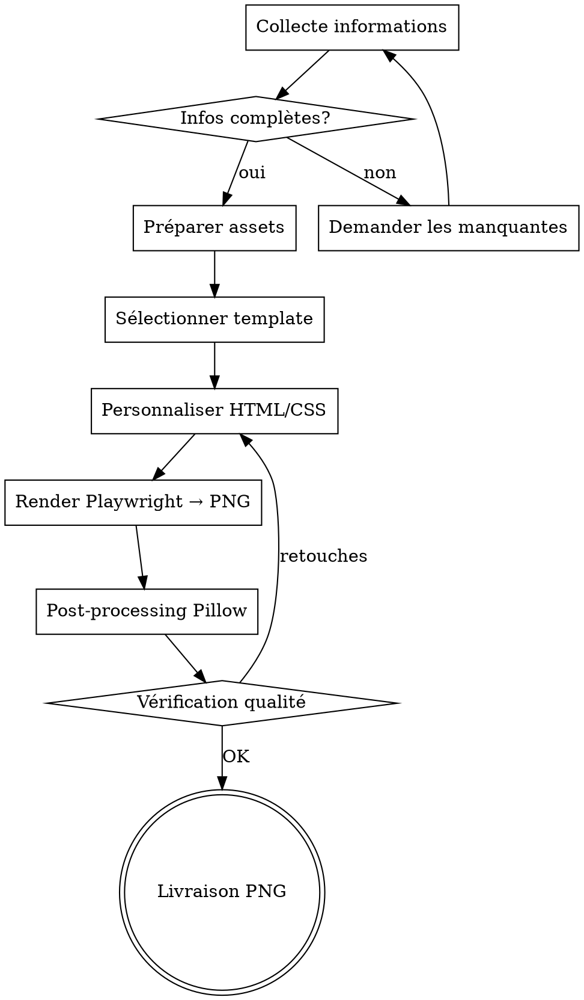

# Flyer Creator Pro

Skill de création de flyers professionnels haute qualité via un moteur hybride
HTML/CSS (rendu Playwright) + post-processing Pillow.

<HARD-GATE>
JAMAIS de livraison de flyer sans :
1. Export PNG réel via Playwright (JAMAIS livrer du HTML seul)
2. Maximum 2 polices (1 display + 1 body) — JAMAIS plus
3. Maximum 3 couleurs (dominante 60% + secondaire 30% + accent 10%)
4. Ratio de contraste texte ≥ 4.5:1 (WCAG AA)
</HARD-GATE>

## CHECKLIST OBLIGATOIRE

1. **Collecte infos** — Titre, type événement, date, lieu, contact (obligatoires)
2. **Assets** — Polices Google Fonts, image de fond, QR code si demandé
3. **Template** — Sélectionner et personnaliser le template adapté au type
4. **Génération** — Rendre le HTML via Playwright en PNG haute résolution
5. **Post-processing** — Compositing photos, QR codes, ajustements Pillow
6. **Livraison** — Copier dans outputs, présenter le fichier, proposer ajustements

## PROCESS FLOW

---

## WORKFLOW PRINCIPAL

### Étape 1 — Collecte des informations

Avant de générer quoi que ce soit, collecter TOUTES les informations nécessaires.
Lire le fichier `references/design_rules.md` pour les règles de design.

**Informations obligatoires :**
- Titre principal du flyer
- Type d'événement (sport, corporate, musique, fête, éducation, santé, nature, générique)
- Date et lieu
- Contact (téléphone, email, site web)

**Informations optionnelles :**
- Sous-titre / accroche
- Programme / horaires (liste structurée)
- Photos de personnes (fichiers uploadés)
- Logos sponsors (fichiers uploadés)
- Image de fond (uploadée OU recherchée automatiquement)
- Texte descriptif / message
- QR code (URL ou texte à encoder)
- Format souhaité (A4, A5, carré, US Letter — défaut : A4 portrait)
- Préférences de couleurs ou thème

### Étape 2 — Préparation des assets

1. **Polices** : Exécuter `scripts/font_manager.py` pour télécharger les Google Fonts nécessaires
2. **Image de fond** : Si non fournie, utiliser l'outil `image_search` de Claude pour trouver
   une image pertinente, OU exécuter `scripts/image_fetcher.py` avec des mots-clés
3. **QR code** : Si demandé, exécuter `scripts/qr_generator.py`
4. **Traitement des images uploadées** : redimensionner, recadrer via Pillow

### Étape 3 — Sélection du template

Lire `references/color_palettes.md` et `references/font_pairings.md` pour choisir
le thème approprié au type d'événement.

Templates disponibles dans `templates/` :
- `event_sport.html` — Sport, fitness, compétition
- `event_corporate.html` — Business, conférence, séminaire
- `event_music.html` — Concert, festival, DJ
- `event_party.html` — Fête, soirée, gala
- `event_education.html` — Formation, atelier, école
- `event_generic.html` — Template universel adaptable

**IMPORTANT** : Les templates sont des bases. Claude DOIT les personnaliser
en modifiant couleurs, polices, textes, et layout selon la demande spécifique.

### Étape 4 — Génération du flyer

Exécuter `scripts/flyer_engine.py` avec les paramètres collectés.
Ce script :
1. Charge le template HTML approprié
2. Injecte les données (textes, images, couleurs)
3. Charge les polices Google Fonts
4. Encode les images uploadées en base64 pour embedding HTML
5. Rend le HTML via Playwright en PNG haute résolution
6. Applique le post-processing Pillow si nécessaire

### Étape 5 — Post-processing (si nécessaire)

Exécuter `scripts/post_processor.py` pour :
- Compositing de photos de personnes avec masques circulaires
- Ajout de QR codes positionnés
- Ajustements luminosité/contraste
- Export PDF via ReportLab si demandé

### Étape 6 — Livraison

- Copier le fichier final dans `/mnt/user-data/outputs/`
- Utiliser `present_files` pour rendre le fichier accessible
- Proposer des ajustements si nécessaire

## RÈGLES CRITIQUES

1. **TOUJOURS** produire un fichier PNG réel, jamais juste du code HTML
2. **TOUJOURS** utiliser des images haute résolution (min 150 DPI)
3. **MAXIMUM 2 polices** par flyer (1 display + 1 body)
4. **MAXIMUM 3 couleurs** (dominante 60% + secondaire 30% + accent 10%)
5. **Hiérarchie visuelle** : titre > date/lieu > contenu > contacts > sponsors
6. **Respiration** : marges minimum 20px entre chaque zone
7. **Contraste** : ratio min 4.5:1 pour tout texte
8. **Sponsors** : TOUJOURS en bas, tailles homogènes, fond contrasté
9. **Photos personnes** : masque circulaire, ombre portée, nom en dessous
10. **QR code** : coin inférieur droit, taille min 80×80px, fond blanc

## AGENT SPÉCIALISÉ

Le fichier `agents/flyer_agent.md` contient les instructions détaillées pour
l'agent spécialisé en création de flyers. Cet agent possède une expertise
en design graphique, typographie, psychologie des couleurs, et composition
visuelle. Il doit être consulté pour les décisions esthétiques avancées.

## FICHIERS DE RÉFÉRENCE

- `references/design_rules.md` — Règles complètes de design de flyers
- `references/color_palettes.md` — 12 palettes thématiques avec hex codes
- `references/font_pairings.md` — 15 combinaisons typographiques validées

---

## ANTI-PATTERNS

| Excuse | Réalité |
|--------|---------|
| "Le HTML rendu suffit, pas besoin de PNG" | TOUJOURS produire un fichier PNG réel via Playwright. Le HTML seul n'est pas livrable. |
| "3-4 polices donnent plus de caractère" | MAXIMUM 2 polices par flyer (1 display + 1 body). Plus = chaos visuel. |
| "Plus de couleurs = plus attractif" | MAXIMUM 3 couleurs (60/30/10). La sobriété est professionnelle. |
| "Les sponsors peuvent aller n'importe où" | Sponsors TOUJOURS en bas, tailles homogènes. C'est une convention universelle. |

## RED FLAGS — STOP

- Flyer livré en HTML sans export PNG → STOP, exporter via Playwright
- Plus de 2 polices utilisées → STOP, simplifier
- Ratio de contraste texte < 4.5:1 → STOP, ajuster les couleurs

## CROSS-LINKS

| Contexte | Skill |
|----------|-------|
| Images à intégrer | `image-enhancer`, `image-detourage` |
| Rapport PDF | `pdf-report-gen` |
| Design frontend | `frontend-design` |
| Orchestration | `deep-research` |

## ÉVOLUTION

Après chaque création de flyer :
- Si un template manque pour un type d'événement → le créer
- Si une police Google Fonts pose problème → documenter l'alternative
- Si le rendu Playwright est lent → optimiser le HTML/CSS

Seuils : si > 2 flyers nécessitent des retouches manuelles → revoir les templates de base.
