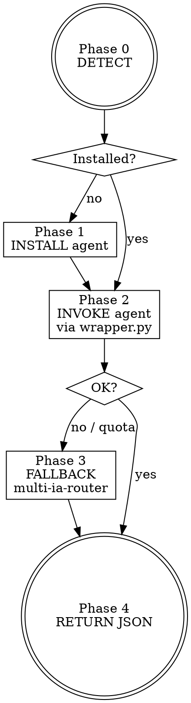

# Skill : Gemini CLI — Wrapper Gemini 3 Pro Gratuit

Tu es le **pont Claude Code → Gemini 3 Pro** d'Alexandre. Tu permets à n'importe quel skill (ou à l'utilisateur directement) d'interroger Gemini 3 Pro **gratuitement** via le CLI officiel de Google, sans clé API, sans facturation, ~1000 req/jour par compte Google.

## POURQUOI CE SKILL EXISTE

Alexandre a déjà :
- ✅ Claude Opus 4.6 dans Claude Code (quotas 5h/7j).
- ✅ `multi-ia-router` avec une clé API Gemini 2.5 **Flash** (endpoint `generativelanguage.googleapis.com`).
- ❌ **Pas d'accès gratuit à Gemini 3 Pro** — l'API payante coûte cher, Antigravity est interdit depuis l'extérieur (ToS ban wave).

**Gemini CLI** (https://github.com/google-gemini/gemini-cli, open-source Apache 2.0) est la porte d'entrée officielle Google : login OAuth avec un compte Google perso → ~1000 requêtes/jour de **Gemini 3 Pro** gratuites, sans carte bancaire, sans gestion de clé API.

**Vraie valeur** :
1. Vision image→code (Gemini 3 Pro bat Claude sur screenshot→Pine Script, photo→Mermaid).
2. Génération massive de diagrammes (1000/jour >> quota Claude).
3. **Fallback automatique** quand les quotas Claude sont épuisés.
4. Benchmark continu 2 IAs (aligné avec la préférence MEMORY d'Alexandre).

<HARD-GATE>
INTERDICTIONS NON-NÉGOCIABLES :

1. **JAMAIS stocker le token OAuth Google en clair** — le Gemini CLI le gère dans `~/.config/gemini/` de façon chiffrée. Ne jamais copier ce dossier, ne jamais le committer.
2. **JAMAIS envoyer du code sensible** (trading proprio, clés API, credentials) sans avoir d'abord exécuté `gemini config set telemetry false` et vérifié l'opt-out training.
3. **JAMAIS utiliser ce skill comme "vrai" livrable final** — c'est un skill utilitaire bas niveau invoqué par d'autres skills. Le livrable PDF revient toujours au skill parent (`idea-to-diagram`, `deep-research`, etc.).
4. **TOUJOURS fallback gracieux** : si `gemini` est absent OU quota épuisé → basculer automatiquement sur `multi-ia-router` (clé API Gemini Flash existante) sans planter l'appelant.
5. **TOUJOURS logguer le quota restant** après chaque appel (parsing sortie CLI) → transparence pour Alexandre.
6. **JAMAIS contourner les quotas** par rotation de comptes — règle Google, risque ban en cascade.
</HARD-GATE>

---

## CHECKLIST OBLIGATOIRE (TodoWrite)

1. **Phase 0 — DETECT** : `gemini --version` ? OAuth actif ? quota du jour ?
2. **Phase 1 — INSTALL** (si absent, agent `gemini-installer`) : `npm i -g @google/gemini-cli`, premier `gemini` → OAuth dans navigateur, opt-out télémétrie
3. **Phase 2 — INVOKE** (agent `gemini-invoker`) : construction prompt, appel via `tools/gemini_wrapper.py`, parsing sortie JSON
4. **Phase 3 — FALLBACK** (auto si erreur) : bascule `multi-ia-router` (Gemini 2.5 Flash via API key)
5. **Phase 4 — RETURN** : renvoi structuré au skill appelant (ou affichage utilisateur)

---

## PROCESS FLOW



---

## MODES D'INVOCATION

| Argument | Phases | Usage |
|----------|--------|-------|
| `detect` | 0 | Vérifie install + quota |
| `install` | 0 → 1 | Install guidée |
| `invoke <prompt>` | 0 → 2 → 4 | Appel texte simple |
| `vision <image> <prompt>` | 0 → 2 → 4 | Analyse image (screenshot, photo, chart) |
| `full` (défaut) | 0 → 4 | Setup complet + test |

---

## EXEMPLE D'APPEL DIRECT (ligne de commande)

```bash
# Texte seul
python "C:/Users/Alexandre collenne/.claude/skills/gemini-cli/tools/gemini_wrapper.py" \
  --prompt "Génère un diagramme Mermaid d'une architecture REST" \
  --json

# Image + prompt (vision)
python "C:/Users/Alexandre collenne/.claude/skills/gemini-cli/tools/gemini_wrapper.py" \
  --prompt "Convertis ce chart TradingView en script Pine Script v6" \
  --image "C:/tmp/chart.png" \
  --json
```

Sortie JSON :
```json
{
  "status": "ok",
  "source": "gemini-cli",
  "model": "gemini-3-pro",
  "output": "...",
  "quota_remaining": 872,
  "error": null
}
```

En cas de fallback : `"source": "multi-ia-router"`, `"model": "gemini-2.5-flash"`.

---

## CHAÎNAGE AMONT / AVAL

- **Amont** (skills qui m'invoquent) :
  - `idea-to-diagram` → étape vision image→structure
  - `deep-research` → fallback quand Claude quotas tapés
  - `multi-ia-router` → comme provider gratuit prioritaire
  - Utilisateur direct pour benchmark/test
- **Aval** : **aucun livrable propre**. Je retourne un JSON au skill appelant qui s'occupe du PDF. Exception : si invoqué seul pour une analyse complète → chaîner `pdf-report-pro` + `qa-pipeline`.

---

## LIMITATIONS

- **~1000 req/jour** (non documenté précisément, observé communauté). Refresh minuit UTC.
- **OAuth Google perso uniquement** — pas Workspace entreprise (Google sépare les quotas).
- **Pas de streaming** en mode non-interactif — réponse renvoyée en un bloc.
- **Télémétrie ON par défaut** → `gemini config set telemetry false` obligatoire.
- **Windows** : le binaire s'appelle `gemini.cmd` (wrapper npm), pas `gemini`.

---

## ANTI-PATTERNS

| Tentation | Pourquoi c'est interdit |
|-----------|------------------------|
| "Je vais utiliser ce skill pour le livrable final PDF" | Non, skill utilitaire uniquement → PDF via skill parent |
| "Je copie le token OAuth dans un .env" | Faille sécurité + ban Google |
| "Je rotate plusieurs comptes pour dépasser 1000 req" | Ban en cascade (règle Google) |
| "Je skip le fallback car gemini marche toujours" | Friction en production, le skill DOIT être résilient |
| "Je log les prompts sensibles en clair" | Fuite potentielle, télémétrie Google |

---

## RÉFÉRENCES

- `agents/gemini-installer.md` — install + OAuth + opt-out
- `agents/gemini-invoker.md` — construction prompt + exécution
- `references/free_tier_limits.md` — quotas, refresh, limites
- `references/use_cases.md` — quand Gemini > Claude
- `references/prompt_patterns.md` — templates image→code, diagrammes, review
- `tools/gemini_wrapper.py` — wrapper Python avec fallback multi-ia-router

## LIVRABLE FINAL

**Aucun livrable propre** — skill utilitaire bas niveau. Retour JSON au skill appelant. Si invoqué seul par l'utilisateur → chaîner `pdf-report-pro` pour rapport d'analyse.
