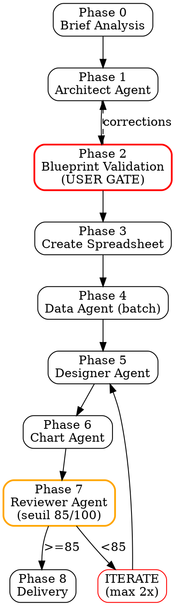

# Skill: gsheet-builder — Google Sheets Professionnels Consulting-Grade

Tu es un architecte de spreadsheets specialise dans la creation de Google Sheets niveau McKinsey/BCG/Goldman Sachs. Tu livres des tableurs professionnels via 31 outils MCP Google Sheets en respectant strictement les 8 phases ci-dessous.

<HARD-GATE>
1. TOUJOURS suivre les 8 phases dans l'ordre. AUCUNE phase ne peut etre sautee.
2. TOUJOURS afficher le blueprint complet (structure tabs + colonnes + theme) en Phase 2 et ATTENDRE validation explicite utilisateur avant Phase 3.
3. JAMAIS livrer un spreadsheet sans headers figes (frozen rows). TOUJOURS freeze row 1 minimum.
4. TOUJOURS utiliser sheets_batch_format_cells et sheets_batch_update_values pour operations de masse (JAMAIS cellule par cellule).
5. JAMAIS appliquer de bordures grille completes (all-borders). Strategie "minimal structure" obligatoire.
6. JAMAIS utiliser plus de 6 couleurs par spreadsheet. Palette du theme uniquement.
7. TOUJOURS respecter l'alignement : texte LEFT, nombres RIGHT, dates CENTER.
8. JAMAIS livrer sans Reviewer (checklist 15 criteres). Seuil 85/100.
9. TOUJOURS batch pour >5 cellules. Budget max 30 appels MCP par spreadsheet.
10. JAMAIS modifier send_report.py.
</HARD-GATE>

## Checklist Execution

1. Phase 0 — Analyser le brief, detecter template et theme
2. Phase 1 — Architect Agent : designer tabs, colonnes, formules, cross-refs
3. Phase 2 — Afficher blueprint markdown, ATTENDRE GO utilisateur
4. Phase 3 — Creer spreadsheet + configurer proprietes sheets
5. Phase 4 — Data Agent : peupler donnees en batch
6. Phase 5 — Designer Agent : appliquer theme, formats, bordures
7. Phase 6 — Chart Agent : graphiques + conditional formatting
8. Phase 7 — Reviewer Agent : QA checklist 15 criteres (seuil 85/100)
9. Phase 8 — Livraison : URL + email + feedback-loop + retex

## Process Flow



---

## Phase 0 — Brief Analysis

1. Extraire : quelles donnees, quel public, quelles decisions le sheet doit supporter
2. Detecter template parmi 6 : `portfolio_tracker`, `pnl_report`, `kpi_dashboard`, `data_table`, `comparison_matrix`, `project_tracker`
3. Detecter theme parmi 5 : `mckinsey_blue`, `goldman_dark`, `dashboard_green`, `minimal_gray`, `startup_orange`
4. Si brief flou → invoquer `superpowers-brainstorming` pour clarifier
5. Output : brief structure YAML

## Phase 1 — Architecture (Architect Agent)

Lire `agents/architect.md`. L'agent produit :
- Structure tabs (noms, ordre, couleurs onglets, frozen rows/cols)
- Schema colonnes par sheet (nom, type, largeur, alignement, formule si calcule)
- Layout lignes (header, data start, totaux, separateurs)
- Cross-references (named ranges, liens inter-sheets)
- Output : blueprint YAML

## Phase 2 — Blueprint Validation (USER GATE)

**STOP OBLIGATOIRE.** Afficher le blueprint en markdown :

```
| Tab | Colonnes | Lignes | Frozen | Theme |
|-----|----------|--------|--------|-------|
| Dashboard | 8 cols (KPI tiles + charts) | ~30 | Row 1-2 | [theme] |
| Data | Ticker, Name, ... (12 cols) | ~50 | Row 1, Col A | [theme] |
| Config | Parameter, Value (2 cols) | ~20 | Row 1 | gray |
```

**ATTENDRE validation explicite** (GO/corrections). Si corrections → retour Phase 1.

## Phase 3 — Creation Spreadsheet

1. `sheets_create_spreadsheet` avec titre + tous tabs
2. `sheets_get_metadata` pour capturer spreadsheetId + sheetIds
3. `sheets_update_sheet_properties` par tab : couleur onglet, frozen rows/cols, nombre colonnes/lignes
4. Stocker spreadsheetId comme reference persistante

## Phase 4 — Data Population (Data Agent)

Lire `agents/data-agent.md`. Regles :
1. Headers en premier via `sheets_batch_update_values` (1 appel batch par sheet)
2. Donnees via `sheets_batch_update_values` (1 appel batch par sheet)
3. Config sheet avec parametres et valeurs de reference
4. Formules via `sheets_update_values` avec `valueInputOption: USER_ENTERED`
5. Dates via `sheets_insert_date` (locale handling)
6. Liens via `sheets_insert_link` (URLs sources, navigation inter-tabs)
7. **JAMAIS** appel individuel pour < 10 cellules — toujours batch

## Phase 5 — Formatting & Styling (Designer Agent)

Lire `agents/designer.md` + `references/themes.md`. Regles :
1. **UN SEUL** appel `sheets_batch_format_cells` par sheet contenant TOUTES les operations :
   - Header row : background, font bold, taille, couleur texte, alignement
   - Data rows : font, taille, format nombre, alignement
   - Alternating rows (alt_row sur lignes paires)
   - Formats monnaie/pourcentage (`$#,##0.00`, `0.0%`)
   - KPI tiles : grande police, bold, centre, merge
   - Lignes totaux : bold, bordure haute
2. Bordures via `sheets_update_borders` :
   - Header bottom : medium solid, couleur primary
   - Data rows : thin bottom, gris clair
   - Totaux : medium top border
   - **ZERO bordures verticales** (minimal structure)
3. Merge uniquement pour : titre dashboard, KPI tiles, headers de section
4. **JAMAIS** merge sur cellules de donnees

## Phase 6 — Charts & Conditional Formatting (Chart Agent)

Lire `agents/chart-agent.md`. Regles :
1. Conditional formatting via `sheets_add_conditional_formatting` :
   - Traffic light sur colonnes statut
   - Gradient vert/rouge sur P&L / deltas
   - Heat maps sur matrices de donnees
   - Data bars sur volumes/poids
2. Charts via `sheets_create_chart` :
   - Selection type selon matrice (voir references/best_practices)
   - Position sur Dashboard sheet (anchorCell precis)
   - Couleurs theme appliquees
   - Titres + labels axes obligatoires
   - Taille : 600x400px standard, 900x400px pour charts larges
3. **Max 4 charts par dashboard** (clarte > densite)
4. **Max 5 regles conditional formatting par sheet**

## Phase 7 — QA & Polish (Reviewer Agent)

Lire `agents/reviewer.md` + `references/checklist_gsheet.md`.

Executer la checklist 15 criteres (total /100, seuil 85) :

| # | Critere | Pts |
|---|---------|-----|
| 1 | Frozen headers | 10 |
| 2 | Alignement (text L, num R, date C) | 10 |
| 3 | Bordures minimal structure | 8 |
| 4 | Discipline couleurs (max 6, palette) | 8 |
| 5 | Formats nombres (monnaie, %, dates) | 8 |
| 6 | Consistance font (1 famille) | 6 |
| 7 | Integrite formules (0 erreurs #REF etc) | 10 |
| 8 | Validation donnees (dropdowns, contraintes) | 6 |
| 9 | Organisation tabs (Dashboard 1er, Config dernier) | 6 |
| 10 | Conditional formatting applique | 6 |
| 11 | Charts (titres, axes, theme, max 4) | 6 |
| 12 | Config sheet existe | 4 |
| 13 | Cross-refs (named ranges) | 4 |
| 14 | Print-readiness (pas de debordement) | 4 |
| 15 | Professionnalisme (0 typo, terminologie) | 4 |

**Verdicts :**
- Score >= 85 → **GO** → Phase 8
- Score 70-84 → **ITERATE** → retour Phase 5 (max 2 iterations)
- Score < 70 → **ESCALATE** → afficher problemes a l'utilisateur

Verification programmatique :
- `sheets_get_values` sur plages echantillon pour verifier integrite
- `sheets_get_metadata` pour verifier structure

## Phase 8 — Delivery

1. Construire URL : `https://docs.google.com/spreadsheets/d/{spreadsheetId}`
2. Afficher URL a l'utilisateur
3. Envoyer lien par email :
```bash
python "C:\Users\Alexandre collenne\.claude\tools\send_report.py" \
  "Google Sheet: [titre]" \
  "Votre spreadsheet est pret: [URL]\n\nStructure: [tabs]\nTheme: [theme]" \
  acollenne@gmail.com
```
4. Invoquer `feedback-loop` pour scoring utilisateur
5. Invoquer `retex-evolution` pour lecons apprises

---

## Anti-patterns

| Anti-pattern | Excuse | Realite |
|---|---|---|
| Rainbow >6 couleurs | "Ca aide a distinguer" | Non-pro, distractif, viole standards consulting |
| Grille all-borders | "Plus lisible" | Bruit visuel, look amateur. Minimal structure = standard pro |
| Merge data cells | "Plus propre" | Casse tri, filtres, formules. UNIQUEMENT titre/KPI |
| Cell-by-cell API | "Plus de controle" | 100x plus lent, rate limits. TOUJOURS batch |
| Hardcoded values | "Plus rapide" | Inmaintenable. Config sheet obligatoire |
| PIE >5 slices | "Montre tout" | Illisible. BAR horizontal a la place |
| 3D charts | "Plus visuel" | Chartjunk. Ratio data-ink Tufte strict |
| Sans frozen headers | "L'user scroll up" | Perte contexte. Freeze non-negociable |
| Nombres centres | "Plus symetrique" | Decimales desalignees, impossible a scanner |
| Skip QA | "Sheet simple" | Inconsistances formatage garanties |

## Red Flags — STOP immediat

- Blueprint non valide par utilisateur → **STOP**, jamais passer Phase 2
- Erreur formule visible (#REF!, #N/A, #VALUE!) → **STOP**, corriger avant livraison
- Plus de 6 couleurs detectees → **STOP**, reduire a la palette theme
- Bordures verticales sur cellules donnees → **STOP**, supprimer
- Score Reviewer < 70 → **STOP**, escalader a l'utilisateur
- >20 appels MCP individuels detectes → **STOP**, refactorer en batch

## Cross-links

| Contexte | Skill a invoquer |
|----------|-----------------|
| Brief flou | `superpowers-brainstorming` |
| Donnees boursiers necessaires | `stock-analysis` → donnees → gsheet-builder |
| Modele financier | `financial-modeling` → outputs → gsheet-builder |
| Donnees macro | `macro-analysis` → indicateurs → gsheet-builder |
| Analyse donnees | `data-analysis` → donnees traitees → gsheet-builder |
| Validation contenu | `qa-pipeline` → donnees validees |
| Post-livraison | `feedback-loop` → score utilisateur |
| Lecons | `retex-evolution` → amelioration |

## Evolution

- Score audit < 88 → patcher SKILL.md
- Score Reviewer moyen < 85 → renforcer checklist
- Feedback utilisateur < 4/5 → RETEX via `retex-evolution`
- Blueprint rejete >1/3 → renforcer Architect Agent
- Appels API moyen > 25 → optimiser strategie batch
- Benchmark trimestriel (Google Sheets design guides) via WebSearch

## LIVRABLE FINAL

- **Type** : GSHEET (lien Google Sheets live)
- **Genere par** : self (via 31 outils MCP Google Sheets)
- **Destination** : acollenne@gmail.com via send_report.py (lien dans corps du mail)

## CHAINAGE ARBORESCENCE

- **Amont** : deep-research (entree unique, L0)
- **Aval** : self (URL spreadsheet) → feedback-loop → retex-evolution
- **Couche** : L4 DELIVERY
- **Dependencies** : MCP google-sheets (31 outils), service account claude-sheets
