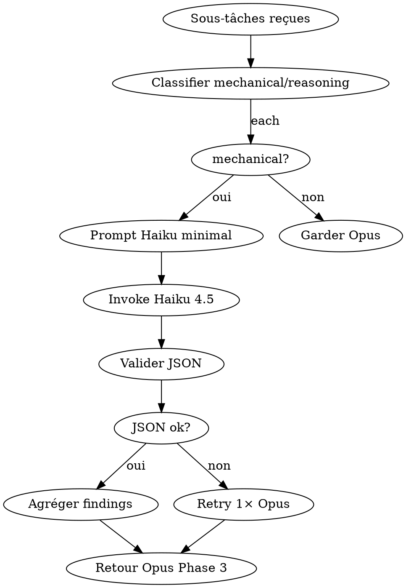

# Skill: haiku-delegator — L6 META Délégation Haiku 4.5

**Rôle** : identifier les **sous-tâches mécaniques** (sans raisonnement) dans le pipeline deep-research et les router vers **Claude Haiku 4.5** (`claude-haiku-4-5-20251001`), 10-20× moins cher qu'Opus, avec retour d'un JSON structuré ≤500 tokens. Opus reste l'orchestrateur et le synthétiseur.

## PRINCIPE REASONING-FIRST

Déléguer à Haiku **libère du budget** pour qu'Opus se concentre sur ce qu'il fait le mieux : **raisonner, arbitrer, synthétiser**. Les gains sont réinvestis en `thinking.effort=high` sur les étapes décisives. Haiku ne raisonne PAS à la place d'Opus ; il **nettoie le terrain**.

<HARD-GATE>
- JAMAIS déléguer : synthèse, arbitrage, décision, scoring final, tone of voice, bull/base/bear.
- TOUJOURS déléguer (si applicable) : grep, list, parse JSON/HTML, extract fields, fetch URL, format table.
- TOUJOURS imposer format retour JSON strict `{findings, citations, next_step, tokens_used}`.
- TOUJOURS limiter sortie Haiku à **500 tokens max** (param `max_tokens=500`).
- TOUJOURS valider le JSON reçu avant de le passer à Opus (gate anti-hallucination).
- JAMAIS Haiku sur données critiques sans re-vérification par Opus en cas de doute.
</HARD-GATE>

## LIVRABLE FINAL
- **Type** : DOC (section `delegations.md` dans token_savings_report)
- **Généré par** : token-economizer (agrégation)
- **Destination** : acollenne@gmail.com via send_report.py

## CHAÎNAGE ARBORESCENCE
- **Amont** : token-economizer (dispatch Phase C étape 3)
- **Aval** : retour findings à deep-research Phase 3 (recherche multi-sources)

## CHECKLIST

1. Recevoir la liste de sous-tâches candidates depuis token-economizer
2. Classifier chaque tâche : `mechanical` (deleguée) ou `reasoning` (Opus garde)
3. Pour chaque tâche mechanical : construire prompt Haiku minimal (≤300 tok input)
4. Invoquer Haiku via Task tool ou API directe (modèle `claude-haiku-4-5-20251001`)
5. Valider JSON retour (schéma strict)
6. Agréger findings et renvoyer à Opus sous forme condensée
7. Logger `{task_type, input_tok, output_tok, cost_saved_vs_opus}`

## PROCESS FLOW



## TAXONOMIE DES TÂCHES

| Type | Déléguer à Haiku ? | Exemple |
|------|--------------------|---------|
| grep / recherche littérale | ✅ OUI | "Trouver toutes occurrences de 'FED rate' dans 20 articles" |
| parse JSON/HTML/CSV | ✅ OUI | "Extraire `price, volume, change` d'une réponse API" |
| list / enumerate | ✅ OUI | "Lister les 10 tickers mentionnés dans ces news" |
| fetch + clean | ✅ OUI | "Récupérer cette URL et retourner le texte principal" |
| format table | ✅ OUI | "Convertir ces données en table markdown" |
| summarize factuel court | ✅ OUI (max 200 tok) | "Résumer ce paragraphe en 3 bullets" |
| **synthèse multi-sources** | ❌ NON | → Opus |
| **arbitrage bull/bear** | ❌ NON | → Opus |
| **scoring qualité** | ❌ NON | → Opus |
| **décision finale** | ❌ NON | → Opus |
| **tone/ton éditorial** | ❌ NON | → Opus |

## FORMAT JSON RETOUR (strict)

```json
{
  "task_id": "grep_fed_rate",
  "task_type": "grep",
  "findings": [
    {"source": "bloomberg.com/x", "match": "Fed cuts by 25bp", "line": 14},
    {"source": "reuters.com/y", "match": "rate pause signaled", "line": 3}
  ],
  "citations": ["url1", "url2"],
  "next_step": "opus_to_arbitrate",
  "tokens_used": {"input": 180, "output": 290}
}
```

## INVOCATION HAIKU

```python
# Via API directe
import anthropic
client = anthropic.Anthropic()
resp = client.messages.create(
  model="claude-haiku-4-5-20251001",
  max_tokens=500,
  system="You are a mechanical data extractor. Return ONLY valid JSON matching the schema.",
  messages=[{"role": "user", "content": task_prompt}]
)
```

```bash
# Via multi-ia-router (fallback local)
python ~/.claude/tools/multi_ia_router.py --model haiku-4.5 --task "grep 'Fed rate' in docs/"
```

## ANTI-PATTERNS

| Excuse | Réalité |
|--------|---------|
| "Haiku peut résumer aussi bien qu'Opus" | Non pour synthèse multi-sources. Limite à factuel court. |
| "Pas besoin de valider le JSON" | Haiku hallucine parfois la structure. Schéma strict obligatoire. |
| "Tout déléguer pour économiser max" | Perte de qualité sur raisonnement. Taxonomie stricte. |
| "Max_tokens=2000 pour être safe" | Casse l'objectif d'économie. 500 strict. |

## RED FLAGS

- Haiku invoqué pour une tâche de raisonnement → STOP, réassigner Opus
- JSON malformé 2× sur même tâche → STOP, garder Opus
- Coût Haiku > 15% coût Opus original → STOP, dispatch inefficace
- Findings contredisent sources citées → STOP, Opus re-vérifie

## CROSS-LINKS

| Contexte | Skill |
|----------|-------|
| Orchestrateur parent | `token-economizer` |
| Routing IA multi-providers | `multi-ia-router` |
| Validation qualité sortie | `qa-pipeline` |
| Cache des prompts Haiku | `prompt-cache-manager` |

## ÉVOLUTION

Logger `{task_type, delegated, quality_score, cost_ratio}` par run. Si `quality_score` moyen < 0.8 sur un `task_type` → retirer de la whitelist de délégation.
