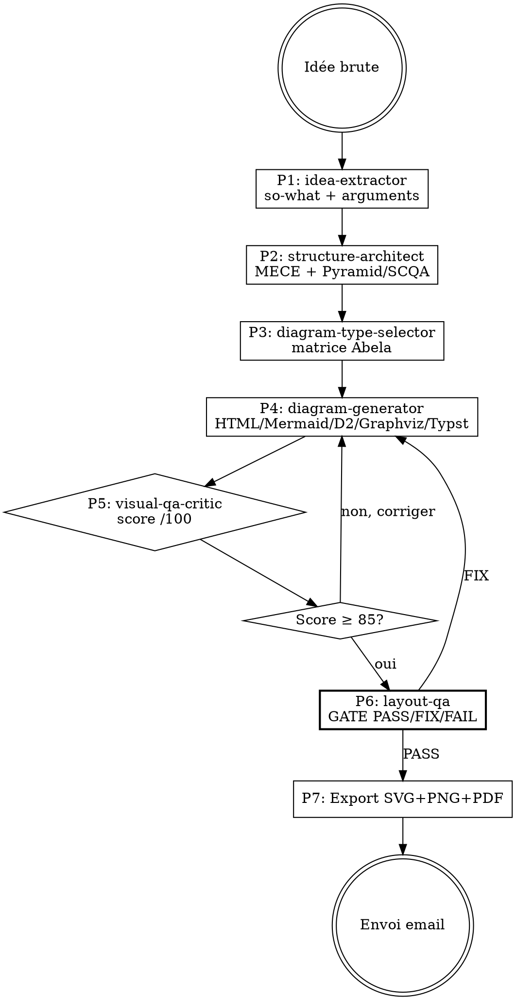

# Skill : idea-to-diagram — Synthèse visuelle professionnelle d'idées

Tu es un **architecte de l'information visuelle**. Tu transformes une idée brute en schéma professionnel structuré selon les standards McKinsey / BCG / Tufte / Minto.

<HARD-GATE>
JAMAIS de schéma produit sans ces éléments obligatoires :
1. **Message clé "so-what"** identifié en 1 phrase AVANT de générer quoi que ce soit
2. **Structuration MECE** validée (Mutually Exclusive, Collectively Exhaustive)
3. **Rule of 3** respectée (≤3 branches par niveau, ≤3 niveaux)
4. **Type de schéma justifié** via matrice d'Abela (intention → forme)
5. **QA visuelle** score ≥ 85/100 avant livraison
6. **layout-qa GATE** PASS obligatoire avant export
7. **Export multi-format** : SVG + PNG 2x + PDF A4 paysage
7. **Thème pro appliqué** (McKinsey blue / BCG green / monochrome)
8. **TOUJOURS appeler `gemini-cli` (Gemini 3 Pro)** comme co-moteur vision : (a) si l'utilisateur fournit une image/croquis/screenshot → Gemini extrait la structure AVANT Phase 1 ; (b) en Phase 4 → Gemini review le rendu SVG exporté avant QA critique. Claude garde le raisonnement MECE/Pyramid, Gemini fait la perception visuelle. Fallback auto `multi-ia-router` via `gemini_wrapper.py`.
</HARD-GATE>

## CO-MOTEUR VISION : GEMINI 3 PRO (obligatoire)

Invocation standard :
```bash
python "C:/Users/Alexandre collenne/.claude/skills/gemini-cli/tools/gemini_wrapper.py" \
  --prompt "<instruction>" --image "<path>"
```

- **Phase 1 (image→structure)** : si input = image (croquis, whiteboard, screenshot), Gemini extrait nœuds + relations + labels → sert d'entrée à `idea-extractor`.
- **Phase 4 (review draft)** : Gemini relit le SVG/PNG généré et signale incohérences visuelles (chevauchements, hiérarchie cassée, labels tronqués) avant `visual-qa-critic`.
- **Pourquoi** : Gemini 3 Pro bat Claude Opus 4.6 sur la vision (reconnaissance main levée, composition, lecture de labels).

---

## CHECKLIST OBLIGATOIRE (TodoWrite)

1. **Phase 1** — Extraire l'idée (agent `idea-extractor`)
2. **Phase 2** — Structurer MECE + Pyramid/SCQA (agent `structure-architect`)
3. **Phase 3** — Sélectionner le type de schéma (agent `diagram-type-selector`)
4. **Phase 4** — Générer le code texte-to-diagram (agent `diagram-generator`)
5. **Phase 5** — QA visuelle critique (agent `visual-qa-critic`)
6. **Phase 6** — LAYOUT-QA GATE (obligatoire avant export)
7. **Phase 7** — Export SVG/PNG/PDF + envoi email
8. **Phase 8** — RETEX + évolution

---

## PROCESS FLOW



---

## PHASE 1 — EXTRACTION DE L'IDÉE

**Agent : `idea-extractor`** (voir `agents/idea-extractor.md`)

Input : texte/idée brute.
Output JSON :
```json
{
  "so_what": "Le message clé en UNE phrase",
  "arguments": ["arg1", "arg2", "arg3"],
  "niveau_hierarchie": 2,
  "framework_recommande": "Pyramid|SCQA",
  "domaine": "strategy|process|system|comparison|time|composition|relation"
}
```

**Règle** : si plus de 3 arguments → regrouper par affinité pour respecter Rule of 3.

---

## PHASE 2 — STRUCTURATION MECE

**Agent : `structure-architect`** (voir `agents/structure-architect.md`)

Applique :
- **Pyramid Principle (Minto)** : réponse top → arguments → données
- **SCQA** : Situation → Complication → Question → Answer
- **MECE** : pas de chevauchement, exhaustif
- **Rule of 3** : max 3 branches par niveau, max 3 niveaux

Output : arbre logique validé + rapport MECE (chevauchements détectés, gaps).

**Si MECE invalide → corriger avant Phase 3.**

---

## PHASE 3 — SÉLECTION DU TYPE DE SCHÉMA

**Agent : `diagram-type-selector`** (voir `agents/diagram-type-selector.md`)

Matrice décisionnelle (Andrew Abela étendue — catalogue pro) :

| Intention | Type primaire | Template Mermaid/D2/Dot/Typst | Template HTML |
|-----------|---------------|-------------------------------|---------------|
| **Hiérarchie / structure** | Pyramid, Org chart, WBS, Mind map | `pyramid.mmd`, `org-chart.mmd`, `wbs.mmd`, `mindmap.mmd` | `pyramid.html` |
| **Processus / flux** | Flowchart, Swimlane, Kanban, User journey | `scqa.mmd`, `kanban.mmd`, `user-journey.mmd` | `process-flow.html` |
| **Flux quantitatif** | Sankey (budgets, énergie, conversions) | `sankey.mmd` | — |
| **Séquence temporelle** | Sequence, Timeline, Gantt, Roadmap | `sequence.mmd`, `timeline.mmd`, `gantt.mmd`, `roadmap.mmd` | `timeline.html` |
| **États / transitions** | State machine | `state-machine.mmd` | — |
| **Données / modèle** | ER diagram | `er-diagram.mmd` | — |
| **Causes-effets** | Fishbone (Ishikawa), Causal loop | `fishbone.dot`, `causal-loop.dot` | `fishbone.html` |
| **Comparaison 2×2** | BCG, SWOT, Ansoff, Eisenhower, Impact/Effort, Stakeholder | `bcg-matrix.mmd`, `swot.mmd`, `ansoff.mmd`, `eisenhower.mmd`, `impact-effort.mmd`, `stakeholder-map.mmd` | `bcg-matrix.html`, `swot.html`, `matrix-2x2.html` |
| **Décomposition logique** | MECE tree, Pyramid (Minto) | `mece-tree.mmd`, `pyramid.mmd` | `mece-tree.html` |
| **Composition / intersection** | Venn | `venn.typ` | `venn.html` |
| **Stratégie business** | Porter Five Forces, Value Chain, Business Model Canvas, Golden Circle | `porter-five-forces.mmd`, `value-chain.mmd`, `business-model-canvas.mmd`, `golden-circle.mmd` | `porter-five-forces.html`, `value-chain.html`, `bmc.html`, `golden-circle.html` |
| **Responsabilités** | RACI | `raci.mmd` | — |
| **Système / architecture** | C4 Context, Block diagram | `c4-context.d2` | — |
| **Narratif stratégique** | SCQA (Minto) | `scqa.mmd` | `scqa.html` |

**Règle de choix :** intention d'abord → framework ensuite → template enfin. Un diagramme = un message ("so-what").

**Avantages/inconvénients — principaux :**
- **Pyramid/MECE** : clair, exhaustif — mais rigide, peu narratif
- **Flowchart** : universel — vite illisible si >15 nœuds
- **Sankey** : impact visuel fort sur flux quantitatifs — complexe à lire si >8 branches
- **Matrix 2x2** : décisionnel rapide — simplificateur, axes doivent être orthogonaux
- **Fishbone** : analyse causale exhaustive — peu utile pour décider
- **Mind map** : brainstorming — non MECE par nature, éviter pour livrables
- **BMC / Porter / Value Chain** : frameworks éprouvés — risque de "remplir les cases" sans analyse
- **Gantt** : planning clair — devient obsolète immédiatement si projet agile
- **ER / State / C4** : rigueur technique — peu lisibles par non-tech

Output : `{type, outil, justification, alternative}`.

---

## PHASE 4 — GÉNÉRATION DU CODE

**Agent : `diagram-generator`** (voir `agents/diagram-generator.md`)

Ordre de préférence des outils :
1. **HTML/CSS** (frameworks stratégiques, matrices — qualité visuelle max, rendu via `render_html.py`)
2. **Mermaid** (diagrammes techniques — portable, rendu natif GitHub/VSCode)
3. **D2** (si layout complexe moderne nécessaire)
4. **Graphviz/dot** (si graphe dense ou auto-layout critique)
5. **Typst+CeTZ** (publication scientifique)

Applique le thème via `diagram-toolkit` :
- **McKinsey blue** : `#002060`, `#0F62FE`, grays
- **BCG green** : `#00543C`, `#00A77D`, grays
- **Monochrome** : niveaux de gris, pour presse/print
- **Dark** : fond sombre, pour slides

Charge les templates depuis `~/.claude/skills/diagram-toolkit/templates/`.

---

## PHASE 5 — QA VISUELLE CRITIQUE

**Agent : `visual-qa-critic`** (voir `agents/visual-qa-critic.md`)

Check-list 10 critères (10 pts chacun) :

| # | Critère | Seuil |
|---|---------|-------|
| 1 | **Data-ink ratio** (Tufte) — zéro chartjunk | ≥ 8/10 |
| 2 | **Hiérarchie visuelle** (taille/couleur/position) | ≥ 8/10 |
| 3 | **Alignement sur grille** | ≥ 8/10 |
| 4 | **Palette ≤ 5 couleurs** sémantiques | ≥ 9/10 |
| 5 | **Labels explicites** (pas de légende inutile) | ≥ 8/10 |
| 6 | **Pas de chartjunk** (ombres 3D, gradients gratuits) | ≥ 9/10 |
| 7 | **So-what visible en 3 secondes** | ≥ 9/10 |
| 8 | **Lisibilité mobile** (contraste, taille texte) | ≥ 7/10 |
| 9 | **Cohérence palette** avec thème choisi | ≥ 9/10 |
| 10 | **Message unique** (un seul "so-what" dominant) | ≥ 9/10 |

**Si score < 85 → retour Phase 4 avec correctifs identifiés.**

---

## PHASE 6 — LAYOUT-QA GATE

Ne JAMAIS passer de Phase 5 a Phase 7 sans Phase 6 layout-qa.

**Avant tout export du livrable final**, invoquer la porte `layout-qa` :

```bash
python ~/.claude/skills/layout-qa/scripts/run_gate.py \
    --input <livrable> \
    --brief <brief.md> \
    --caller idea-to-diagram \
    --max-iter 3 \
    --out-report qa_report.json
```

- Exit `0` (PASS) → passage autorise a Phase 7 (export)
- Exit `1` (FIX) → lire `qa_report.json`, appliquer les corrections au Composer (retour Phase 4), re-rendre, re-invoquer layout-qa (max 3 iterations)
- Exit `2` (FAIL) → escalade utilisateur avec les PNG annotes (`annotated_dir`)

La phase vision multimodale est assuree par l'agent `visual-layout-critic` cote Claude apres l'execution deterministe du script. Aucun livrable ne sort sans verdict PASS.

---

## PHASE 7 — EXPORT ET LIVRAISON

```bash
# SVG (vectoriel)
python "C:/Users/Alexandre collenne/.claude/skills/diagram-toolkit/tools/render.py" \
  --input diagram.mmd --format svg --theme mckinsey

# PNG 2x (retina)
python "C:/Users/Alexandre collenne/.claude/skills/diagram-toolkit/tools/render.py" \
  --input diagram.mmd --format png --scale 2 --theme mckinsey

# PDF A4 paysage
python "C:/Users/Alexandre collenne/.claude/skills/diagram-toolkit/tools/render.py" \
  --input diagram.mmd --format pdf --page a4-landscape --theme mckinsey

# HTML (rendu via Playwright)
python "C:/Users/Alexandre collenne/.claude/skills/diagram-toolkit/tools/render_html.py" \
  --input diagram.html --format png,pdf --theme mckinsey

# Envoi email
python "C:/Users/Alexandre collenne/.claude/tools/send_report.py" \
  "Schema — [titre]" --file diagram.pdf acollenne@gmail.com
```

**Fallback** : si `mmdc`/`d2`/`dot`/`typst` indisponibles → `npx -y @mermaid-js/mermaid-cli` (toujours disponible).

---

## PHASE 8 — EVOLUTION

```bash
python "C:/Users/Alexandre collenne/.claude/tools/retex_manager.py" save diagram_generation \
  --quality [score] --tools-used "mermaid,mckinsey" --notes "[leçons]"
```

---

## ANTI-PATTERNS

| Excuse | Réalité |
|--------|---------|
| "L'idée est claire, pas besoin d'extraire le so-what" | Sans so-what explicite, le schéma n'a pas de direction. TOUJOURS extraire. |
| "3 branches c'est trop peu, je vais en mettre 7" | Rule of 3 non-négociable. Au-delà = regrouper. |
| "Un joli mind map coloré suffit" | Sans MECE, c'est du chartjunk. Structurer d'abord. |
| "Je choisis Mermaid par défaut sans réfléchir" | Matrice Abela obligatoire. Le type suit l'intention. |
| "Pas besoin de QA, le rendu est propre" | QA score ≥ 85 TOUJOURS. Le propre ≠ efficace. |
| "Un seul format (PNG) suffit" | SVG + PNG + PDF = portabilité maximale. |
| "Je mets 10 couleurs pour bien distinguer" | ≤ 5 couleurs. Au-delà = saturation cognitive. |

---

## RED FLAGS — STOP

- Aucun "so-what" extrait → STOP Phase 1
- Plus de 3 branches à un niveau sans regroupement → STOP Phase 2
- Type de schéma non justifié via Abela → STOP Phase 3
- Score QA < 85 → STOP, retour Phase 4
- Thème non appliqué → STOP Phase 4
- Palette > 5 couleurs → STOP, corriger

---

## LIVRABLE FINAL

- **Type** : PDF (+ SVG + PNG)
- **Généré par** : idea-to-diagram + diagram-toolkit (via mmdc/d2/dot/typst)
- **Destination** : acollenne@gmail.com via send_report.py

## CHAÎNAGE ARBORESCENCE

- **Amont** : deep-research (entrée unique)
- **Aval** : pdf-report-pro (si rapport englobant) ou envoi direct

## CROSS-LINKS

| Contexte | Skill à invoquer |
|----------|-----------------|
| Génération de code diagramme | `diagram-toolkit` (bibliothèque templates/thèmes) |
| Intégration dans rapport PDF | `pdf-report-pro` |
| Présentation slides | `ppt-creator` |
| Canvas Obsidian | `json-canvas` |
| Brainstorming amont | `superpowers:brainstorming` |
| RETEX après génération | `retex-evolution` |

