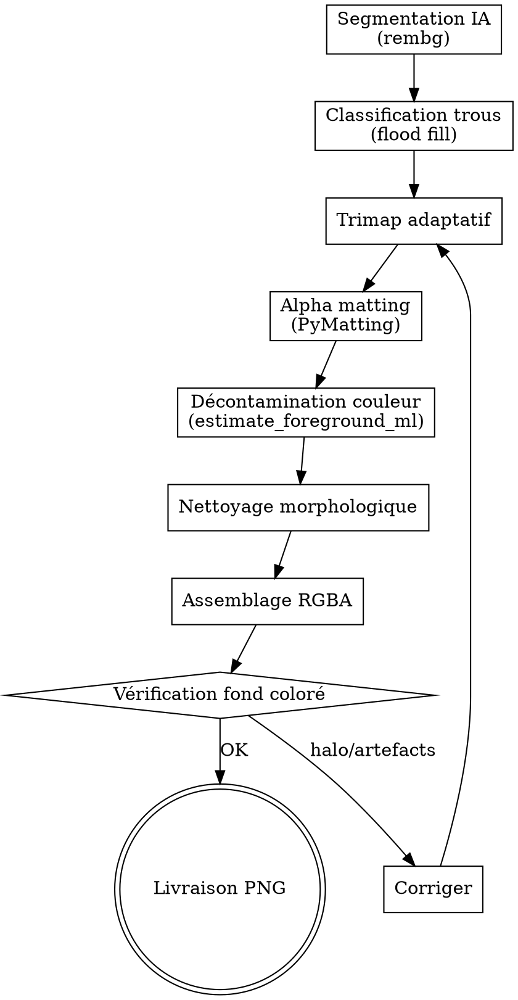

# Image Détourage — Pipeline Professionnel

<HARD-GATE>
JAMAIS de détourage sans :
1. Vérification sur fond COLORÉ (bleu/vert) avant livraison — JAMAIS livrer sans contrôle
2. Décontamination couleur (`estimate_foreground_ml`) — JAMAIS livrer avec halo blanc
3. Sauvegarde en PNG (RGBA) — JAMAIS en JPEG (pas de transparence)
4. Fichier original INTACT — JAMAIS écraser le fichier source
</HARD-GATE>

## CHECKLIST OBLIGATOIRE

1. **Segmentation IA** — Masque initial via rembg (birefnet ou isnet selon RAM)
2. **Classification trous** — Distinguer trous réels vs artefacts (flood fill)
3. **Trimap adaptatif** — 3 zones (avant-plan / arrière-plan / inconnu)
4. **Alpha matting** — Calculer alpha continu via PyMatting (downscale 512px)
5. **Décontamination couleur** — `estimate_foreground_ml` pour éliminer le halo
6. **Nettoyage morphologique** — Ouverture, anti-aliasing, plus grand composant
7. **Assemblage RGBA + vérification** — PNG transparent + contrôle fond coloré

## PROCESS FLOW



---

## Vue d'ensemble

Ce skill implémente un pipeline de détourage en 7 étapes, conçu pour gérer les cas
difficiles : objets blancs sur fond blanc (chaussures, vêtements), objets percés
(disques de musculation, grilles), cheveux fins, et équipements complexes.

## Principe fondamental

Le halo blanc après détourage est un problème **mathématique**, pas cosmétique.
Chaque pixel de l'image originale est un composite : `I = α×F + (1-α)×B`.
Sans décontamination couleur, les pixels de bordure portent les valeurs RGB du fond.
La solution : inverser l'équation via `estimate_foreground_ml()` de PyMatting.

## Pipeline en 7 étapes

### Étape 1 — Segmentation IA (masque initial)

Utiliser rembg avec le meilleur modèle disponible selon les contraintes mémoire :

| Modèle | Taille | Qualité | Cas d'usage |
|--------|--------|---------|-------------|
| `birefnet-general` | 973 Mo | ★★★★★ | Production (nécessite >6 Go RAM) |
| `isnet-general-use` | 179 Mo | ★★★★☆ | Recommandé par défaut |
| `u2net` | 176 Mo | ★★★☆☆ | Fallback léger |

```python
from rembg import remove, new_session
import io, numpy as np
from PIL import Image

# Choix du modèle selon mémoire disponible
try:
    session = new_session("birefnet-general")
except:
    session = new_session("isnet-general-use")

with open(input_path, "rb") as f:
    input_bytes = f.read()
mask_bytes = remove(input_bytes, session=session, only_mask=True)
mask = np.array(Image.open(io.BytesIO(mask_bytes)).convert("L"))
del session  # Libérer la mémoire immédiatement
```

### Étape 2 — Classification des trous intérieurs

Distinguer les trous intentionnels (poignées, ouvertures) des artefacts du masque.
Utiliser le flood fill depuis les bords pour identifier le fond extérieur, puis
analyser les composantes connexes restantes.

```python
import cv2

mask_bin = (mask > 127).astype(np.uint8) * 255
inv = cv2.bitwise_not(mask_bin)
flood = inv.copy()
flood_mask = np.zeros((h+2, w+2), np.uint8)
cv2.floodFill(flood, flood_mask, (0, 0), 128)

# Pixels restés à 255 = trous intérieurs (non connectés aux bords)
interior_holes = (flood == 255).astype(np.uint8) * 255
n_labels, labels, stats, _ = cv2.connectedComponentsWithStats(interior_holes)

SMALL_THRESHOLD = 1500  # px — ajustable selon résolution
for i in range(1, n_labels):
    area = stats[i, cv2.CC_STAT_AREA]
    if area < SMALL_THRESHOLD:
        mask_bin[labels == i] = 255  # Boucher (artefact)
    # else: laisser transparent (trou réel)
```

### Étape 3 — Trimap adaptatif

Générer un trimap à 3 zones (avant-plan certain / arrière-plan certain / inconnu).
**Adapter la bande inconnue** dans les zones blanc-sur-blanc pour éviter les erreurs
du matting quand F ≈ B.

```python
def generate_trimap_adaptive(mask_bin, image_rgb, erode_size=8, dilate_size=12):
    h, w = mask_bin.shape
    k_e = cv2.getStructuringElement(cv2.MORPH_ELLIPSE, (2*erode_size+1,)*2)
    k_d = cv2.getStructuringElement(cv2.MORPH_ELLIPSE, (2*dilate_size+1,)*2)

    eroded = cv2.erode(mask_bin, k_e)
    dilated = cv2.dilate(mask_bin, k_d)

    trimap = np.full((h, w), 128, dtype=np.uint8)
    trimap[eroded >= 254] = 255   # Avant-plan certain
    trimap[dilated <= 1] = 0       # Arrière-plan certain

    # Adaptation blanc-sur-blanc
    gray = cv2.cvtColor(image_rgb, cv2.COLOR_RGB2GRAY)
    is_white = gray > 220
    is_unknown = trimap == 128
    trimap[(is_white & is_unknown & (mask_bin > 127))] = 255
    trimap[(is_white & is_unknown & (mask_bin <= 127))] = 0

    return trimap
```

**Paramètres recommandés selon le sujet :**
- Objets solides (équipement, produits) : erode=8, dilate=12
- Personnes avec cheveux : erode=5, dilate=20
- Objets très fins (bijoux, fils) : erode=3, dilate=25

### Étape 4 — Alpha Matting (PyMatting)

Calculer un alpha continu (0.0–1.0) au lieu d'un masque binaire.
**Toujours downscaler** pour le matting — les algorithmes sont O(n²) en mémoire.

```python
from pymatting import estimate_alpha_knn

# Downscale à 512px max pour économiser la mémoire
scale = min(1.0, 512 / max(h, w))
nw, nh = int(w * scale), int(h * scale)

img_s = cv2.resize(img_norm, (nw, nh))  # img_norm = float64 /255
tri_s = cv2.resize(tri_norm, (nw, nh), interpolation=cv2.INTER_NEAREST)

alpha_s = estimate_alpha_knn(img_s, tri_s)

# Upscale le résultat
alpha = cv2.resize(alpha_s, (w, h), interpolation=cv2.INTER_LINEAR)
alpha = np.clip(alpha, 0, 1)
```

**Choix de l'algorithme :**
- `estimate_alpha_knn` : rapide, faible mémoire, bon pour contours nets → **défaut**
- `estimate_alpha_cf` : meilleure qualité, mais gourmand (Closed-Form Matting)
- `estimate_alpha_rw` : bon pour les contours très nets (Random Walk)

### Étape 5 — Décontamination couleur (CRITIQUE)

**C'est l'étape qui élimine le halo blanc.** Sans elle, les pixels semi-transparents
portent la couleur du fond incrustée dans leurs valeurs RGB.

```python
from pymatting import estimate_foreground_ml

fg_s = estimate_foreground_ml(img_s, alpha_s)
foreground = cv2.resize(fg_s, (w, h), interpolation=cv2.INTER_LINEAR)
foreground = np.clip(foreground, 0, 1)
```

Alternative manuelle si PyMatting n'est pas disponible :
```python
def manual_decontaminate(rgb_norm, alpha, bg_color=1.0):
    alpha_safe = np.where(alpha > 0.01, alpha, 1.0)
    fg = (rgb_norm - (1.0 - alpha[:,:,np.newaxis]) * bg_color) / alpha_safe[:,:,np.newaxis]
    return np.clip(fg, 0, 1)
```

### Étape 6 — Nettoyage morphologique

```python
alpha_u8 = (alpha * 255).astype(np.uint8)

# Ouverture : supprime les pixels isolés
k3 = cv2.getStructuringElement(cv2.MORPH_ELLIPSE, (3, 3))
alpha_u8 = cv2.morphologyEx(alpha_u8, cv2.MORPH_OPEN, k3)

# Anti-aliasing doux
alpha_u8 = cv2.GaussianBlur(alpha_u8, (3, 3), 0)

# Garder uniquement le plus grand composant connexe
_, thresh = cv2.threshold(alpha_u8, 10, 255, cv2.THRESH_BINARY)
n_labels, labels, stats, _ = cv2.connectedComponentsWithStats(thresh)
if n_labels > 1:
    sizes = stats[1:, cv2.CC_STAT_AREA]
    largest = np.argmax(sizes) + 1
    alpha_u8[labels != largest] = 0
```

### Étape 7 — Assemblage RGBA

```python
fg_u8 = (foreground * 255).astype(np.uint8)
result = np.dstack([fg_u8, alpha_u8])
result_img = Image.fromarray(result, "RGBA")
result_img.save(output_path, "PNG")
```

## Script complet

Le script `scripts/detourage.py` implémente le pipeline complet.
**Lancer avec** : `python scripts/detourage.py <input> <output> [--model MODEL] [--matting-size 512]`

Pour l'utiliser depuis Claude, exécuter :
```bash
python /path/to/skill/scripts/detourage.py /mnt/user-data/uploads/image.jpg /mnt/user-data/outputs/result.png
```

## Gestion mémoire

Le pipeline est conçu pour fonctionner dans des environnements à mémoire limitée (4 Go).
Stratégies appliquées :
- **Split en étapes** : charger le modèle rembg, générer le masque, puis `del session`
- **Downscale pour le matting** : 512px max par défaut (configurable)
- **Libération agressive** : `gc.collect()` entre les étapes lourdes
- **Fallback modèle** : si birefnet échoue (OOM), basculer sur isnet-general-use

## Vérification visuelle

Toujours générer une image de contrôle sur fond coloré :
```python
bg = Image.new("RGBA", result_img.size, (50, 150, 230, 255))
composite = Image.alpha_composite(bg, result_img)
composite.save("check.png")
```

## Cas difficiles et solutions

| Problème | Cause | Solution |
|----------|-------|----------|
| Halo blanc résiduel | Fond blanc incrusté dans RGB | Étape 5 : `estimate_foreground_ml()` |
| Chaussures/vêtements blancs supprimés | Confusion sujet/fond | Trimap adaptatif blanc-sur-blanc (étape 3) |
| Trous intérieurs remplis | Masque binaire sans distinction | Flood fill + composantes connexes (étape 2) |
| Bords crénelés | Masque binaire sans transition | Alpha matting continu (étape 4) |
| Barre/objet fin coupé | Modèle IA rate les objets fins | Connecter les composantes non-blanches au sujet |
| Mémoire insuffisante | Modèle trop lourd | Fallback modèle + downscale matting |

## Dépendances

```bash
pip install rembg pillow onnxruntime pymatting opencv-python-headless scipy --break-system-packages
```

## Notes importantes

- **Toujours sauvegarder en PNG** (pas JPEG) pour conserver la transparence
- **Toujours vérifier sur fond coloré** avant de livrer
- Le format RGBA utilise 4 canaux : R, G, B + Alpha (transparence)
- Pour les photos de personnes avec équipement : favoriser `isnet-general-use`
- Pour les photos produit e-commerce simples : `u2net` suffit souvent
- Pour la qualité maximale avec GPU : envisager ViTMatte (HuggingFace Transformers)

---

## ANTI-PATTERNS

| Excuse | Réalité |
|--------|---------|
| "Le masque binaire suffit, pas besoin de matting" | Le masque binaire produit des bords crénelés. L'alpha matting (étape 4) est ESSENTIEL pour des transitions douces. |
| "La décontamination couleur est optionnelle" | SANS l'étape 5 (`estimate_foreground_ml`), les pixels de bordure portent la couleur du fond → halo blanc visible. |
| "On peut sauvegarder en JPEG" | JAMAIS de JPEG après détourage. Le JPEG ne supporte pas la transparence. Toujours PNG (RGBA). |
| "Le plus gros modèle est toujours le meilleur" | `birefnet-general` (973 Mo) peut causer un OOM. Adapter le modèle à la mémoire disponible (isnet par défaut). |

## RED FLAGS — STOP

- Résultat livré sans vérification sur fond coloré → STOP, toujours vérifier
- Halo blanc visible et pas de décontamination appliquée → STOP, exécuter étape 5
- Image source écrasée → STOP, toujours garder l'original

## CROSS-LINKS

| Contexte | Skill |
|----------|-------|
| Upscale après détourage | `image-enhancer` |
| Intégration dans flyer | `flyer-creator` |
| Photos produit e-commerce | `website-analyzer` |
| Orchestration | `deep-research` |

## ÉVOLUTION

Après chaque détourage :
- Si un type de sujet est mal détouré (cheveux, objets fins) → ajuster les paramètres trimap
- Si un nouveau modèle surpasse BiRefNet → l'ajouter au catalogue avec benchmark
- Si le fallback modèle est activé trop souvent → optimiser la gestion mémoire

Seuils : si halo résiduel > 20% des cas → revoir le pipeline de décontamination.

## LIVRABLE FINAL

- **Type** : image
- **Généré par** : self
- **Destination** : acollenne@gmail.com via send_report.py

## CHAÎNAGE ARBORESCENCE

- **Amont** : deep-research (entrée unique)
- **Aval** : self

