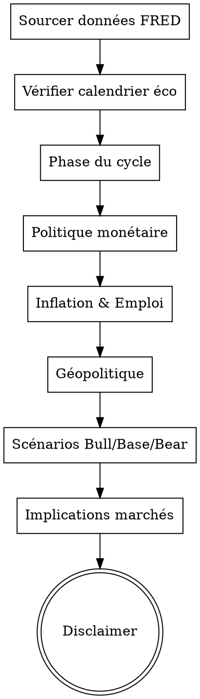

## RÈGLE UNIVERSELLE — LIRE L'INTÉGRALITÉ DU SKILL AVANT D'AGIR

**OBLIGATOIRE : Avant d'exécuter quoi que ce soit, tu DOIS :**
1. Lire l'INTÉGRALITÉ de ce fichier SKILL.md (pas juste le début)
2. Comprendre chaque section, chaque règle, chaque contrainte
3. Respecter ce skill À LA LETTRE — ne rien sauter, ne rien simplifier

**Ne JAMAIS commencer l'exécution sans avoir lu et compris TOUT le skill.**

---

# Skill : Analyse Macroéconomique

<HARD-GATE>
JAMAIS d'analyse macro sans :
1. Données datées de MOINS DE 7 JOURS (WebSearch/FRED obligatoire, JAMAIS training seul)
2. TROIS scénarios probabilisés (Base/Bull/Bear) pour chaque indicateur majeur
3. Calendrier économique vérifié (prochaines réunions FOMC/BCE/BoJ)
4. Disclaimer : "Analyse académique, pas de conseil en investissement"
</HARD-GATE>

## CHECKLIST OBLIGATOIRE

1. **Sources FRED** — Consulter GDP, CPI, UNRATE, FEDFUNDS, DGS10, T10Y2Y, VIX
2. **Calendrier éco** — Vérifier dates FOMC, BCE, BoJ, NFP, CPI à venir
3. **Situation cyclique** — Phase du cycle, PMI/ISM, courbe des taux
4. **Politique monétaire** — Taux directeurs, bilans BC, forward guidance
5. **Inflation & emploi** — CPI core, PCE, NFP, JOLTS, salaires
6. **Scénarios** — Produire Base (proba%), Bull (proba%), Bear (proba%)
7. **Implications marchés** — Actions, obligations, devises, commodities

## PROCESS FLOW

---

## SOURCES DONNÉES MACRO OBLIGATOIRES

### FRED API (Federal Reserve Economic Data)
Indicateurs à consulter systématiquement :
- GDP (PIB US), CPIAUCSL (CPI inflation), UNRATE (chômage US)
- FEDFUNDS (taux directeur Fed), DGS10 (taux 10 ans US), T10Y2Y (spread 10-2 ans)
- DEXUSEU (EUR/USD), VIXCLS (VIX volatilité)
Accès : via clé API dans api_keys.json ou WebSearch "FRED [indicateur] latest"

### Calendrier Économique Automatique
TOUJOURS vérifier les dates clés à venir :
- Fed : 8 réunions FOMC/an (janvier, mars, mai, juin, juillet, septembre, novembre, décembre)
- BCE : 6 réunions/an
- BoJ : 8 réunions/an
- NFP (emploi US) : 1er vendredi de chaque mois
- CPI US : ~12 du mois
- PIB US : fin de mois (advance, preliminary, final)
WebSearch "economic calendar [mois] [année]" pour dates exactes.

### Scénarios Probabilisés Obligatoires
Pour chaque indicateur majeur, produire :
- **Scénario Base** (proba X%) : [description + impact marchés]
- **Scénario Bull** (proba X%) : [description + impact marchés]
- **Scénario Bear** (proba X%) : [description + impact marchés]

---

## ROUTAGE MULTI-IA — MACRO
| Tâche | IA Primaire | IA Secondaire | Justification |
|-------|------------|---------------|---------------|
| Analyse macro FR | Mistral Large | Gemini Flash | Mistral N°1 français 10/10 |
| Calculs/projections | Gemini Flash | Mistral Large | Gemini N°1 calculs 10/10 |
| Raisonnement profond | DeepSeek-R1 (OpenRouter) | Gemini Flash | R1 thinking tokens |
| Validation rapide | Groq (2.8s) | HuggingFace (2.0s) | Vitesse prioritaire |
| Vérification croisée | TOUTES en parallèle | — | Anti-hallucination |

---

## SECTION GÉOPOLITIQUE STRUCTURÉE
Pour chaque analyse macro, couvrir :
1. **Guerres commerciales** : tarifs douaniers, sanctions, restrictions export
2. **Conflits géopolitiques** : impact sur énergie, supply chain, marchés
3. **Élections et changements politiques** : impact fiscal, réglementaire
4. **Relations Chine-US-Europe** : découplage tech, investissements
5. **Risques émergents** : dette souveraine, crises bancaires, black swans

---

## ANALYSE COURBE DES TAUX ET SPREADS
- Spread 10Y-2Y (T10Y2Y) : indicateur de récession si inversé
- Spread crédit HY-IG : stress financier
- TED spread : risque interbancaire
- Spread souverain : risque pays (Italie vs Allemagne, etc.)
Interprétation : courbe inversée = signal récession 12-18 mois avant

---

## SYSTÈME DE CONFIANCE
| Niveau | Critère | Marqueur |
|--------|---------|----------|
| ÉLEVÉ | 3+ sources concordantes | ✓✓✓ |
| MOYEN | 2 sources ou source fiable unique | ✓✓ |
| FAIBLE | 1 source non vérifiée | ✓ |
| SPÉCULATIF | Projection/opinion | ~ |

## MATRICE DE FALLBACK
| Source principale | Fallback 1 | Fallback 2 |
|------------------|------------|------------|
| FRED API | WebSearch "FRED [indicateur]" | Investing.com |
| BCE données | WebSearch "ECB [indicator]" | Eurostat |
| BoJ données | WebSearch "BoJ [indicator]" | OECD |
| Alpha Vantage | FMP API | WebSearch structuré |

---

# Skill : Analyse Macroéconomique

## Déclencheurs automatiques
- Questions sur la Fed, BCE, BoJ, politique monétaire
- Inflation, CPI, PCE, taux directeurs
- PIB, chômage, indicateurs avancés
- Cycles économiques, récession
- Flux de capitaux, devises (DXY, EUR/USD)
- Courbe des taux, spreads de crédit

## Cadre d'analyse

### 1. Situation cyclique actuelle
- Phase du cycle : expansion / pic / contraction / creux
- Indicateurs avancés : PMI, ISM, Conference Board LEI
- Courbe des taux : normale / plate / inversée
- Spreads de crédit (IG, HY) : signal de stress

### 2. Politique monétaire
- Banques centrales actives : Fed, BCE, BoJ, BoE, PBoC
- Taux directeurs actuels vs neutres
- Bilan des banques centrales (QT/QE)
- Forward guidance et prochaines réunions
- Probabilités des marchés (Fed Funds Futures)

### 3. Inflation & Prix
- CPI core, PCE (US), HICP (EU)
- Composantes : logement, énergie, services
- Attentes d'inflation (breakevens TIPS, 5y5y)
- Pipeline : PPI → CPI, coûts salariaux

### 4. Croissance & Emploi
- PIB réel : croissance, contributions
- Marché du travail : NFP, chômage, JOLTS, salaires
- Consommation des ménages, investissement des entreprises
- Commerce extérieur, balance courante

### 5. Liquidité & Flux de capitaux
- Conditions financières (GS FCI, Bloomberg FCI)
- DXY et implications dollar fort/faible
- Flux vers émergents vs développés
- Taux réels vs nominaux

### 6. Risques géopolitiques & Structurels
- Dettes souveraines, déficits
- Risques géopolitiques impactant les marchés
- Transitions structurelles (démographie, IA, énergie)

### 7. Implications pour les marchés
- Actions : secteurs gagnants/perdants selon le régime
- Obligations : duration, crédit, inflation-linked
- Devises : positionnement
- Matières premières : or, pétrole, agricoles

## Format de sortie
Toujours dater les données utilisées.
Utiliser une notation régime : "Goldilocks / Reflation / Stagflation / Déflation"
Sources prioritaires : Fed, BCE, BLS, Eurostat, BIS, IMF, OCDE
Disclaimer : "Analyse académique, pas de conseil en investissement."

---

## ANTI-PATTERNS

| Excuse | Réalité |
|--------|---------|
| "Les données de training suffisent pour l'analyse macro" | Les données macro changent CHAQUE MOIS. TOUJOURS sourcer les chiffres actuels via WebSearch/FRED avant d'analyser. |
| "Un seul scénario suffit" | TOUJOURS produire 3 scénarios probabilisés (Base/Bull/Bear). Un scénario unique = biais non identifié. |
| "La politique monétaire US suffit" | Couvrir Fed + BCE + BoJ minimum. Les interactions entre banques centrales déterminent les flux de capitaux. |
| "La géopolitique c'est hors sujet" | Les risques géopolitiques (guerres commerciales, sanctions) impactent DIRECTEMENT l'inflation, les devises et les marchés. |

## RED FLAGS — STOP

- Analyse macro sans données datées (source + date) → STOP, sourcer d'abord
- Un seul scénario sans alternatives → STOP, produire Bull/Base/Bear
- Pas de calendrier économique vérifié → STOP, consulter les dates FOMC/BCE/BoJ

## CROSS-LINKS

| Contexte | Skill |
|----------|-------|
| Impact sur actions | `stock-analysis`, `financial-analysis-framework` |
| WACC et taux | `financial-modeling` |
| Données graphiques | `data-analysis` |
| Rapport PDF | `pdf-report-gen` |
| Orchestration | `deep-research` |

## ÉVOLUTION

Après chaque analyse macro :
- Si un indicateur clé manquait → l'ajouter à la liste des indicateurs FRED
- Si un calendrier économique était incomplet → améliorer les sources
- Si un scénario s'est avéré faux rétrospectivement → documenter pourquoi

Seuils : si prédictions fausses > 40% → revoir la méthodologie de scénarisation.

## LIVRABLE FINAL

- **Type** : PDF
- **Généré par** : pdf-report-pro
- **Destination** : acollenne@gmail.com via send_report.py

## CHAÎNAGE ARBORESCENCE

- **Amont** : deep-research (entrée unique)
- **Aval** : pdf-report-pro

