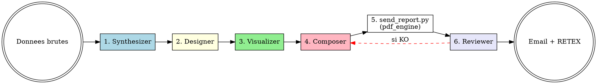

# PDF Report Gen v2 — Pipeline Multi-Agents Institutionnel

Transformer des donnees brutes en document PDF professionnel via un pipeline de 5 agents specialises, en s'appuyant sur le moteur Python `pdf_engine/` (Playwright + WeasyPrint).

---

## HARD-GATE — REGLES NON NEGOCIABLES

<HARD-GATE>
1. **JAMAIS de HTML inline dans le contenu Markdown** — uniquement Markdown pur + frontmatter YAML + callouts GitHub-style
2. **TOUJOURS utiliser `--file rapport.md`** — JAMAIS de contenu inline en bash (troncature shell garantie)
3. **TOUJOURS choisir un template adapte** — executive / financial / technical / research / minimal (pas le defaut au hasard)
4. **TOUJOURS lancer l'agent Reviewer** apres generation pour QC (taille, pages, lisibilite)
5. **TOUJOURS suivre l'ordre des 5 agents** : Synthesizer -> Designer -> Visualizer -> Composer -> Reviewer
6. **JAMAIS de PDF sans cover page** sauf demande explicite (`--no-cover`)
</HARD-GATE>

---

## CHECKLIST OBLIGATOIRE

Creer une tache TodoWrite pour chaque etape :

1. **Agent SYNTHESIZER** — Transformer les donnees brutes en Markdown structure
2. **Agent DESIGNER** — Choisir le template + page de garde + frontmatter YAML (KPIs, classification, version)
3. **Agent VISUALIZER** — Generer les graphiques (chart_generator) et/ou diagrammes (Mermaid) si pertinents
4. **Agent COMPOSER** — Assembler le Markdown final (callouts, footnotes, sources, headings)
5. **Generation PDF** — Lancer `send_report.py` avec les bons flags (`--template`, `--check-quality`, `--file`)
6. **Agent REVIEWER** — Verifier le PDF final (pages, taille, lisibilite, structure)
7. **Envoi email** — Si tout est OK, envoyer a `acollenne@gmail.com`

---

## PIPELINE



---

## LES 5 AGENTS

| Agent | Role | Fichier | Sortie |
|-------|------|---------|--------|
| **Synthesizer** | Donnees brutes -> Markdown structure (sections, conclusions, recos /10) | `agents/synthesizer.md` | Markdown brut sans frontmatter |
| **Designer** | Choix template + cover + frontmatter YAML (KPIs, classification, version) | `agents/designer.md` | Frontmatter YAML + recommandations layout |
| **Visualizer** | Graphiques (chart_generator) et diagrammes (Mermaid) | `agents/visualizer.md` | Liste des images PNG + blocs Mermaid |
| **Composer** | Assemblage final : callouts, footnotes, sources, integration images | `agents/composer.md` | Fichier .md complet pret pour `send_report.py` |
| **Reviewer** | QC post-PDF : pages, taille, lisibilite, structure, recommandations | `agents/reviewer.md` | Rapport QC + decision OK/RETRY |

Lire chaque agent dans `agents/` AVANT de l'invoquer dans le pipeline.

---

## TEMPLATES DISPONIBLES

| Template | Quand l'utiliser | Caracteristiques |
|----------|-----------------|-------------------|
| **executive** | Synthese pour board/direction, decisions strategiques | Serif, gros titres, beaucoup de blanc, palette sobre |
| **financial** | Trading, valorisation, analyse boursiere, P&L, DCF | KPI cards prominents, tableaux denses, palette bleu nuit + vert/rouge |
| **technical** | Documentation code, API, guides developpeur | Code colore (Pygments), monospace, palette teal |
| **research** | Etude de marche, analyse academique, recherche fondamentale | Serif Cambria, footnotes academiques, palette neutre, justifie |
| **minimal** | Document austere N&B, impression economique | Noir et blanc total, sans serif, pas de couleurs |

Voir les briefs complets dans `templates/[nom].md`.

**Selection automatique** : `send_report.py` choisit le template selon le titre :
- "trading"/"valorisation"/"DCF" -> `financial`
- "executive"/"synthese"/"board" -> `executive`
- "code"/"guide"/"API" -> `technical`
- "recherche"/"etude" -> `research`
- defaut -> `executive`

Pour forcer : `--template financial`.

---

## FRONTMATTER YAML — STRUCTURE COMPLETE

```yaml
---
template: financial            # executive | financial | technical | research | minimal
doc_type: financial            # override de la detection auto
author: Alexandre Collenne     # nom auteur
version: 1.2                   # version du document
classification: CONFIDENTIEL   # PUBLIC | INTERNE | CONFIDENTIEL | STRICT
subtitle: Analyse Q1 2026      # sous-titre cover page
logo: chemin/vers/logo.png     # logo cover page (optionnel)
kpis:
  - label: Revenue 2026E
    value: 1.5B USD
    change: +15%
    sentiment: positive        # positive | negative | neutral
  - label: EBITDA Margin
    value: 28.5%
    change: +1.2pt
    sentiment: positive
  - label: Net Debt
    value: 420M USD
    change: -8%
    sentiment: positive
---
```

---

## CALLOUTS GITHUB-STYLE (utiliser dans le contenu)

```markdown
> [!NOTE]
> Information neutre, contexte additionnel.

> [!TIP]
> Astuce ou bonne pratique recommandee.

> [!IMPORTANT]
> Information critique a retenir absolument.

> [!WARNING]
> Avertissement, attention requise.

> [!CAUTION]
> Risque eleve, action potentiellement dangereuse.
```

---

## FOOTNOTES ACADEMIQUES

```markdown
Selon l'etude Bloomberg [^1], la croissance attendue est de 15%.

[^1]: Bloomberg Research, "Outlook Tech 2026", 15 mars 2026.
```

Les footnotes sont automatiquement collectees et affichees en fin de document.

---

## METHODE D'INVOCATION — TOUJOURS `--file`

### Etapes obligatoires

1. **Ecrire** le contenu Markdown final dans un fichier temp via Write tool
2. **Lancer** :
```bash
python "C:\Users\Alexandre collenne\.claude\tools\send_report.py" \
  "Titre du rapport" \
  --file "/chemin/vers/rapport.md" \
  --template financial \
  --check-quality \
  acollenne@gmail.com
```
3. **Lire** la sortie pour le rapport QC
4. **Supprimer** le fichier temp apres envoi

### Pour du code (2 PDFs separes)

```bash
python send_report.py "[Nom] - CODE"  --file code.md  --template technical acollenne@gmail.com
python send_report.py "[Nom] - GUIDE" --file guide.md --template technical acollenne@gmail.com
```

### Options avancees

| Flag | Effet |
|------|-------|
| `--template <nom>` | Force le template (sinon auto-detection) |
| `--no-cover` | Pas de page de garde complete |
| `--check-quality` | Lance le QC post-generation |
| `--pdf-ua` | Tag PDF/UA-1 (accessibilite, WeasyPrint uniquement) |
| `--no-email` | Genere et garde local sans envoyer |
| `--output-dir` | Force un repertoire de sortie |

---

## MODIFICATION DE PDF EXISTANTS

Pour modifier un PDF deja genere, utiliser `modify_pdf.py` :

```bash
# Fusionner plusieurs PDFs
python modify_pdf.py merge a.pdf b.pdf -o merged.pdf

# Decouper un PDF en pages individuelles
python modify_pdf.py split big.pdf -o pages_dir/

# Extraire un range de pages
python modify_pdf.py extract big.pdf 1-5 -o intro.pdf

# Ajouter un watermark
python modify_pdf.py watermark doc.pdf "CONFIDENTIEL" -o watermarked.pdf

# Rotation des pages
python modify_pdf.py rotate doc.pdf 90 -o rotated.pdf

# Modifier les metadonnees
python modify_pdf.py metadata doc.pdf --title "Nouveau" --author "Alex" -o updated.pdf

# Inspecter un PDF
python modify_pdf.py info doc.pdf
```

---

## GRAPHIQUES (chart_generator + Mermaid)

### chart_generator (matplotlib)
```bash
python chart_generator.py <type> <json> <titre> <output.png>
```
Types : `line`, `bar`, `area`, `multi_line`, `hbar`, `scatter`

### Mermaid (diagrammes inline)
```markdown
\`\`\`mermaid
graph TD
    A[Donnees brutes] --> B[Synthesizer]
    B --> C[Designer]
    C --> D[Composer]
    D --> E[PDF final]
\`\`\`
```

Le pipeline tente le rendu via `mermaid-cli` si installe, sinon affiche le code source.

---

## FORMAT DE SORTIE ATTENDU

```
PDF REPORT v2 — [titre]

Pipeline           : Synthesizer -> Designer -> Visualizer -> Composer -> Reviewer
Template           : [executive | financial | technical | research | minimal]
Type document      : [code | analysis | financial | research | executive]
Cover page         : [oui | non]
Frontmatter YAML   : [KPIs: N | classification: X | version: Y]
Graphiques         : [N images, M diagrammes Mermaid]
Pages PDF          : [N pages]
Taille PDF         : [N KB]
Quality Check      : [OK | KO + warnings]
Engine PDF         : [playwright | weasyprint]
Envoye a           : acollenne@gmail.com
PDF persiste       : reports/AAAA-MM/rapport_XXX.pdf
```

---

## ANTI-PATTERNS

| Excuse | Realite |
|--------|---------|
| "Un peu de HTML pour le styling" | JAMAIS. Markdown pur + callouts + frontmatter uniquement (bug confirme 28/03/2026). |
| "Le contenu inline en bash suffit" | TOUJOURS `--file rapport.md`. Le shell tronque les longs contenus. |
| "Le template par defaut suffit" | NON. Choisir activement selon l'audience et le type de contenu. |
| "Pas besoin de cover page pour ce rapport" | Cover page = pro. Desactiver uniquement si demande explicite. |
| "Pas besoin de QC post-generation" | TOUJOURS `--check-quality`. Le Reviewer peut detecter pages vides, structure cassee. |
| "Sauter l'agent Synthesizer pour gagner du temps" | NON. Sans synthese, le contenu est brut et non structure -> PDF mediocre. |
| "Les KPIs c'est pas pour mon cas" | Si rapport financier ou executif -> TOUJOURS au moins 3-4 KPI cards en frontmatter. |

---

## RED FLAGS — STOP

- HTML detecte dans le Markdown -> STOP, convertir
- Contenu inline (pas `--file`) -> STOP, ecrire dans un fichier d'abord
- Aucun template specifie pour un rapport important -> STOP, choisir activement
- PDF genere sans QC -> STOP, ajouter `--check-quality`
- Reviewer signale `qc_ok: false` -> STOP, corriger et regenerer
- Footnotes utilisees mais pas de definitions `[^id]:` -> STOP, ajouter les definitions

---

## CROSS-LINKS

| Contexte | Skill |
|----------|-------|
| Invoque par | `deep-research` (Phase 4) |
| Apres validation | `qa-pipeline` |
| Donnees financieres | `financial-analysis-framework`, `stock-analysis` |
| Graphiques | `chart_generator.py` (outil) |
| Modification PDF | `modify_pdf.py` (outil) |
| Feedback apres envoi | `feedback-loop` |
| RETEX | `retex-evolution` |

---

## EVOLUTION DU SKILL

Apres chaque generation :
- Si Reviewer signale > 2 warnings -> identifier le pattern (template inadapte ? contenu mal structure ?)
- Si email non recu -> verifier `email_config.json` ou variables `GMAIL_SENDER`/`GMAIL_APP_PASSWORD`
- Si rendu visuel KO -> verifier que Playwright Chromium est installe (`playwright install chromium`)
- Si > 2 PDFs mal formates -> revoir le pipeline et lancer skill-creator improve

Seuils :
- Score QC moyen < 8/10 sur 5 generations -> revoir agents Composer/Reviewer
- Taille PDF > 5 MB regulierement -> optimiser images embedees (chart_generator dpi)
- Temps de generation > 30s -> profiler le pipeline (Playwright peut etre lent au cold start)

## LIVRABLE FINAL

- **Type** : PDF
- **Généré par** : self
- **Destination** : acollenne@gmail.com via send_report.py

## CHAÎNAGE ARBORESCENCE

- **Amont** : deep-research (entrée unique)
- **Aval** : self


---

## DELIVERY GATE — layout-qa (OBLIGATOIRE)

**Avant tout envoi du livrable final**, ce skill DOIT invoquer la porte `layout-qa` :

```bash
python ~/.claude/skills/layout-qa/scripts/run_gate.py \
    --input <livrable> \
    --brief <brief.md> \
    --caller <nom-de-ce-skill> \
    --max-iter 3 \
    --out-report qa_report.json
```

- Exit `0` (PASS) → envoi autorisé (email, téléchargement utilisateur)
- Exit `1` (FIX) → lire `qa_report.json`, appliquer les corrections au Composer, re-rendre, re-invoquer layout-qa (max 3 itérations)
- Exit `2` (FAIL) → escalade utilisateur avec les PNG annotés (`annotated_dir`)

La phase vision multimodale est assurée par l'agent `visual-layout-critic` côté Claude après l'exécution déterministe du script. Aucun livrable ne sort sans verdict PASS.
