# pdf-report-pro — Rapports PDF Institutionnels niveau McKinsey

<HARD-GATE>
Tu TOUJOURS suivras les 6 phases dans l'ordre. Tu JAMAIS ne sauteras la Phase 2 Storyliner (ghost deck action titles). Tu JAMAIS ne livreras sans passer le Reviewer (checklist McKinsey 15 critères). Tu OBLIGATOIRE utiliseras le pyramid principle de Minto (conclusion d'abord). Tu JAMAIS ne mettras de 3D, de gradients gratuits ou de chartjunk (Tufte data-ink ratio strict). Tu TOUJOURS citeras les sources. Tu JAMAIS ne modifieras `send_report.py` (intégration seule).
</HARD-GATE>

## Objectif

Produire des rapports PDF de niveau institutionnel (McKinsey, BCG, Bain, Goldman Sachs, Morgan Stanley) à partir d'un brief utilisateur — exécutifs, rapports d'analyse, data decks, pitch decks investisseurs.

## Checklist d'exécution (v2 — 9 phases)

1. **Phase 0 — Audit brief** : extraire sujet, audience, ton, contraintes, deadline, format cible. Si brief flou → `superpowers-brainstorming`.
2. **Phase 1 — Strategist** (`agents/strategist.md`) : objectif, MECE top-level, key message, template cible parmi 7.
3. **Phase 2 — Storyliner** (`agents/storyliner.md`) : ghost deck (action titles 5-15 mots, Minto, flux horizontal).
4. **Phase 1.5 — Researcher** (`agents/researcher.md`) **NOUVEAU** : collecte 8+ sources, scoring, `sources.yaml` numéroté [1]…[N]. Invoque `qa-pipeline` (Source Validator).
5. **Phase 3 — Synthesizer** (`agents/synthesizer.md`) : rédaction contenu sourcé à partir de `sources.yaml`.
6. **Phase 4 — Visualizer** (`agents/visualizer.md`) : charts Tufte (sparklines, small multiples, slopegraphs). Délégation `image-studio` si complexe.
7. **Phase 5 — Composer** (`agents/composer.md`) : rendu via **Typst (défaut)** → WeasyPrint → Playwright → Markdown (`send_report.py`).
8. **Phase 4.5 — Accessibility Auditor** (`agents/accessibility_auditor.md`) **NOUVEAU** : `tools/pdf_accessibility_check.py`, score /20, seuil 16.
9. **Phase 6 — Reviewer** (`agents/reviewer.md`) : checklist 20 critères (`references/checklist_mckinsey.md`), seuil 85/100, max 2 itérations.
10. **Phase 7 — Archivist** (`agents/archivist.md`) **NOUVEAU** : `tools/pdf_versioner.py`, golden PDF v1.0, archivage `~/Documents/reports/<slug>/v<X.Y>/`.
11. **Phase 8 — Livraison** : `tools/send_report.py` → acollenne@gmail.com, puis `retex-evolution`.

Utiliser `TodoWrite` pour tracker les 11 étapes.

## Flowchart du pipeline

```dot
digraph pdf_report_pro {
  rankdir=LR;
  node [shape=box, style="rounded,filled", fillcolor="#F5F5F5", fontname="Inter"];
  Brief -> Strategist [label="Phase 1"];
  Strategist -> Storyliner [label="Phase 2\nghost deck"];
  Storyliner -> Synthesizer [label="Phase 3\ncontenu"];
  Synthesizer -> Visualizer [label="Phase 4\ncharts Tufte"];
  Visualizer -> Composer [label="Phase 5\nHTML/CSS→PDF"];
  Composer -> Reviewer [label="Phase 6\n15 critères"];
  Reviewer -> Composer [label="si score<85\nboucle max 2x", style=dashed, color="#E63946"];
  Reviewer -> Livraison [label="OK"];
  Livraison -> Email [label="send_report.py"];
  Livraison -> RETEX [label="retex-evolution"];
}
```

## Les 6 phases détaillées

### Phase 1 — Strategist (cadrage)
- Extrait objectif, audience (CEO, board, analyste, investisseur), ton (factuel, persuasif, pédagogique), longueur cible.
- Choisit le template parmi 5 : `executive_brief`, `institutional_report`, `financial_analysis`, `data_deck`, `pitch_deck`.
- Livrable : brief structuré (YAML).

### Phase 2 — Storyliner (ghost deck)
- Rédige un ghost deck : liste ordonnée d'action titles (5-15 mots chacun) appliquant le **pyramid principle de Minto** (conclusion en premier, puis arguments MECE).
- Chaque action title doit être une phrase complète avec verbe et chiffre quand possible : « Le CA APAC progresse de 14 % porté par l'Inde » ≠ « Vue d'ensemble APAC ».
- Valide l'enchaînement horizontal (test du « so what ? »).

### Phase 3 — Synthesizer (contenu)
- Rédige le corps sous chaque action title. Sources obligatoires. Chiffres sourcés.
- Appelle `qa-pipeline` pour vérification anti-hallucination si analyse financière.

### Phase 4 — Visualizer (charts Tufte)
- Produit charts respectant **data-ink ratio** (Edward Tufte) : pas de 3D, pas de gradients décoratifs, pas de fond gris, pas de légende redondante.
- Délègue à `image-studio` pour visuels complexes (schémas, infographies).
- Script `tools/chart_generator.py` pour charts matplotlib minimalistes.

### Phase 5 — Composer (rendu)
- **Moteur principal v2** : **Typst 0.14+** via `tools/typst_render.py` — PDF/UA tagged natif, 10-100× plus rapide que LaTeX, baseline grid 8pt natif. Installer via `winget install Typst.Typst`.
- **Fallback 1** : WeasyPrint (HTML/CSS) via `tools/weasyprint_render.py` (KO si GTK absent sur Windows).
- **Fallback 2** : Playwright HTML→PDF (toujours dispo).
- **Fallback ultime** : Markdown pur via `send_report.py` (jamais modifié).
- Templates HTML dans `templates/` utilisant `_base.css` (design system institutionnel).

### Phase 6 — Reviewer (QA McKinsey)
- Applique la checklist 15 critères (`references/checklist_mckinsey.md`).
- Score sur 100. Seuil de livraison : ≥ 85/100.
- Si < 85 → retour Phase 3/4/5 selon critères échoués. Max 2 itérations.

## Design system institutionnel

| Élément | Spécification v2 |
|---|---|
| **Baseline grid** | **8 pt — toutes tailles/marges sont multiples de 4 ou 8** |
| Grille colonnes | 12 colonnes, gouttière 24 pt |
| Typo corps | **Inter** (Helvetica fallback) — 10 pt / 14 pt leading |
| Typo titres | **Source Serif 4** (Georgia fallback) — 24 pt / 32 pt H1 |
| Typo data | JetBrains Mono — 9 pt |
| Primaire | `#0B3D91` (contraste 11.6:1 — WCAG AAA) |
| Accent | `#C1121F` (contraste 6.4:1 — WCAG AA, remplace #E63946 trop clair) |
| Neutres | `#1A1A1A` / `#4A4A4A` / `#B0B0B0` / `#F5F5F5` |
| Marges page | 24 mm (multiples de 8) |
| Interligne | 1,4 |
| Data-ink | Tufte strict : pas de 3D, pas de gradients, pas de chartjunk |
| Accessibilité | **PDF/UA tagged + WCAG AA contraste vérifié auto** |

## Anti-patterns

| Anti-pattern | Excuse fréquente | Réalité |
|---|---|---|
| Titres descriptifs (« Overview », « Q3 results ») | « C'est plus court » | Viole pyramid principle — chaque slide doit porter une conclusion |
| 3D charts, gradients, fond gris | « C'est plus joli » | Chartjunk — réduit data-ink ratio, McKinsey interdit |
| Pas de sourcing | « Je connais le chiffre » | Rapport non défendable devant un board |
| Skip du Storyliner | « Je sais déjà ce que je veux dire » | Rapport incohérent, pas de flux horizontal |
| Modifier send_report.py | « J'ai besoin de plus de features » | Outil partagé, incompatibilité garantie |
| Livrer sans Reviewer | « Le contenu est déjà bon » | Score<85 garanti, re-work coûteux |

### Red flags (STOP, corriger immédiatement)
- Action title > 15 mots ou sans verbe → STOP, refaire Storyliner.
- Chart 3D ou camembert > 5 tranches → STOP, refaire Visualizer.
- Score Reviewer < 70 → STOP, retour Phase 2 complet.
- Brief contient « urgence » sans contraintes claires → invoquer `superpowers-brainstorming`.

## Cross-links (skills liés)

| Contexte | Avant | Skill | Après |
|---|---|---|---|
| Brief flou | utilisateur | `superpowers-brainstorming` | clarification |
| Analyse stock | brief | `stock-analysis` | données → pdf-report-pro |
| Analyse macro | brief | `macro-analysis` | données → pdf-report-pro |
| Modèle DCF | brief | `financial-modeling` | valo → pdf-report-pro |
| Visuels complexes | Phase 4 | `image-studio` | images → Composer |
| Anti-hallucination | Phase 3 | `qa-pipeline` | contenu validé |
| Routage IA rédaction | Phase 3 | `multi-ia-router` | meilleur modèle |
| Retour d'expérience | Phase 7 | `retex-evolution` | amélioration skill |
| Présentation .pptx | alternative | `ppt-creator` | deck éditable |

Références backticks : `pdf-report-pro` `ppt-creator` `image-studio` `qa-pipeline` `multi-ia-router` `retex-evolution` `stock-analysis` `financial-modeling` `superpowers-brainstorming`.

## Tests

### Trigger scenarios (DOIT déclencher)
1. « Fais-moi un rapport PDF institutionnel sur NVIDIA » → pdf-report-pro + stock-analysis amont.
2. « Rédige un executive brief 2 pages sur la Fed » → pdf-report-pro template executive_brief + macro-analysis.
3. « Génère un pitch deck investisseur PDF pour ma startup » → pdf-report-pro template pitch_deck.

### No-trigger scenarios (NE DOIT PAS déclencher)
1. « Crée-moi un flyer promotionnel » → `flyer-creator` / `image-studio`, PAS pdf-report-pro.
2. « Fais-moi une présentation .pptx » → `ppt-creator`, PAS pdf-report-pro.
3. « Débug ce script Python » → `code-debug`, PAS pdf-report-pro.

## Limitations connues

- WeasyPrint sur Windows nécessite GTK (souvent KO) → fallback automatique vers Playwright HTML→PDF.
- Typst non installé par défaut → ignoré si absent.
- Charts complexes > 10 000 points → déléguer à `data-analysis`.
- Rapports > 100 pages → splitter et assembler avec pdftk.

## Évolution (RETEX et auto-amélioration)

Après chaque livraison :
1. Score audit (`skill-creator/scripts/audit_skills.py pdf-report-pro`) — seuil d'action **si score < 90** → identifier critère faible, patcher SKILL.md.
2. Score Reviewer moyen sur 5 dernières missions — seuil **si < 85** → renforcer la checklist McKinsey.
3. Feedback utilisateur via `feedback-loop` — seuil **si note < 4/5** → RETEX obligatoire.
4. Benchmark pro : re-scraper tous les 30 jours les guidelines McKinsey/BCG publics (WebSearch + WebFetch).
5. `retex-evolution` enregistre le RETEX dans MEMORY.md et propose un patch.

Fichier RETEX : `~/.claude/skills/pdf-report-pro/references/retex.log`.
