# ppt-creator — Présentations .pptx niveau McKinsey/BCG

<HARD-GATE>
Tu TOUJOURS suivras les 6 phases dans l'ordre. Tu OBLIGATOIRE afficheras le ghost deck complet à l'utilisateur en Phase 2 et ATTENDRAS une validation explicite avant la Phase 3. Tu JAMAIS ne rédigeras un titre descriptif (« Overview », « Q3 results ») — TOUJOURS un action title 5-15 mots avec verbe et chiffre. Tu TOUJOURS respecteras « 1 slide = 1 idée ». Tu JAMAIS ne livreras sans Reviewer. Tu TOUJOURS exporteras `.pptx` (et `.pdf` via Playwright HTML parallèle si demandé).
</HARD-GATE>

## Objectif

Produire des présentations `.pptx` entièrement éditables, conformes aux standards McKinsey, BCG, Bain, Sequoia, YC, à partir d'un brief utilisateur.

## Checklist d'exécution

1. **Phase 0 — Audit brief** : sujet, audience, durée de pitch, format, contraintes branding. Si flou → `superpowers-brainstorming`.
2. **Phase 1 — Strategist** : lancer `agents/strategist.md` pour cadrer key message, MECE, template cible parmi 5.
3. **Phase 2 — Storyliner + VALIDATION UTILISATEUR** : lancer `agents/storyliner.md`, afficher le ghost deck sous forme de **table markdown** (#slide | action title | messages clés) et **ATTENDRE GO explicite**.
4. **Phase 3 — Synthesizer** : lancer `agents/synthesizer.md` pour contenu slide par slide, sourcing.
5. **Phase 4 — Visualizer** : lancer `agents/visualizer.md` pour charts Tufte et diagrammes. Délégation à `image-studio` si visuels complexes.
6. **Phase 5 — Composer** : lancer `agents/composer.md` pour assembler via `python-pptx` (principal), Marp CLI (draft rapide), ou Canva MCP (premium).
7. **Phase 6 — Reviewer** : lancer `agents/reviewer.md` (checklist 15 critères McKinsey). Max 2 itérations.
8. **Phase 7 — Export + livraison** : `.pptx` (et `.pdf` via rendu HTML parallèle + Playwright `page.pdf()` — voir Phase 7), envoi email via `send_report.py` (pièce jointe `.pptx`), RETEX.

Utiliser `TodoWrite` pour tracker les 8 étapes.

## Flowchart du pipeline

```dot
digraph ppt_creator {
  rankdir=LR;
  node [shape=box, style="rounded,filled", fillcolor="#F5F5F5", fontname="Inter"];
  Brief -> Strategist [label="Phase 1"];
  Strategist -> Storyliner [label="Phase 2"];
  Storyliner -> UserValidation [label="GHOST DECK\naffiché"];
  UserValidation -> Synthesizer [label="GO utilisateur"];
  UserValidation -> Storyliner [label="corrections", style=dashed, color="#E63946"];
  Synthesizer -> Visualizer [label="Phase 4"];
  Visualizer -> Composer [label="Phase 5\npython-pptx"];
  Composer -> Reviewer [label="Phase 6\n15 critères"];
  Reviewer -> Composer [label="score<85\nmax 2x", style=dashed, color="#E63946"];
  Reviewer -> Export [label="OK"];
  Export -> Email [label="pptx+pdf"];
  Export -> RETEX [label="retex-evolution"];
}
```



## Les 6 phases détaillées

### Phase 1 — Strategist
- Key message, audience (board, VC, client, interne), durée de pitch, template parmi : `executive_deck` (5-10 slides), `institutional_deck` (20+), `financial_analysis_deck`, `data_deck`, `pitch_deck` (15 slides style Sequoia/YC).
- Livrable : brief YAML.

### Phase 2 — Storyliner (point critique — VALIDATION OBLIGATOIRE)
- Rédige un **ghost deck complet** sous cette forme :

```markdown
| # | Action title (5-15 mots) | Messages clés |
|---|---|---|
| 1 | Le CA APAC a progressé de 14 % porté par l'Inde | +18 % Inde, -3 % Japon, mix produit favorable |
| 2 | ... | ... |
```

- Applique le **pyramid principle de Minto** : conclusion slide 1, arguments MECE ensuite, détails après.
- **Affiche à l'utilisateur** et **ATTEND GO explicite**. Si corrections demandées → itère.
- Règles : action title 5-15 mots, verbe conjugué, chiffre si possible, pas de vague (« Overview », « Context », « Introduction »).

### Phase 3 — Synthesizer
- Rédige contenu détaillé pour chaque slide validée. Sources obligatoires.
- Respecte « 1 slide = 1 idée ».
- Invoque `qa-pipeline` si données financières.

### Phase 4 — Visualizer
- Charts Tufte (data-ink strict). Délègue `image-studio` pour visuels riches.
- Script `tools/chart_generator.py`.

### Phase 5 — Composer
- **Principal** : `python-pptx` via `tools/pptx_builder.py` (sortie éditable).
- **Draft rapide** : Marp CLI (Markdown → .pptx).
- **Premium** : Canva MCP via `image-studio`.
- Templates dans `templates/` générés par `tools/build_templates.py`.
- Design system : typo Inter, primaire `#0B3D91`, accent `#E63946`, neutres McKinsey.

### Phase 6 — Reviewer
- Checklist 15 critères (`references/checklist_mckinsey.md`), seuil 85/100.
- Vérifications obligatoires : chaque slide a un action title ? MECE ? 1 idée/slide ? Pyramid principle ? Ghost deck validé utilisateur ?

### Phase 7 — Export
- `.pptx` toujours.
- `.pdf` (optionnel) via rendu HTML parallèle du deck → Playwright `page.pdf()` (LibreOffice INTERDIT sur ce poste). Si seul le `.pptx` est requis, on s'arrête là.
- Envoi email via `send_report.py` (intégration, jamais modifié) :
  ```
  python "C:\Users\Alexandre collenne\.claude\tools\send_report.py" "Sujet" "contenu" acollenne@gmail.com
  ```
  Joindre le `.pptx` (et `.pdf` si généré) en attachement.

## Règles McKinsey OBLIGATOIRES

| Règle | Exemple BON | Exemple MAUVAIS |
|---|---|---|
| Action title 5-15 mots | « Le CA APAC progresse de 14 % porté par l'Inde » | « Q3 Overview » |
| 1 slide = 1 idée | 1 chart + 1 insight | 3 charts empilés |
| MECE | Segments sans chevauchement | « Europe, France, Clients » |
| Pyramid principle | Conclusion slide 1 | Conclusion slide 12 |
| Ghost deck validé | GO utilisateur avant rédaction | Rédaction sans squelette |

## Anti-patterns

| Anti-pattern | Excuse | Réalité |
|---|---|---|
| Titres descriptifs | « C'est plus clair » | Viole pyramid principle |
| Skip validation ghost deck | « Je gagne du temps » | Re-work complet garanti |
| Charts 3D / gradients | « C'est joli » | Chartjunk, interdit McKinsey |
| 3 idées par slide | « Je compresse » | Audience perdue |
| Pas de sourcing | « Connaissance générale » | Non défendable |
| Modifier send_report.py | « Besoin feature X » | JAMAIS |

### Red flags (STOP)
- Utilisateur n'a pas validé le ghost deck → STOP, ne JAMAIS passer à Phase 3.
- Action title commence par un nom (« Overview », « Results ») → STOP, refaire.
- Slide > 30 mots de bullet → STOP, splitter.
- Score Reviewer < 70 → STOP, retour Phase 2.

## Cross-links

| Contexte | Avant | Skill | Après |
|---|---|---|---|
| Brief flou | utilisateur | `superpowers-brainstorming` | clarifié |
| Analyse stock | brief | `stock-analysis` | → ppt-creator |
| Analyse macro | brief | `macro-analysis` | → ppt-creator |
| Valo DCF | brief | `financial-modeling` | → ppt-creator |
| Visuels riches | Phase 4 | `image-studio` | images |
| QA données | Phase 3 | `qa-pipeline` | contenu validé |
| Routage IA | Phase 3 | `multi-ia-router` | meilleur modèle |
| Rapport PDF statique | alternative | `pdf-report-pro` | rapport |
| RETEX | Phase 7 | `retex-evolution` | amélioration |

Références : `ppt-creator` `pdf-report-pro` `image-studio` `qa-pipeline` `multi-ia-router` `retex-evolution` `stock-analysis` `financial-modeling` `superpowers-brainstorming`.

## Tests

### Trigger scenarios
1. « Fais-moi une présentation pitch deck pour lever 2M€ » → ppt-creator template pitch_deck.
2. « Génère un .pptx executive 10 slides sur la stratégie APAC » → ppt-creator executive_deck.
3. « Crée un deck d'analyse financière sur Apple » → ppt-creator financial_analysis_deck + stock-analysis.

### No-trigger scenarios
1. « Rédige un rapport PDF institutionnel » → `pdf-report-pro`, PAS ppt-creator.
2. « Crée-moi une affiche événementielle » → `image-studio` / `flyer-creator`.
3. « Debug ce code » → `code-debug`.

## Limitations connues

- `python-pptx` n'embarque pas nativement tous les charts — fallback images PNG.
- LibreOffice INTERDIT sur ce poste → export PDF via rendu HTML parallèle + Playwright `page.pdf()`. Sinon livraison `.pptx` seul.
- Canva MCP nécessite auth OAuth active.
- Marp ne supporte pas tous les layouts McKinsey.

## Évolution (RETEX et auto-amélioration)

1. Score audit seuil **si < 88** → patcher SKILL.md.
2. Score Reviewer moyen seuil **si < 85** → renforcer checklist.
3. Feedback utilisateur seuil **si < 4/5** → RETEX via `retex-evolution`.
4. Ghost deck rejeté > 1 fois sur 3 → renforcer Strategist.
5. Benchmark pro trimestriel (McKinsey, BCG, Sequoia, YC guidelines) via WebSearch.

Fichier RETEX : `~/.claude/skills/ppt-creator/references/retex.log`.
