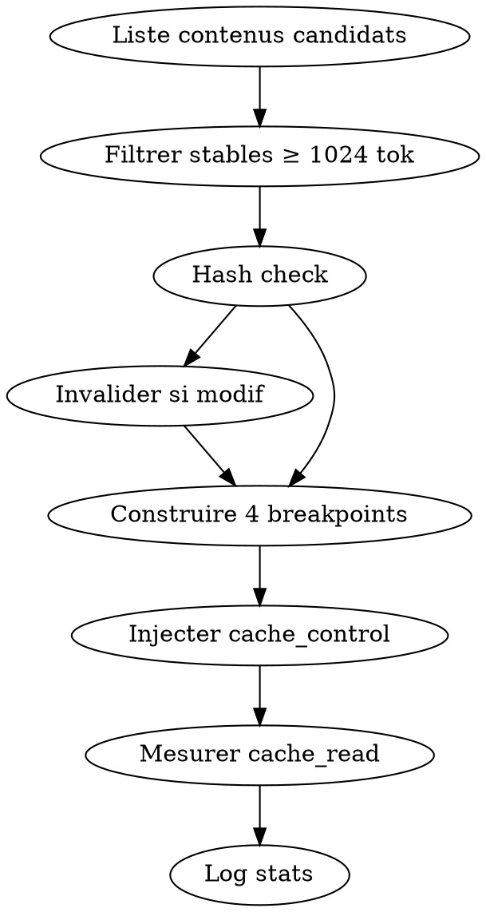

# Skill: prompt-cache-manager — L6 META Cache Anthropic

**Rôle** : identifier et marquer les contenus **stables et volumineux** du pipeline deep-research pour les cacher via `cache_control: {type: "ephemeral", ttl: "1h"}` et obtenir 90% de réduction sur tokens entrée.

## PRINCIPE REASONING-FIRST

Le caching **n'altère jamais le raisonnement** : le modèle reçoit le contenu identique, il le lit seulement 10× moins cher. C'est le gain "gratuit" idéal — à appliquer en PRIORITÉ absolue.

<HARD-GATE>
- JAMAIS cacher des contenus dynamiques (requête user, résultats tools volatils).
- JAMAIS dépasser 4 cache breakpoints par requête (limite API Anthropic).
- TOUJOURS cacher en ordre : [tool_defs] → [system] → [docs stables] → [messages].
- TOUJOURS invalider cache si fichier source modifié (hash check).
- TOUJOURS mesurer cache_read_input_tokens vs cache_creation_input_tokens post-call.
</HARD-GATE>

## LIVRABLE FINAL
- **Type** : DOC (rapport `cache_usage.md` joint au token_savings_report)
- **Généré par** : token-economizer (agrégation)
- **Destination** : acollenne@gmail.com via send_report.py

## CHAÎNAGE ARBORESCENCE
- **Amont** : token-economizer (dispatch Phase C étape 1)
- **Aval** : retour métrique à token-economizer

## CHECKLIST

1. Lister contenus candidats au cache (critères : stable, > 1024 tokens, réutilisé)
2. Vérifier hash (invalidation si modif)
3. Construire la liste ordonnée des 4 breakpoints max
4. Injecter `cache_control` aux bons emplacements (tool defs, system, docs)
5. Mesurer `cache_read_input_tokens` après call
6. Logger ratio cache-hit dans `memory/cache_stats.json`

## PROCESS FLOW



## CONTENUS À CACHER (deep-research)

| Priorité | Contenu | Taille estimée | TTL |
|----------|---------|----------------|-----|
| 1 | Tool definitions (MCPs actifs) | ~8k tokens | 1h |
| 2 | System prompt Claude Code + deep-research SKILL.md | ~6k | 1h |
| 3 | CLAUDE.md global + MEMORY.md index | ~4k | 5min |
| 4 | Docs MCP (Bigdata/Honeycomb/Context7) | ~10k | 1h |

**Total cachable** : ~28k tokens → **économie ≈ 25k tokens/requête** (90% de 28k).

## FORMAT INJECTION

```python
messages = [
  {"role": "system", "content": [
    {"type": "text", "text": SYSTEM_PROMPT, "cache_control": {"type": "ephemeral", "ttl": "1h"}}
  ]},
  {"role": "user", "content": [
    {"type": "text", "text": CLAUDE_MD, "cache_control": {"type": "ephemeral", "ttl": "5m"}},
    {"type": "text", "text": MCP_DOCS, "cache_control": {"type": "ephemeral", "ttl": "1h"}},
    {"type": "text", "text": USER_QUERY}  # PAS de cache sur le dynamique
  ]}
]
```

## HASH INVALIDATION

```bash
md5sum ~/.claude/CLAUDE.md ~/.claude/skills/deep-research/SKILL.md > /tmp/cache_hash.txt
# Comparer à l'exécution précédente, invalider si diff
```

## ANTI-PATTERNS

| Excuse | Réalité |
|--------|---------|
| "Cacher la requête user aussi" | La requête change à chaque fois, jamais de cache-hit. |
| "Un breakpoint suffit" | Rate plusieurs opportunités. Utiliser jusqu'à 4. |
| "TTL 1h partout" | CLAUDE.md peut changer. 5m pour volatils. |
| "Ignorer le hash check" | Cache stale = réponses obsolètes. Hash obligatoire. |

## RED FLAGS

- `cache_creation_input_tokens` > `cache_read_input_tokens` sur 3 runs → cache pas réutilisé, reconsidérer
- 0 cache-hit sur requête répétée → ordre des breakpoints incorrect
- Dépassement 4 breakpoints → erreur API

## CROSS-LINKS

| Contexte | Skill |
|----------|-------|
| Orchestrateur parent | `token-economizer` |
| Compression contenu avant cache | `context-compressor` |
| Mesure qualité | `qa-pipeline` |

## ÉVOLUTION

Logger à chaque run : `{cache_read, cache_creation, ratio_hit, gain_tokens}`. Si ratio_hit < 0.5 sur 20 runs → revoir sélection contenus cachés.
