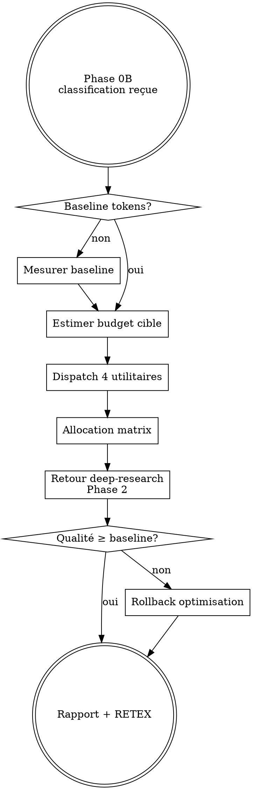

# Skill: token-economizer — L6 META Orchestrateur efficacité

**Rôle** : orchestrer les 4 utilitaires d'optimisation de tokens (prompt-cache-manager, haiku-delegator, context-compressor, adaptive-thinking-router) de manière **reasoning-first** : chaque token économisé est **réinvesti** en profondeur de raisonnement Opus, pas supprimé.

## PRINCIPE DIRECTEUR — REASONING-FIRST, TOKENS-SECOND

Ce skill n'est PAS un compresseur naïf. Hiérarchie stricte :
1. **Protéger** le raisonnement d'Opus (contexte dense, signal/bruit maximal)
2. **Déléguer** le mécanique à Haiku 4.5 (grep/parse/list/fetch)
3. **Réinvestir** les gains en `thinking.effort=high` sur étapes critiques
4. **Mesurer** la qualité (qa-pipeline) AVANT de valider le gain

<HARD-GATE>
- JAMAIS activé après Phase 1 de deep-research. Entrée EXCLUSIVE en Phase 0B.
- JAMAIS compresser sans préserver un niveau SUMMARY récupérable.
- JAMAIS déléguer à Haiku une tâche de raisonnement/arbitrage/synthèse.
- TOUJOURS mesurer (tokens AVANT/APRÈS) + (qualité qa-pipeline AVANT/APRÈS).
- TOUJOURS rejeter l'optimisation si qualité < baseline (gate de non-régression).
- TOUJOURS produire le livrable `token_savings_report.md`.
</HARD-GATE>

## LIVRABLE FINAL
- **Type** : DOC (Markdown `token_savings_report.md`)
- **Généré par** : pdf-report-gen (pour version PDF envoyée par email)
- **Destination** : acollenne@gmail.com via send_report.py

## CHAÎNAGE ARBORESCENCE
- **Amont** : deep-research (Phase 0B uniquement)
- **Aval** : prompt-cache-manager, haiku-delegator, context-compressor, adaptive-thinking-router (4 utilitaires L6), puis retour à deep-research Phase 2 avec allocation matrix optimisée.

## CHECKLIST (TodoWrite obligatoire)

1. Lire la classification complexité Phase 1 (LITE/STANDARD/FULL)
2. Mesurer la baseline tokens de la requête courante (estimation + token counting API)
3. Estimer le budget cible = baseline × (1 − objectif_gain)
4. Invoquer `prompt-cache-manager` pour marquer system prompts + CLAUDE.md + docs MCP stables
5. Invoquer `context-compressor` pour pruning pré-envoi + compression hiérarchique
6. Invoquer `haiku-delegator` pour déléguer tâches mécaniques identifiées
7. Invoquer `adaptive-thinking-router` pour piloter `thinking.effort`
8. Générer l'**allocation matrix optimisée** (tokens par Phase 2/3/4)
9. Rendre la main à deep-research Phase 2 avec le rapport d'allocation
10. En fin de pipeline : mesurer gains réels + qualité qa-pipeline + écrire `token_savings_report.md`
11. Logger dans `memory/feedback_token_savings.md` (RETEX)

## PROCESS FLOW

## PHASES DÉTAILLÉES

### Phase A — Mesure baseline
- Estimer tokens entrée (system + CLAUDE.md + outils MCP + requête utilisateur + historique)
- Estimer tokens sortie attendus (selon LITE/STANDARD/FULL : 2k/8k/20k)
- Écrire `baseline.json` : `{input, output, thinking, total, model_mix}`

### Phase B — Allocation matrix cible
Par classification, budgets cibles (tokens Opus) :
| Classif | Baseline | Cible | Gain | Thinking reinvest |
|---------|----------|-------|------|-------------------|
| LITE    | 15k      | 5k    | −67% | +0 (low)          |
| STANDARD| 60k      | 18k   | −70% | +3k (medium)      |
| FULL    | 200k     | 60k   | −70% | +10k (high)       |

### Phase C — Dispatch 4 utilitaires (ordre fixe)
1. `prompt-cache-manager` : marque contenus stables (gain instantané 90%)
2. `context-compressor` : pruning + compression hiérarchique
3. `haiku-delegator` : identifie tâches mécaniques Phase 3, les route vers Haiku
4. `adaptive-thinking-router` : règle `thinking.effort` selon complexité

### Phase D — Gate qualité
- Après exécution deep-research : scoring qa-pipeline
- Si `score_optim < score_baseline` → ROLLBACK (annuler compression, retourner contexte FULL)
- Si `score_optim ≥ score_baseline` → VALIDER

### Phase E — Rapport `token_savings_report.md`
Sections : résumé exécutif / baseline vs optimisé / gain par utilitaire / impact qualité qa-pipeline / recommandations ajustement.

## ANTI-PATTERNS

| Excuse | Réalité |
|--------|---------|
| "Compresser tout pour économiser max" | Qualité s'effondre. Compression ciblée seulement. |
| "Pas besoin de baseline, on verra après" | Impossible de mesurer gain sans référence. Baseline OBLIGATOIRE. |
| "Haiku peut synthétiser aussi bien qu'Opus" | FAUX. Haiku = mécanique uniquement. |
| "Skip le gate qualité, ça ralentit" | Sans gate, on dégrade silencieusement. OBLIGATOIRE. |
| "Appliquer token-economizer en Phase 3" | Trop tard. Phase 0B UNIQUEMENT. |

## RED FLAGS — STOP

- Baseline non mesurée → STOP, mesurer
- Qualité qa-pipeline non évaluée → STOP, évaluer
- Compression > 80% du contexte original → STOP, trop agressif
- Haiku invoqué pour synthèse/arbitrage → STOP, réassigner à Opus
- Gain mesuré < 30% → STOP, diagnostiquer inefficacité

## CROSS-LINKS

| Contexte | Skill |
|----------|-------|
| Cache contenus stables | `prompt-cache-manager` |
| Déléguer mécanique | `haiku-delegator` |
| Compresser contexte | `context-compressor` |
| Piloter thinking | `adaptive-thinking-router` |
| Valider qualité | `qa-pipeline` |
| RETEX post-exécution | `retex-evolution` |
| Livraison PDF | `pdf-report-gen` |

## ÉVOLUTION

Après chaque session deep-research avec token-economizer actif :
1. Logger dans `memory/feedback_token_savings.md` : classif, baseline, gain réel, score qualité Δ
2. Si gain moyen < 50% sur 10 sessions → réviser allocation matrix
3. Si qualité régresse > 2 fois → durcir gate + réduire agressivité compression
4. Si un utilitaire apporte < 10% → évaluer déprécation
